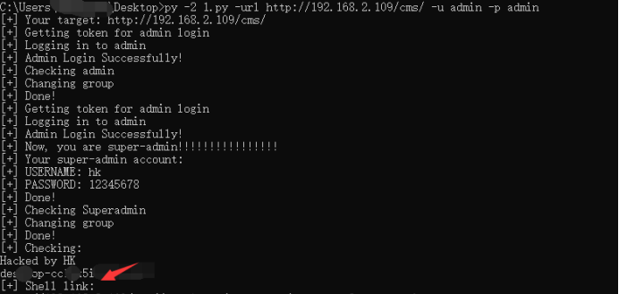

# JoomlaRCE远程代码执行（CVE-2020-11890）

最后更新于：2020-09-23 16:18:31

#### 简介

Joomla! CMS versions 2.5.0 – 3.9.16版本在处理用户组时缺少对根用户组的检查，从而导致了一个提权漏洞的产生(CVE-2020-11890)。

#### 影响版本

CMS versions 2.5.0 - 3.9.16

#### POC

链接：https://pan.baidu.com/s/1iDkl9dnCjIEXCJ1QvMLEeQ
提取码：whu7

```
py -2 1.py -url http://192.168.2.109/cms/ -u admin -p admin
```


给出了shell地址


#### 修复建议

升级到最新版