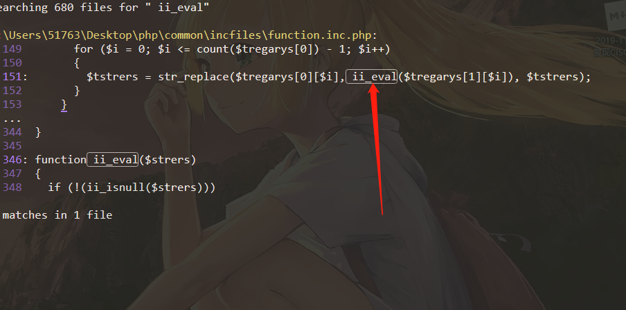
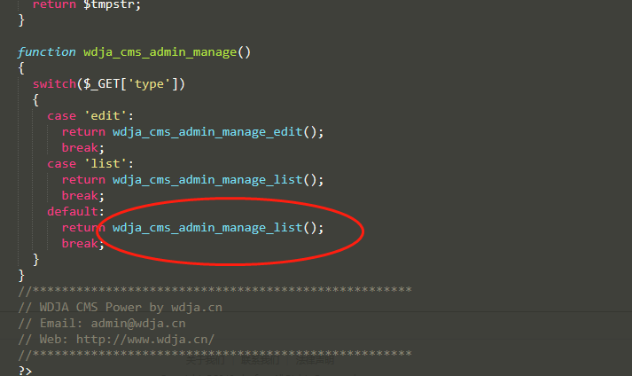
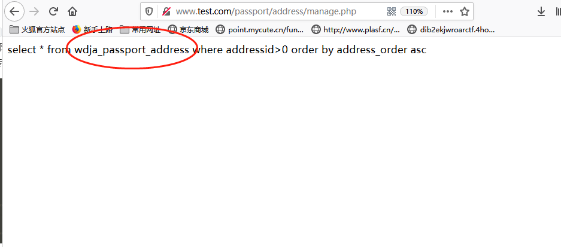
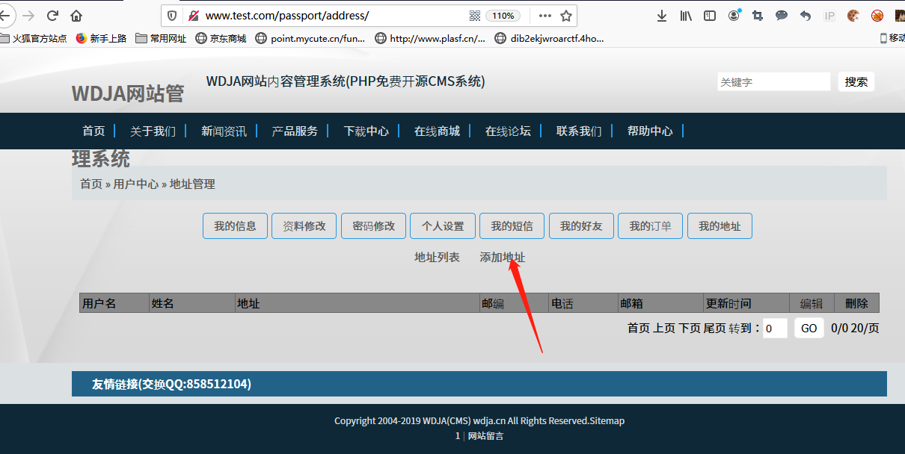

WDJA CMS 1.5.2模板注入漏洞 漏洞发掘分析 前言 这是年初无聊在家审的一个小众的CMS，漏洞官方已经修复，现在分享出来给大家，希望一起共同学习和进步。 代码审计 `漏洞文件：\common\incfiles\function.inc.php` 全局搜索中发现这个cms的模板引擎是使用eval来实现的。  我们 跟进`ii_eval()`函数。非常这里`$strers`可控疑似存在代码执行。我们在继续跟进`ii_eval()`看谁调用了他。  `漏洞文件：\common\incfiles\function.inc.php` 只有一个地方对他进行了调用，他是`ii_creplace()`函数  我们看`ii_creplace()`代码，`$strers`可控，但是它必须匹配`({\$=(.[^\}]*)})`这个正则类似于下面： `{$=phpinfo()}`  `漏洞文件passport\address\common\incfiles\manage_config.inc.php` 那么我们继续跟进`ii_creplace()`函数看谁对他进行了调用，找了很多但是都对函数中的`$`进行了转义，但是在`passport\address\common\incfiles\manage_config.inc.php`中的`wdja_cms_admin_manage_list()`并未做任何过滤。我们继续跟进。  我们发现`\passport\address\manage.php`对`passport\address\common\incfiles\manage_config.inc.php`进行了包含并调用了`wdja_cms_admin_manage_action()`,而它调用了`wdja_cms_admin_manage_list()`,那么很明显我们只需将符合`{\$=(.[^\}]*)}`正则的payload传入即可导致getshell.  那么从哪传入呢，我们直接把`wdja_cms_admin_manage_list()`中的sql语句打印出来即可知道。   很明显是从用户地址中获取。  Getshell 先注册一个会员 `http://www.域名.com/passport/?type=register` 在添加地址出写入要注入的命令,确认添加地址即可。 `http://www.域名.com/passport/address/index.php?type=list`   getshell exp,同样方法在地址出写入下面代码即可在`passport\address`路径下生成一个shell.php   

[本主题由 村长CZ 于 2020-11-17 18:53 添加图章 100元奖金](https://bbs.ichunqiu.com/forum.php?mod=misc&action=viewthreadmod&tid=59066)