# 简介

WordPress插件WPFileManager中存在一个严重的0day安全漏洞，攻击者可以在安装了此插件的任何WordPress网站上任意上传文件并远程执行代码。

 

# **影响版本**

```
File Manager 6.0-6.8
```

 

# **环境搭建**

Wordpress下载地址

```
https://cn.wordpress.org/wordpress-5.4.1-zh_CN.tar.gz
```

插件下载地址

 

```
http://plugins.svn.wordpress.org/wp-file-manager/tags/6.0/
```

登录后台把插件压缩包上传插件并启动


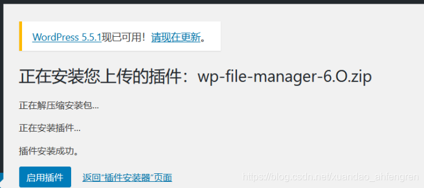

# **漏洞复现**

 

访问http://192.168.56.1/wordpress/wp-content/plugins/wp-file-manager/lib/php/connector.minimal.php页面可以发现errUnknownCmd

疑似漏洞


Poc地址：https://github.com/xDro1d/wp-file-manager

可以发现命令成功执行

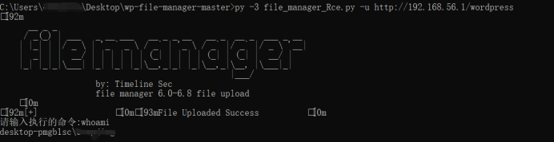

# **漏洞分析**

 

直接从elFinderConnector构造方法后的run开始


然后\wordpress\wp-content\plugins\wp-file-manager\lib\php\elFinderConnector.class.php文本中

初始化


然后run


首先判断是否是POST方法传入数据，接着合并数组至$src

$maxInuptVars = null，而$src是存在的


此时$_REQUEST中，cmd为upload，target为l1_Lw==

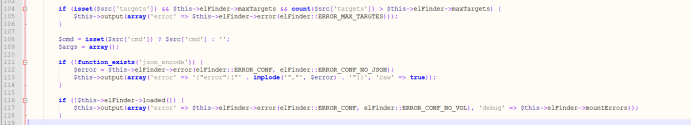

没有targets参数,第一个if语句不执行

第二个if语句判断json_encode方法是否可用，后面看flFinder->loaded方法，这里返回true，跳过


Cmd存在值，跳过


此处的$cmd为upload


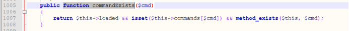

来到foreach语句

commandArgsList方法跟进


整理得

```
'upload' => array('target' => true, 'FILES' => true, 'mimes' => false, 'html' => false, 'upload' => false, 'name' => false, 'upload_path' => false, 'chunk' => false, 'cid' => false, 'node' => false, 'renames' => false, 'hashes' => false, 'suffix' => false, 'mtime' => false, 'overwrite' => false, 'contentSaveId' => false
```

$list第一键值不是FILES，所以跳过第一个if语句，而第一个target又存在于$src数组中

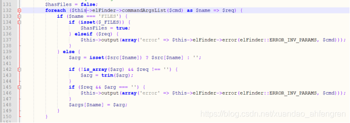

将target的值给了$arg，再用trim函数清空白字符


$args中debug是存在的，所以debug的值被设置为false


接着就是elFinderConnector的input_filter方法


因为这里的php版本大于5.4所以$magic_quotes_gpc的值为false，$args是数组，然后都进行过滤一遍


再之后对将上传文件的信息给了$args数组中的FILES元素，接着执行elFinder对象的exec函数


再之后对将上传文件的信息给了$args数组中的FILES元素，接着执行elFinder对象的exec函数

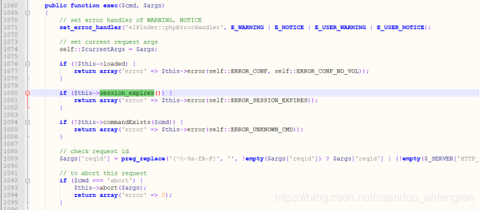

在exec函数中判断完session以及是否可以进行上传操作之后继续判断

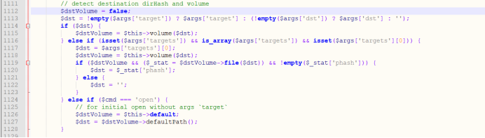

将l1_Lw== 作为参数传递给volume函数

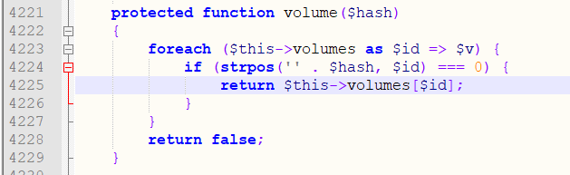

此时volumes中有两个键，到此处可以发现POC中上传文件的target元素的值只能以l1或者t1开头

这里传入的$hash为l1_Lw==

$result为空


$args['sessionCloseEarlier']被设置为true等等


跟进$cmd进入到upload方法


接着获取到文件的临时文件名，$paths获取到文件路径为$target的值

 

接着$files，$header等一系列变量对文件上传的设置进行初始化或者得到上传文件的具体信息

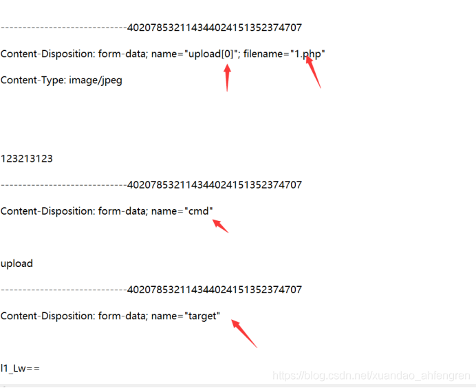

post提交cmd的值，调用upload方法，upload方法从上传文件中提取信息


$files的error为0，使用第一个if语句直接忽略


接着看changeDst被设置为false，因为第一个if循环中的值都存在，所以将$changeDst设置为true，之后进入foreach循环

'

此时的$_target已经有$target的值了


继续跟进


来到commandDisabled函数判断是否允许上传功能

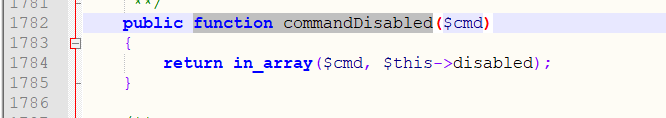

有上传功能，继续调用dir方法，将$hash(target)的值传入，再跟进file方法


file函数中有一个decode方法，跟进

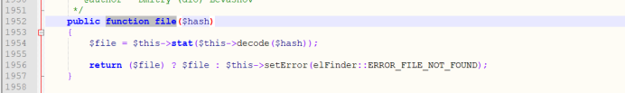

这里把我们的l1_Lw==进行了解码，decode函数首先判断$hash是以l1_开头，还是以t1_开头，接着对l1_之后的部分进行base64解码


紧接着返回我们的file方法

file方法又返回给dir方法


跟进到mimetype获取上传文件的上传类型


