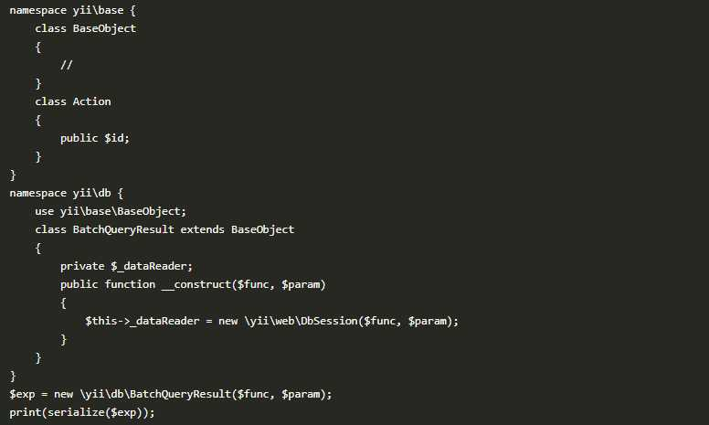

#### 简介

如果在使用yii框架，并且在用户可以控制的输入处调用了unserialize()并允许特殊字符的情况下，会受到反序列化远程命令命令执行漏洞攻击。 该漏洞只是php 反序列化的执行链，必须要配合unserialize函数才可以达到任意代码执行的危害。 该反序列化执行链在今年8月初已经公开，建议使用yii框架的同学排查

#### 影响范围

Yii2 <2.0.38

#### 修复方案

目前官方已经禁止BatchQueryResult类被反序列化

#### exp

   exp.txt [CVE-2020-15148 Yii框架反序列化RCE利用链](./CVE-2020-15148 Yii框架反序列化远程命令执行/POC.txt)

#### 参考链接

https://github.com/yiisoft/yii2/commit/9abccb96d7c5ddb569f92d1a748f50ee9b3e2b99 https://xz.aliyun.com/t/8082#toc-8 https://github.com/AFKL-CUIT/phpggc/