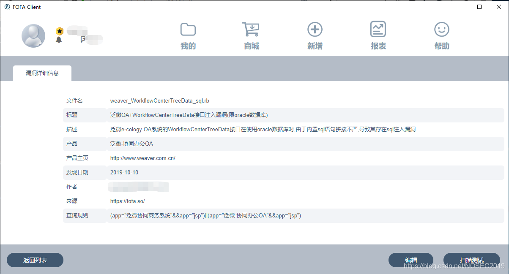

2019年10月，白帽汇安全研究院观测外网出现泛微办公软件的SQL注入漏洞，攻击者可在未经身份验证的情况下进行攻击，获得系统敏感数据。该漏洞目前属于0day，所有使用了Oracle数据库的泛微网站都有可能受到影响，且利用难度低，危害大（可获取密码等敏感信息），预计会对泛微的主要服务地区——中国市场产生一定冲击。


该漏洞是由于OA系统的`WorkflowCenterTreeData`接口中涉及Oracle数据库的SQL语句缺乏安全检查措施所导致的，任意攻击者都可借SQL语句拼接时机注入恶意payload，造成SQL注入攻击。目前官方尚未发布漏洞补丁，所有使用了Oracle数据库的泛微网站都有可能受到影响，请相关网站管理人员在官方发布补丁前及时下线网站。

## 概况

目前FOFA系统最新数据（一年内数据）显示全球范围内共有10266个泛微服务（基于jsp语言）。中国大陆使用数量最多，共有10166个，中国香港第二，共有51个，美国第三，共有15个，新加坡第四，共有11个，英国第五，共有4个。

全球范围内泛微服务分布情况如下（仅为分布情况，非漏洞影响情况）。


中国大陆地区广东省使用数量最多，共有1559个，四川省第二，共有1014个，河南省第三，共有1008个，江西省第四，共有961个，上海市省第五，共有811个。


## 危害等级

```
严重

12
```

## 漏洞原理

泛微e-cology OA系统的`WorkflowCenterTreeData`接口在接收到用户输入时会在未经过安全过滤的情况下直接拼接到SQL语句中，造成SQL注入。


（上图来源于网络）

## 漏洞影响

所有使用了Oracle数据库的泛微服务都有可能存在漏洞。

## 漏洞POC

目前FOFA客户端平台已经更新该远程命令执行漏洞的检测POC。
 
 POC截图

## CVE编号

```
暂无编号 

12
```

## 修复建议

由于目前没有官方补丁，请使用了泛微办公软件且后端数据库是Oracle的网站的管理员及时下线网站。

## 参考

[1] https://www.weaver.com.cn/

[2] [https://baike.baidu.com/item/%E6%B3%9B%E5%BE%AE/426156?fr=aladdin](https://baike.baidu.com/item/泛微/426156?fr=aladdin)

白帽汇从事信息安全，专注于安全大数据、企业威胁情报。

公司产品：FOFA-网络空间安全搜索引擎、FOEYE-网络空间检索系统、NOSEC-安全讯息平台。

为您提供：网络空间测绘、企业资产收集、企业威胁情报、应急响应服务。