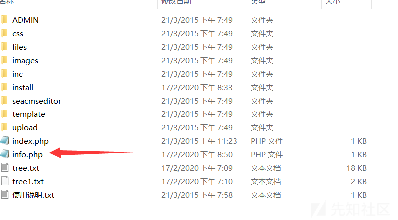
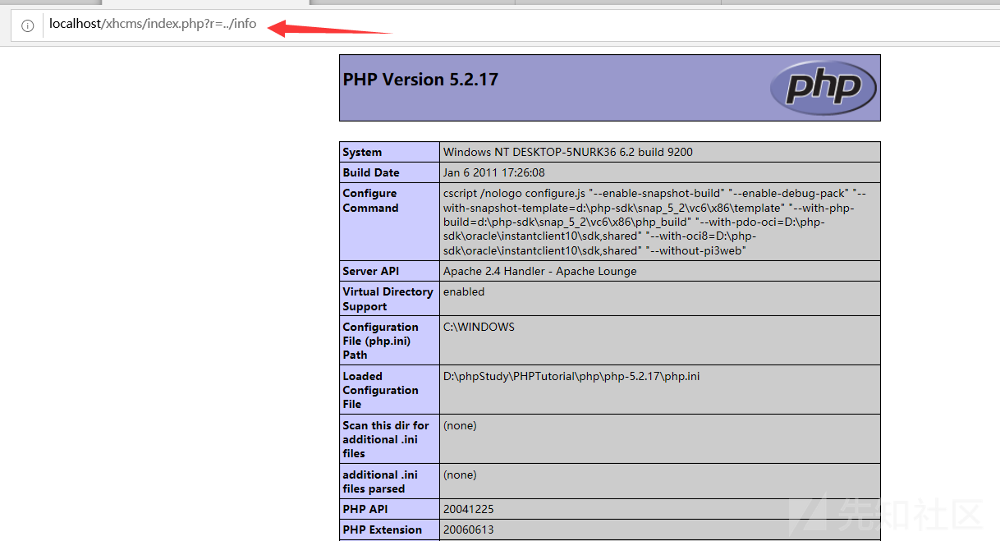

#### 漏洞详情 ####
跟进文件

    <?php
    //单一入口模式
    error_reporting(0); //关闭错误显示
    $file=addslashes($_GET['r']); //接收文件名
    $action=$file==''?'index':$file; //判断为空或者等于index
    include('files/'.$action.'.php'); //载入相应文件
    ?>
代码逻辑大概为，通过GET型传参传入r，并将值经过一个addslashes()函数操作，然后一个三元运算符判断要载入的文件，直接进入include函数包含。

include('files/'.$action.'.php');这条语句包含了file目录下的文件。

    语法为：条件表达式？表达式1：表达式2
    
    问号前面的位置是判断的条件，判断结果为bool型，为true是调用表达式1，为false时调用表达式2.
由代码逻辑可知，代码限制了我们访问的目录为file。

Bypass:可用../进行目录跳转。

#### 漏洞演示 ####
我们首先在cms根目录下新建一个phpinfo文件

然后我们在本地访问index.php添加如下参数。即可正确解析phpinfo界面

因为此处代码会自动在文件名后添加.php，所以我们不添加后缀名，否则无法正常解析
### 参考链接 ###
https://xz.aliyun.com/t/7629