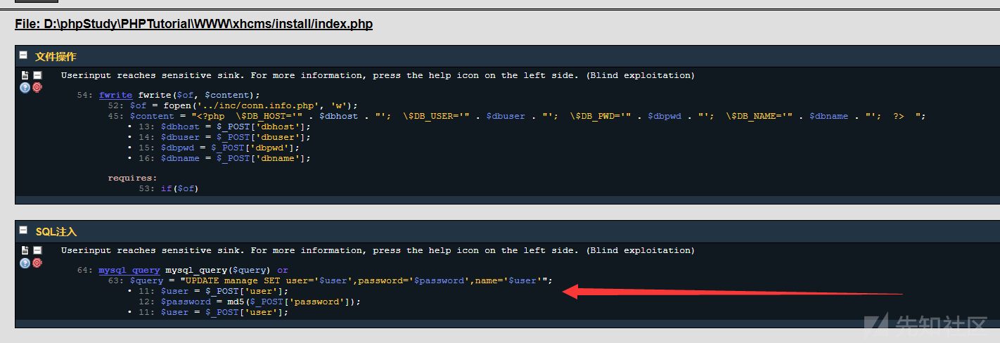

#### 漏洞详情： ####
漏洞位置：/install/index.php

RIPS审计出现sql注入，跟进文件比对审计结果。

通读代码发现代码逻辑如下：

1.检测是否生成了InstallLock.txt文件

2.执行sql语句

审计发现这里sql语句确实没有经过过滤，直接插入update的sql语句，导致sql注入。

漏洞演示：
payload:

    
    1' extractvalue(1,concat(0x7e,(select @@version),0x7e))#
1.根据源码可知，我们首先需要删除安装目录下的installLock.txt文件（如果网站上存在一个任意文件删除漏洞）

2.删除后我们重新进入安装界面。

在管理账号一栏输入我们的payload，也就是我们常见的报错注入方法，

之后我们提交：

发现在修改错误一栏发现爆出我们的Mysql版本，证明漏洞存在。

### 参考链接 ###
https://xz.aliyun.com/t/7629