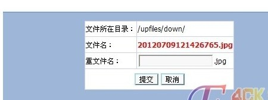
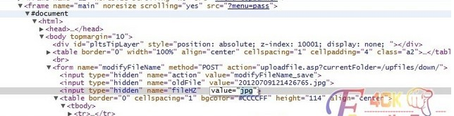

**上传修改拿shell漏洞 

**影响版本：
KindEditor 3.5.2~4.1
 
漏洞利用：
打开编辑器，将一句话改名为1.jpg  上传图片，
打开文件管理，进入“down”目录，跳至尾页，最后一个图片既是我们上传的一句话
点击改名
 
 
 
打开谷歌浏览器的 审查元素
 
 
 
找到form表单 

 
 
 修改“jpg”为“asp”
 
 
 
名字修改为1 保存
 
 

 一句话就生成了，连接地址为

http://www.*.com /upfiles/down/1.asp