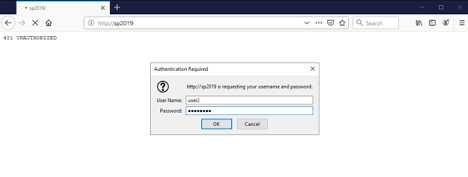
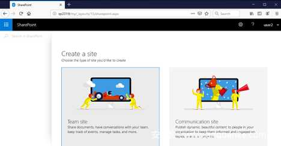
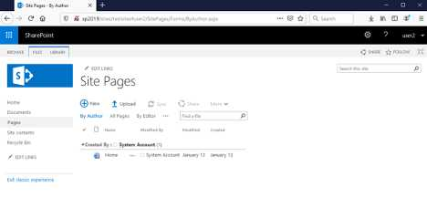
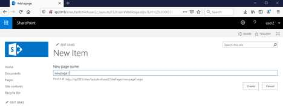
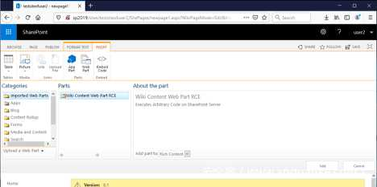
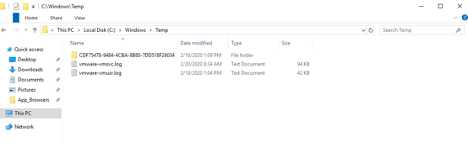

# CVE-2020-1181 SharePoint远程代码执行漏洞

最后更新于：2020-09-19 15:39:29

#### 漏洞描述

微软SharePoint服务器允许用户创建web页面，但为了避免被滥用，服务器会严格限制这些页面上能够出现的组件。SharePoint服务器会以不同的方式来处理“自有”页面和用户定义的页面。SharePoint的“自有”页面存放在文件系统上，不受任何限制。用户页面存放在数据库中，受服务器约束。其中有些限制条件包括无法使用代码块（code block）、无法包含文件系统中的文件。用户页面通常只能使用预定义列表中允许的web控件。

如果用户通过上传方式创建新页面，那么该页面也会受到限制。然而，如果新页面通过SharePoint Web Editor创建，那么就会被当成“ghost”页面，同样是可信的源。这个逻辑也很正常，因为SharePoint Web Editor会限制能够添加到页面的具体组件，因此页面可以在不受限制的模式下安全运行。

Web Editor中允许一种Web Part类型：WikiContentWebpart。这种Web Part允许包含任意ASP.NET标记，因此攻击者可以利用这种方式，在不受限模式下运行任意ASP.NET标记，最终实现远程代码执行。

#### POC

演示场景中，我们使用的版本为默认配置的Microsoft SharePoint 2019 Server，安装在Windows Server 2019 Datacenter系统上。服务器主机名为sp2019.contoso.lab，已加入contoso.lab域中，域控制器为一台独立的虚拟机。我们的目标主机已安装截至2020年2月份的所有补丁，因此对应的版本号为16.0.10355.20000。

攻击系统中只需要使用支持的web浏览器即可。如下图所示，我们使用的浏览器为Mozilla Firefox 69.0.3。我们还会使用与前文类似的WikiContentWebpart，将其命名为WikiContentRCE.xml。

首先我们访问SharePoint Server，以普通用户（user2）通过身份认证：

接下来创建站点，使该用户变成该站点所有者（owner），具备所有权限。

点击顶部面板的“SharePoint”区域：

然后点击“+ Create site”链接：

选择“Team Site”。现在我们需要为新站点设置名称，这里我们设置为testsiteofuser2。

点击“Finish”，成功创建新站点：

现在点击“Pages”链接：

我们需要切换到“Classic View”，点击左下角的“Return to classic SharePoint”链接即可：

点击“+ New”，为新页面设置一个名称。这里我们设置为newpage1：

点击“Create”按钮确认

现在我们需要在“INSERT”标签页中选择“Web Part”：

在对话框窗口中，选择左下角的“Upload Web Part”链接，上传我们构造的WikiContentRCE.xml文件：

点击Upload。我们可能会看到一个警告弹窗：“确认离开页面？您输入的数据可能不会被保存”。此时点击“Leave Page”按钮即可，返回主编辑视图：

我们需要再次在INSERT标签页中选择Web Part小部件，其中将出现我们导入的Web Part：

在点击Add按钮之前，我们先转到目标SharePoint服务器，打开C:\windows\temp目录：

此时该目录中不存在RCE_PoC.txt文件。

现在我们转到攻击者主机，将我们导入的Web Part添加到页面中：

再次在目标服务器上检查C:\windows\temp目录：

通过这种方法，攻击者可以执行任意系统命令，入侵服务器。攻击者只需要在WikiContentRCE.xml文件中，将echo pwned > c:/windows/temp/RCE_PoC.txt字符串替换成所需的命令即可。