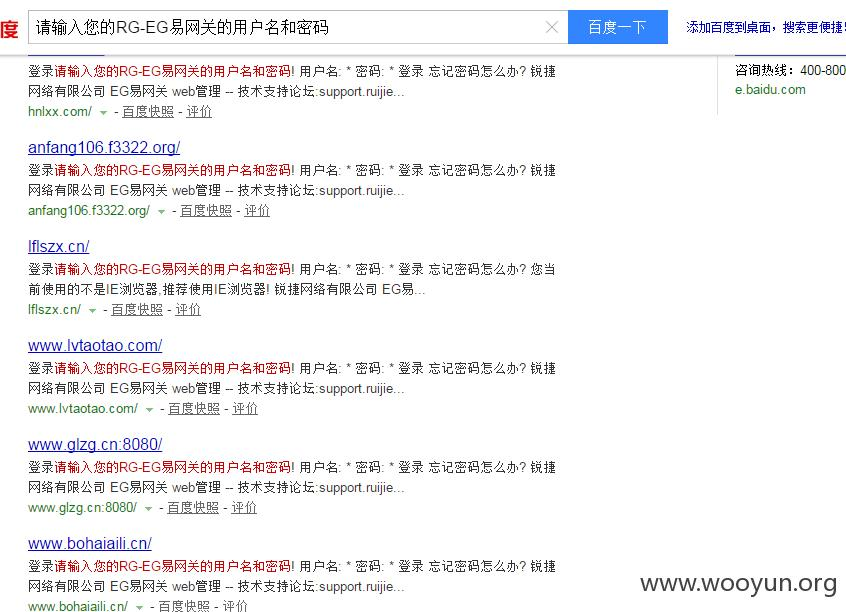
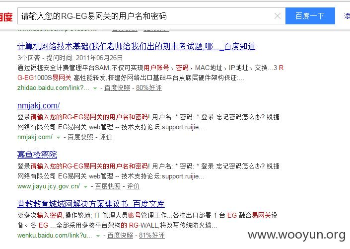
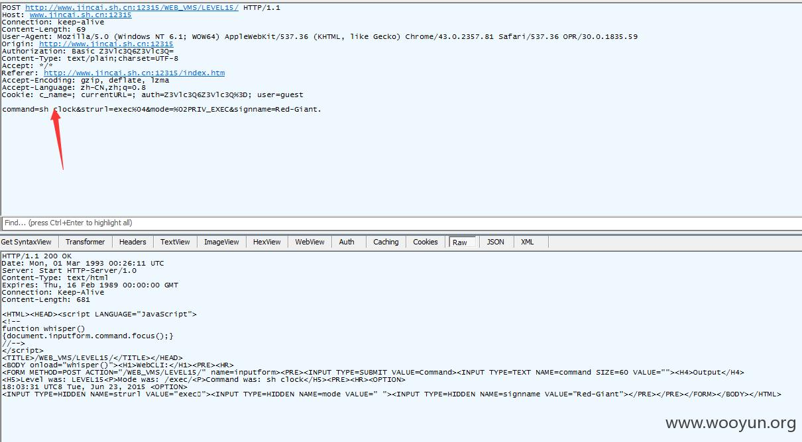
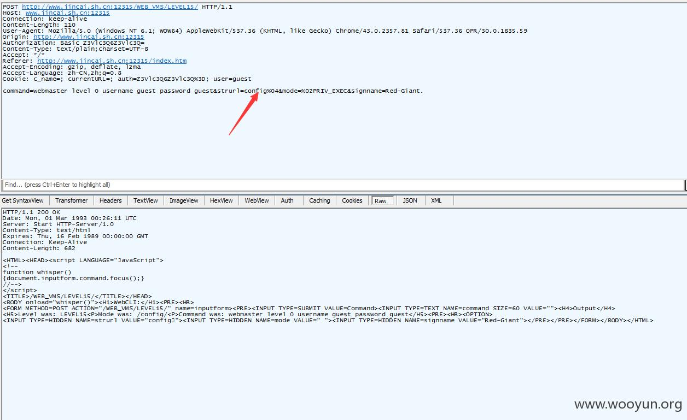
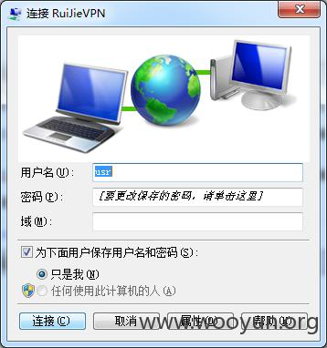

## 漏洞详情

### 详细说明：

### 漏洞证明：

1.百度搜索：“请输入您的RG-EG易网关的用户名和密码”

2，找了一个登录抓包

发现参数很有意思command=执行的命令strurl=应该是当前的运行模式挖掘后发现有exec config等mode=priv_exec直接特权模式3.于是show run一下

注意到这里有一个webmaster level 0 1 2通过了解0的级别是最高的，也就是权限是最好的，1和2 依次减低那我是否可以直接通过执行webmaster level 0 username guest password guest来提升权限呢？试一下

把strurl改成config即可执行成功如此说来我就可以直接执行所有的命令啦，但没必要这么麻烦了。再查看show run最下面发下有telnet的密码信息

于是直接telnet进来了

然后嘛，就是配置一个vpn，直接内网漫游了

好吧，我是好孩子，配置已经还原了试了百度搜索出来的十来个链接，发现弱口令都有http://www.jincai.sh.cn:12315/index.htmhttp://jsgz.cn/http://xczp.qhrcsc.comhttp://lbszx.comhttp://www.zmjsjt.cnhttp://wcjy.zhjedu.cn/index.htmhttp://www.lflszx.comhttp://www.jyxqxx.com:88/index.htmhttp://www.lvtaotao.comhttp://oa.haotel.comhttp://www.tzcgps.cn/index.htm百度那么多没敢一个一个试话说我看到其它漏洞，厂商回复已经做了补丁，但这些还在受害的用户，明显他们还不知道该问题，那该怎么办？对了，话说最近看到锐捷发了一个新网关产品 eg350，看链接好像web是用的php的，通过挖掘已经发现部分漏洞，版本号（EG_RGOS 11.1(3)B1T3,  Release(02162111)），但不知道是不是厂商的遗留版本，如果不是请告知，我会补出来，如果是那就忽略吧。

### 修复方案：

升级到最新版本