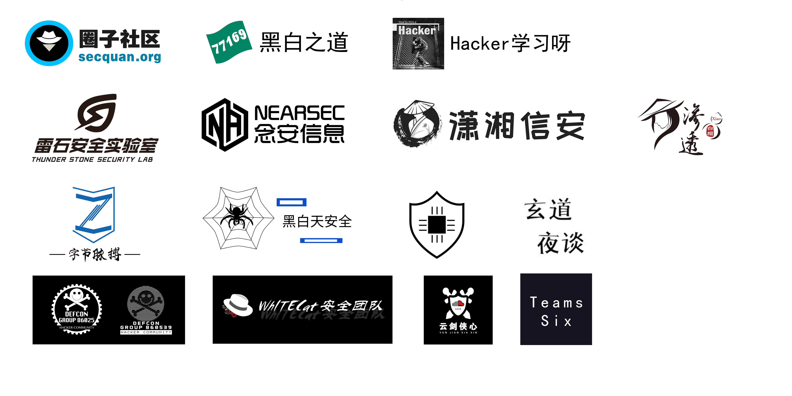

# 尊敬的白客，欢迎来到白阁

技术获取无需条条框框，开源才是真正共享

### 注意事项
白阁文库现已永久开源至Github,无需注册，表哥们可下载至本地已满足制作工具等需求
无需求的表哥可随时访问文库网站查阅

白阁文库地址：[https://wiki.bylibrary.cn](https://wiki.bylibrary.cn)

Github地址：[https://github.com/BaizeSec/bylibrary](https://github.com/BaizeSec/bylibrary)

投稿邮箱：ByLibrary@163.com或直接在github  Pull requests

文库每天实时更新，欢迎各位安全团队和白帽子加入我们的公益事业

有兴趣的表哥可微信关注公众号“白泽Sec”了解更多技术内容

想入交流群的表哥添加运营小姐姐微信：Echo-630-

## 文库维护团队


## 支持团队


      

## 支持白帽子

感谢以下白客对于白阁文库的贡献：
（排名不分先后）


福林表哥、x77、阿乐、Le、Lx、mys3t、hps_fly、NickName、return0、loveU、m_ing、aaaahui、Wizard、P1kAju


## 错误修改

关于页面出现的错误，可以直接在所在页面右上角点击 🖊 符号进行修改提交。

## 贡献指南

### 贡献文档要求

当你打算贡献某部分的内容时，你应该尽量确保

- 文档内容满足基本格式要求
- 文档的合理性以及准确性
- 文档图片以及附件的存储格式

### 文档存储格式

1.目前仓库只接受 Markdown 格式的贡献提交，如果有其他格式的提交请联系我们进行转换。

2.文章内图片存储要求：如果文章内有图片演示等，应将图片放在本地，避免使用外链。推荐使用相对路径进行图片索引链接，复制图片到与当前文档同名的文件夹下，或可直接在 MarkDown 软件中设置复制图片到指定路径，图片存储位置策略代码如下：

```
./${filename}
```

其中 `./${filename}` 表示当前文件名，具体案例演示如下：

假设我有一篇名为`xss 技术总结.md` 的文章，里面有若干图片，那么图片应该存储在 `xss 技术总结` 这个文件夹内，提交时应当将此文件夹和 .md 文件一同提交。


## 关于文库

白阁文库文章均来自网络文章综合和团队原创，对于有可溯来源的文章我们将会注明来源，对引用参考内容的文章，我们将会在每篇文章末标注引用参考来源。如有文章来源和参考链接更新不及时的情况，请各位及时批评指正。

关于白阁文库的文章，目前正在不断的进行更新扩充中...

