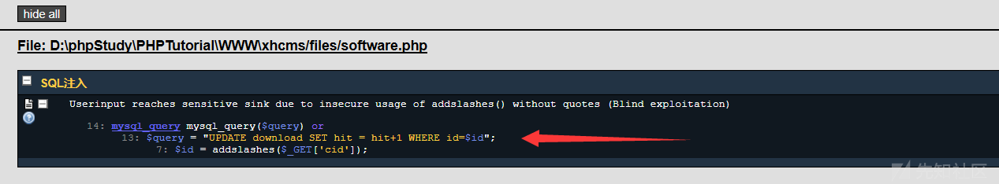

#### 漏洞详情： ####
结合RIPS扫描结果可发现多处sql注入漏洞，该CMS采用过滤方式大多是通过addslashes()函数过滤。

单纯使用addslashes()函数会造成两个问题：

1.是否采用GBK（宽字节注入）

2.sql语句是否采用了单引号闭合。

**software.php**

漏洞位置：files/software.php第13行，where后字句忘记加单引号保护。

    $query = "UPDATE download SET hit = hit+1 WHERE id=$id";

**ontent.php**

漏洞位置：files/content.php第19行，where后字句忘记加单引号保护。

    $query = "UPDATE content SET hit = hit+1 WHERE id=$id";
**submit.php**

首先可看见 过滤和传参

    $type=addslashes($_GET['type']);
    $name=$_POST['name'];
    $mail=$_POST['mail'];
    $url=$_POST['url'];
    $content=$_POST['content'];
    $cid=$_POST['cid'];
    $ip=$_SERVER["REMOTE_ADDR"];
    $tz=$_POST['tz'];
    if ($tz==""){$tz=0;}
    $jz=$_POST['jz'];
只对type参数进行了过滤，因此其他参数涉及到sql语句的可能存在sql注入。

漏洞位置：files/submit.php第66行

    $query = "SELECT * FROM interaction WHERE( mail = '$mail')";
漏洞位置：files/submit.php 第121-147行

    $query = "INSERT INTO interaction (
    type,
    xs,
    cid,
    name,
    mail,
    url,
    touxiang,
    shebei,
    ip,
    content,
    tz,
    date
    ) VALUES (
    '$type',
    '$xs',
    '$cid',
    '$name',
    '$mail',
    '$url',
    '$touxiang',
    '$shebei',
    '$ip',
    '$content',
    '$tz',
    now()
    )";

漏洞位置：files/submit.php 第176行

    $query = "SELECT * FROM content WHERE( id= $cid)";

漏洞位置：files/submit.php 第206行

    $query = "SELECT * FROM download WHERE( id= $cid)";

### 参考链接 ###
https://xz.aliyun.com/t/7629