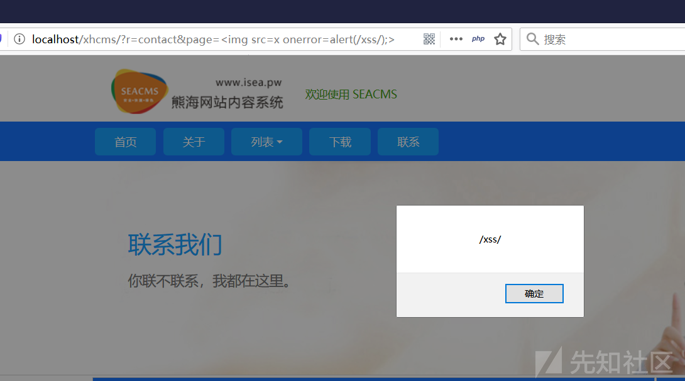

#### 漏洞详情： ####
反射型XSS

漏洞位置：files/contact.php 第12~15行

    $page=addslashes($_GET['page']);
    if ($page<>""){
    if ($page<>1){
    $pages="第".$page."页 - ";

经过一次addslashes函数处理就直接带入页面。

#### 复现过程  ####

我们访问网址的联系功能，找到了代码对于的page参数，其实就是留言列表的页数。

我们尝试插入一个简单XSS payload

    page=

漏洞利用成功。

### 参考链接 ###
https://xz.aliyun.com/t/7629