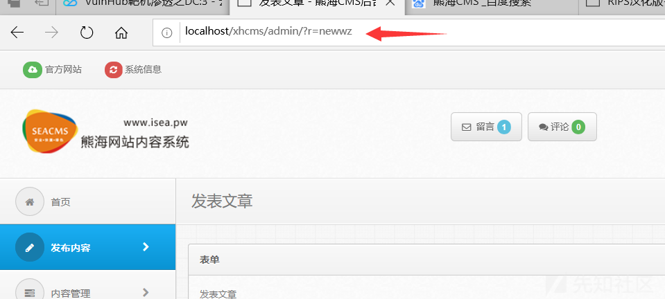

#### 漏洞详情： ####

漏洞位置：inc/checklogin.php

    <?php
    $user=$_COOKIE['user'];
    if ($user==""){
    header("Location: ?r=login");
    exit;   
    }
    ?>

该处的代码逻辑存在问题，直接从COOKIE处赋值给$user

如果 $user为空就跳转至登录界面

反之如果不为空就可以访问，因此存在越权访问。

#### 漏洞利用： ####

我们首先从admin中进入使用之前的账号登录后台。然后找到一个发布内容的页面：参数为?r=newwz

之后我们退出登录，回到登录界面。查看页面的cookie

发现在cookie里确实没有user值，我们尝试直接跳转刚才登录后的发布页面，发现会自动跳转到登录界面。

根据代码逻辑，我们可以尝试在cookie中添加一个user，因为代码没有判断user的具体值，所以填入任意数值即可。

我们在尝试跳转页面

发现没有登录，我们也成功进入了后台页面。

### 参考链接 ###
https://xz.aliyun.com/t/7629