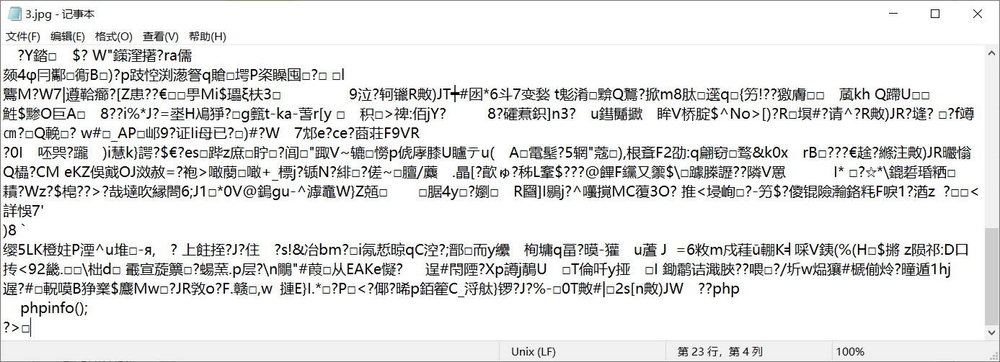

#### 漏洞详情 ####
1.后台可以修改模板文件，在模板文件中调用模板代码可实现文件包含

2.首先在设置中上传logo处，上传图片马，需要注意不能是用户的头像上传处上传木马，因为头像会进行缩放，导致文件内容被修改

3.上传成功后会返回路径，图片马内容为<?php phpinfo(); ?>，需要注意php代码必须包含最后的?>，否则会报语法错误

4.进入模板功能处，在index.html，即主页模板中添加模板代码，同样需要注意，路径不能以/开头，否则会被找不到错误

    {include file="uploads/config/20200325/033966a7d27975812915522464e252a3.jpg" /}

接着打开主页，即可看到phpinfo信息

### 参考链接 ###
https://xz.aliyun.com/t/7486