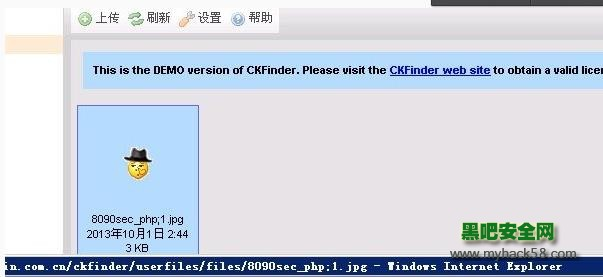
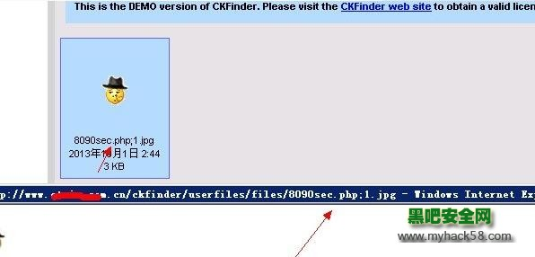

CKFinder 是国外一款非常流行的所见即所得文字编辑器,其1.4.3 asp.net版本存在任意文件上传漏洞，攻击者可以利用该漏洞上传任意文件。  CKFinder在上传文件的时候,强制将文件名（不包括后缀）中点号等其他字符转为下划线_，但是在修改文件名时却没有任何限制，从而导致可以上传  8090sec_php;1.jpg 等畸形文件名，最终导致文件上传漏洞。

 

如图：

 

 

注意看 点被过滤掉了 变成了横线 刚才说了 上传有过滤但是在修改文件名时却没有任何限制 接下来相信你懂的.....

​      