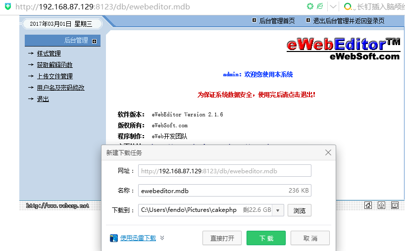
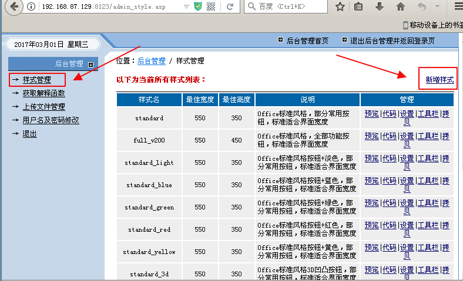
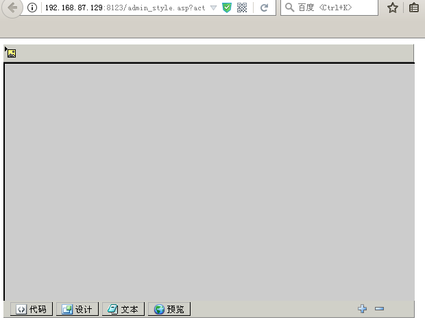
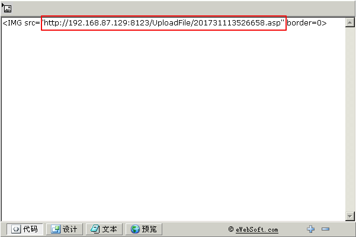

**2.Ewebeditor编辑器**

Ewebeditor是基于浏览器的、所见即所得的在线HTML编辑器。她能够在网页上实现许多桌面编辑软件（如：Word）所具有的强大可视编辑功能。WEB开发人员可以用她把传统的多行文本输入框 `<TEXTAREA>` 替换为可视化的富文本输入框，使最终用户可以可视化的发布HTML格式的网页内容。eWebEditor!已基本成为网站内容管理发布的必备工具！
 
 

**3.Ewebeditor利用核心**

 

如何发现编辑器地址

 Ewebeditor：
 默认后台：ewebeditor/admin_login.asp
 默认数据库：ewebeditor/db/ewebeditor.mdb
 默认账号密码：admin admin/admin888

 

**4.利用过程**

通常入侵ewebeditor编辑器的步骤如下:
 

**1、首先访问默认管理页看是否存在**

 

​    默认管理页地址2.80以前为 ewebeditor/admin_login.asp 以后版本为admin/login.asp(其他语言改后戳,这里以asp为例) 。

 

 

 

**2、默认管理帐号密码**

​    默认管理页存在！我们就用帐号密码登陆！默认帐号密码为: admin admin888 ！常用的密码还有admin admin999 admin1 admin000 之类的。

 

**3、默认数据库地址**

​    如果密码不是默认的。我们访问的就不是默认数据库！尝试下载数据库得到管理员密码！管理员的帐号密码，都在eWebEditor_System表段里，sys_UserName Sys_UserPass 都是md5加密的。得到了加密密码。可以去www.cmd5.com www.xmd5.org 等网站进行查询！暴力这活好久不干了！也可以丢国外一些可以跑密码的网站去跑!

 

默认数据库路径为:ewebeditor/db/ewebeditor.mdb 常用数据库路径为:

ewebeditor/db/ewebeditor.asa 

ewebeditor/db/ewebeditor.asp

ewebeditor/db/#ewebeditor.asa 

ewebeditor/db/#ewebeditor.mdb

ewebeditor/db/!@#ewebeditor.asp 

ewebeditor/db/ewebeditor1033.mdb 等等。

 

 

 

​    很多管理员常改.asp后缀，一般访问.asp .asa 后缀的都是乱码！可以用下载工具下载下来，然后更改后缀为.mdb来查看内容！

 

**4、漏洞基本利用步骤，以asp为例！**
 

登陆后台以后。选择样式管理，默认编辑器的默认样式都不可以修改的。
我们可以从任意样式新建一个样式，然后在图片上传添加可上传后缀。.asa .cer .cdx 等！.asp 过滤过了。
但是我们可以用.aaspsp后缀来添加，这样上传文件正好被ewebeditor 吃掉asp后缀，剩下.asp 。
同样，如果遇到一个管理员有安全意识的，从代码里，把.asp .asa .cer .cdx  都完全禁止了，我们也可以用.asasaa 后缀来突破。
添加完了后缀，可以在样式管理，点击预览，然后上传！

 

asa|cer|asp|aaspsp

Asa cer 它可以在iis6.0平台解析为asp执行

Aaspsp：绕过过滤 过滤asp aaspsp=》asp

 

注意：低版本ewebeditor不支持ie7.0以下版本访问（ietest软件模拟ie6.0上传）

以下以2.1.6这个版本为例来演示:

 

点击样式管理,然后新增样式

 

 

 

在图片类型中加入以下类型:asa|cer|asp|aaspsp

 

 

 

然后点击提交。

 

 

 

然后在工具栏里新增工具

 

 

 

 

 

在按钮设置里新增"插入或修改图片"

 

 

 

然后点击保存设置。然后再回去点击预览。

 

 

 

控件效果就出来了。然后直接上传一句话木马

 

 

 

点击确定，上传成功，之后，查看代码，就能看到完整的地址

 

 

 

用菜刀一连就能就OK了。。。