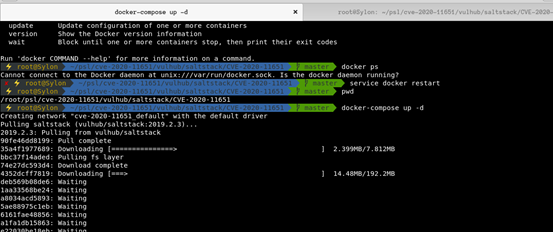
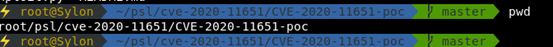

## 0x01 简介

SaltStack 是基于 Python 开发的一套C/S架构配置管理工具。

## 0x02 漏洞概述

在 CVE-2020-11651 认证绕过漏洞中，攻击者通过构造恶意请求，可以绕过 Salt Master 的验证逻辑，调用相关未授权函数功能，从而可以造成远程命令执行漏洞：

ClearFuncs类会处理非认证的请求和暴露_send_pub()方法，可以用来直接在master publish服务器上对消息进行排队。这些消息可以用来触发minion来以root权限运行任意命令。

ClearFuncs类还会暴露  _prep_auth_info()方法，该方法会返回用来认证master服务器上本地root用户的命令的root key。然后root  key就可以远程调用master 服务器的管理命令。这种无意的暴露提供给远程非认证的攻击者对salt  master的与root权限等价的访问权限。

## 0x03 影响版本

	SaltStack < 2019.2.4
 	SaltStack < 3000.2

## 0x04 环境搭建

直接使用vulhub进行搭建
 git clone https://github.com/vulhub/vulhub.git
 cd /vulhub/saltstack/CVE-2020-11651/
 docker-compose up -d
 

查看环境是否启动docker ps
 

## 0x05 漏洞复现

Poc：
 https://github.com/jasperla/CVE-2020-11651-poc
 

执行前需要安装salt库，需指定salt库版本

pip3 install salt==2019.2.3
 

靶机ip：192.168.10.113
 攻击机ip：192.168.10.113

读取文件：
 python3 exploit.py --master 192.168.232.170 -r /etc/passwd

0x06 修复方式

1、SaltStack官方已发布最新版本修复此漏洞，建议相关用户及时更新至安全版本及其以上，并开启SaltStack自动更新，以便实时获取补丁或升级至安全版本：https://repo.saltstack.com/
 2、禁止将Salt Master默认监听端口（4505、4506）向公网开放，并设置为仅对可信对象开放。