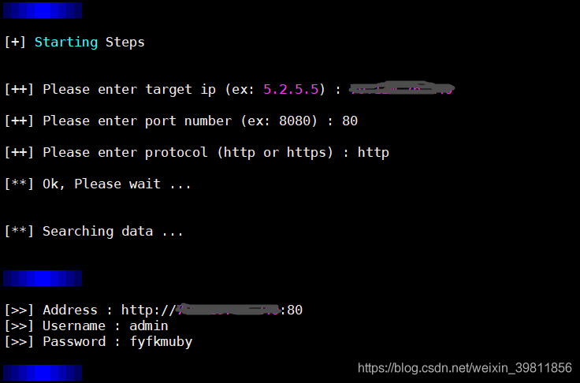
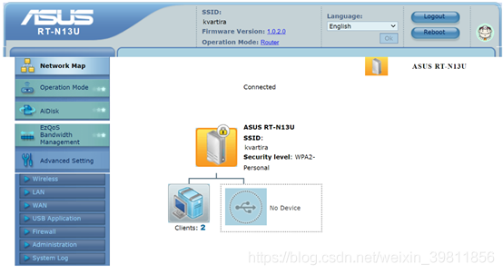
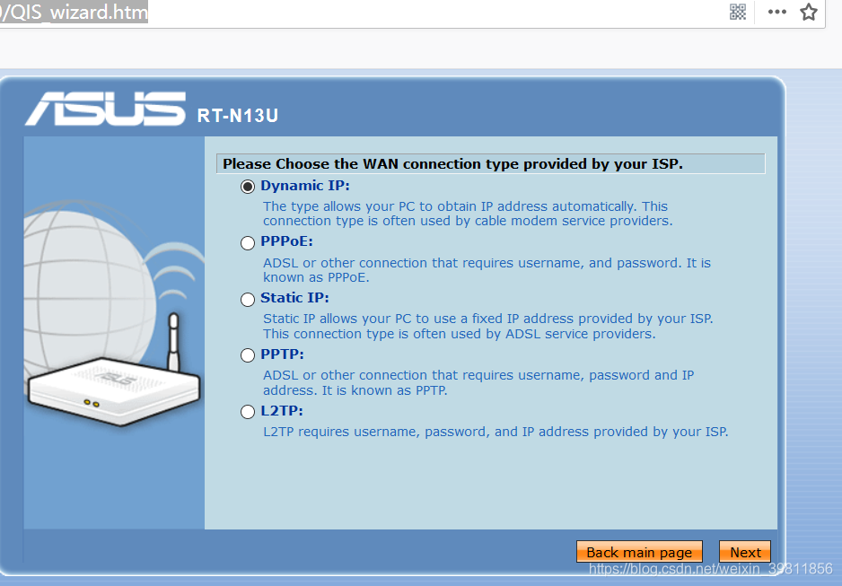

# 影响产品：

# Asus Routers (DSL-RT-N13 , DSL-N14U B1)

 

# 漏洞复现：

###  1、查找目标机器

  

##  2、测试POC

## 3、登录验证

## POC

链接：https://pan.baidu.com/s/1-JcqgZY9IZqLbKmQRE4H7Q 
 提取码：hhhh

 

## POC分析：

在未登录情况下访问该页面:

## 查看网页源代码：

