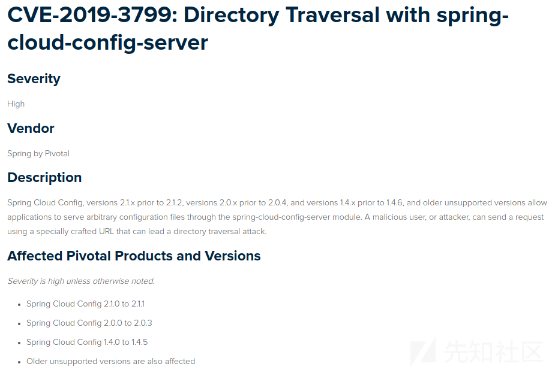
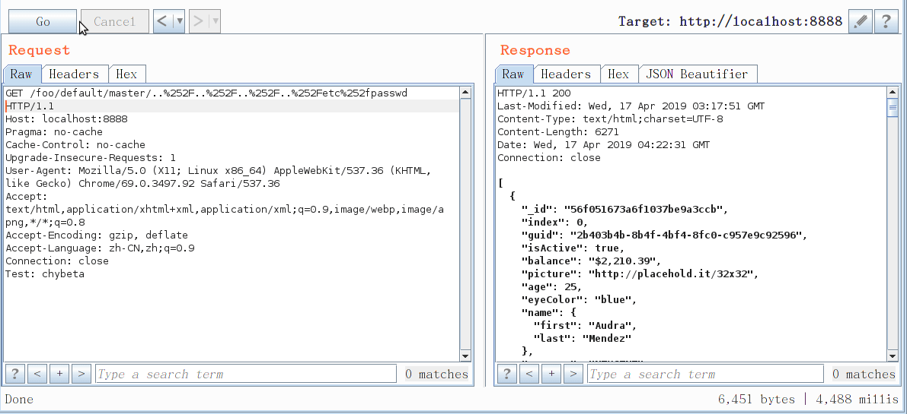
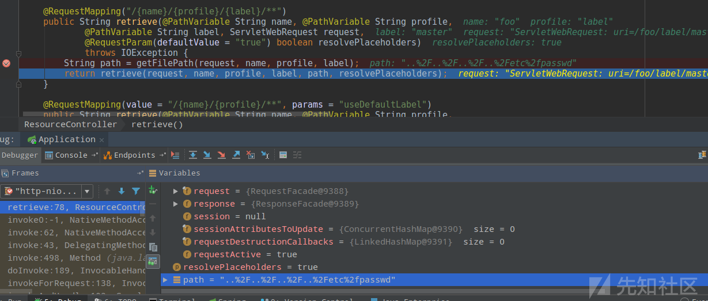

# 漏洞公告

https://pivotal.io/security/cve-2019-3799

[](https://xzfile.aliyuncs.com/media/upload/picture/20190417224755-c8ec71d6-611f-1.png)

# 漏洞复现

环境搭建： https://github.com/spring-cloud/spring-cloud-config#quick-start

```
GET /foo/default/master/..%252F..%252F..%252F..%252Fetc%252fpasswd HTTP/1.1
Host: localhost:8888
```

[](https://xzfile.aliyuncs.com/media/upload/picture/20190417224820-d7bb29b4-611f-1.gif)

# 漏洞分析

Spring Cloud Config是Spirng Cloud下用于分布式配置管理的组件，分为`Config-Server`和`Config-Client`两个角色。 `Config-Server`负责集中存储/管理配置文件，`Config-Client`则可以从`Config-Server`提供的HTTP接口获取配置文件使用。2019年4月16日，Pivotal官方发布安全通告，Spring Cloud Config Server 部分版本存在目录遍历漏洞，据此可以获取Server端服务器文件。

根据[官方文档](https://cloud.spring.io/spring-cloud-static/spring-cloud.html#_serving_plain_text)，可以通过如下请求`GET /{name}/{profile}/{label}/{path}` 来获取配置文件，`name`，`profile`和`label`的含义与常规环境下的endpoint相同，而`path`是指文件名。以官方示例为环境，我们请求 https://github.com/spring-cloud-samples/config-repo/blob/master/test.json 这个文件并以文本形式返回 ，则我们需要向`Spring Cloud Config Server`发出如下请求：

```
GET http://127.0.0.1:8888/foo/label/master/test.json
```

[](https://xzfile.aliyuncs.com/media/upload/picture/20190417224828-dc743d10-611f-1.png)

根据请求格式可以在 `org/springframework/cloud/config/server/resource/ResourceController.java:54` 中找到对应的处理 `@RequestMapping("/{name}/{profile}/{label}/**")`：

[](https://xzfile.aliyuncs.com/media/upload/picture/20190417224833-dfb766c8-611f-1.png)

其中`path`值即为payload:`..%2F..%2F..%2F..%2Fetc%2fpasswd`

跟入`retrieve` 在`org/springframework/cloud/config/server/resource/ResourceController.java:104` ：

```
synchronized String retrieve(ServletWebRequest request, String name, String profile,
            String label, String path, boolean resolvePlaceholders) throws IOException {
        name = resolveName(name);
        label = resolveLabel(label);
        Resource resource = this.resourceRepository.findOne(name, profile, label, path);
        ...
    }
```

这里会根据前面所传条件获取到resource。文档中提到`only the first one to match is returned`，所以继续跟入`findOne`:

[](https://xzfile.aliyuncs.com/media/upload/picture/20190417224838-e2d0b1ac-611f-1.png)

可以看到这里`locations`的值为`file:/tmp/config-repo-7168113927339570935/`，这是`Config-Server`从后端拉取到配置文件时临时存放，正常情况下将会在该文件夹下进行文件的查找，比如`test.json`：

[](https://xzfile.aliyuncs.com/media/upload/picture/20190417224844-e6079124-611f-1.png)

不过我们传入的却是`..%2F..%2F..%2F..%2Fetc%2fpasswd`，最终拼接出来的文件url即为：

[](https://xzfile.aliyuncs.com/media/upload/picture/20190417224850-e97ab386-611f-1.png)

返回后获取到的`resource`即为`/etc/passwd`，调用`StreamUtils.copyToString(is, Charset.forName("UTF-8")`读取到文件内容：

[](https://xzfile.aliyuncs.com/media/upload/picture/20190417224854-ebf9be0e-611f-1.png)

# 漏洞补丁

https://github.com/spring-cloud/spring-cloud-config/commit/3632fc6f64e567286c42c5a2f1b8142bfde505c2

主要在获取到local后进行了判断：

```
if (!isInvalidPath(local) && !isInvalidEncodedPath(local)) {
    Resource file = this.resourceLoader.getResource(location)
            .createRelative(local);
    if (file.exists() && file.isReadable()) {
        return file;
    }
}
```

`isInvalidPath`用于检测其中是否含有`:/`、`..`、`WEB-INF`等关键字样，`isInvalidEncodedPath`中在进行编解码后仍是调用`isInvalidPath`进行检测。

​                