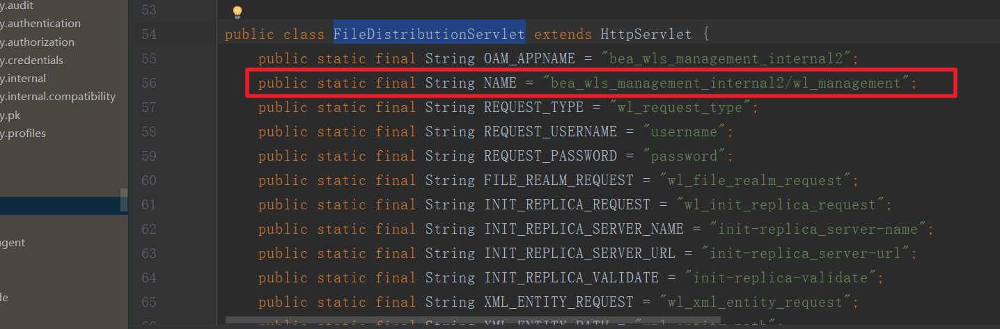
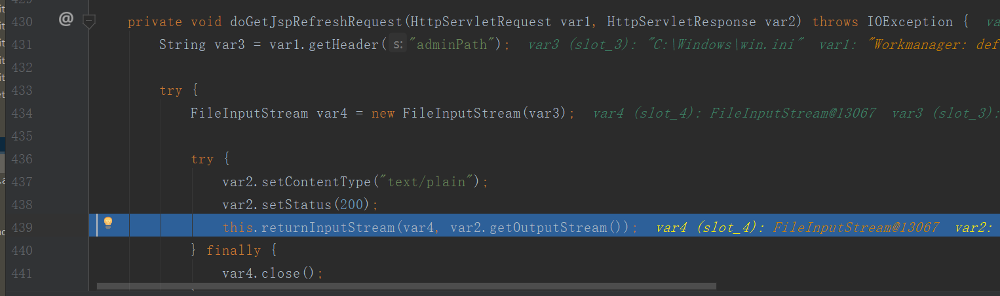
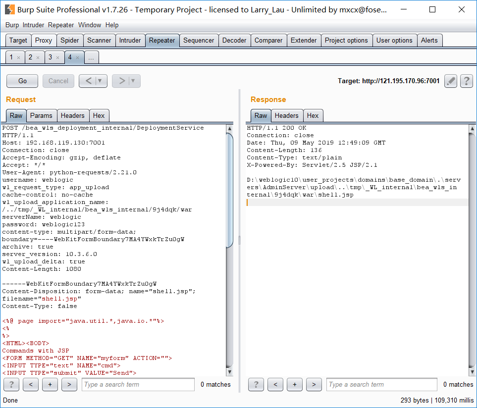
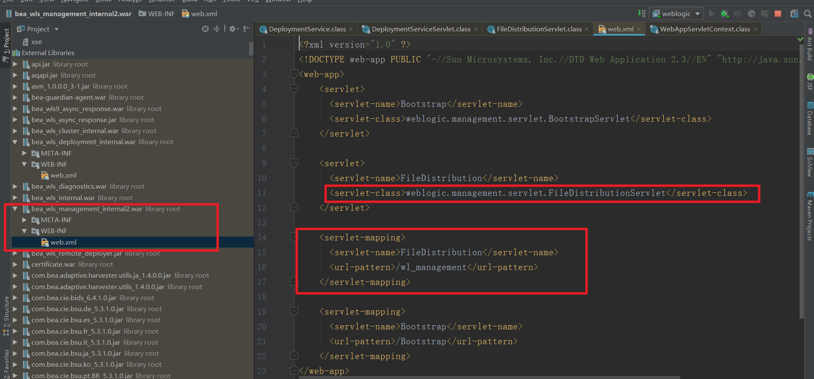

需要用户名密码文件读取。    定位到FileDistributionServlet这个Servlet,路由如下    走到doGet方法    来到doGetJspRefreshRequest方法，读入传入文件路径，439输出。  

没啥好分析的，直接定位到DeploymentServiceServlet这个类的handlePlanOrApplicationUpload方法以可就知道了，挺鸡肋的，还需要用户名和密码。
 
 最后看一下路由是怎么形成的，定位到bea_wls_deployment_internal.war包web.xml。这里有路由的指向。
 
 第一个路由构成，bea_wls_management_internal2.war中的web.xml-->最后拼成/bea_wls_management_internal2/wl_management
 
 参考链接：
 https://xz.aliyun.com/t/5078#toc-3